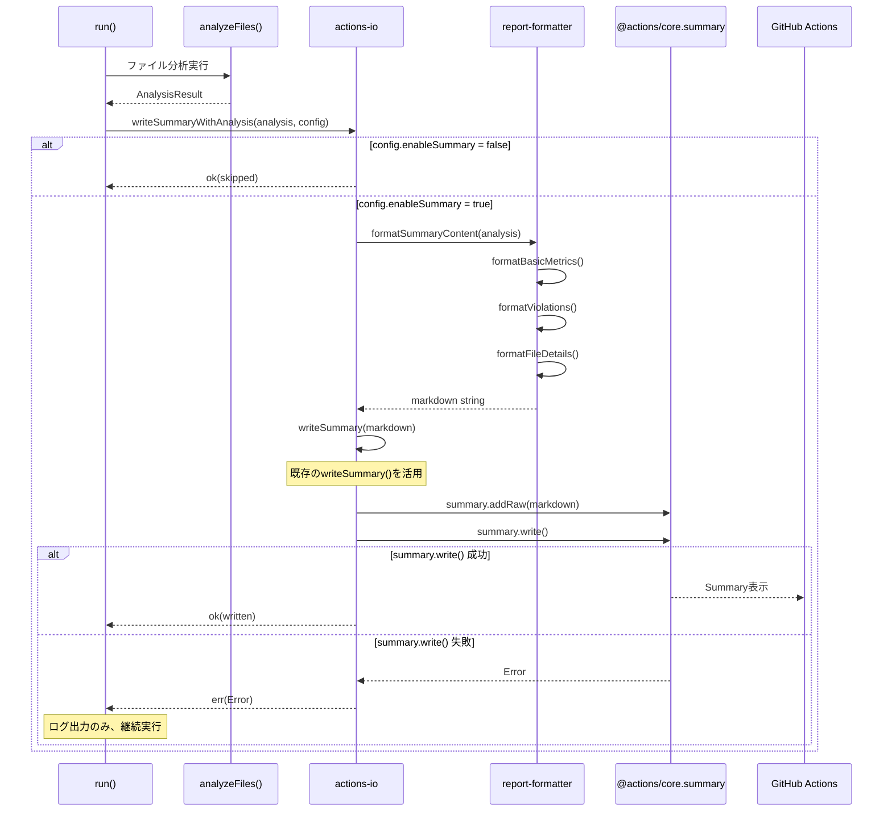
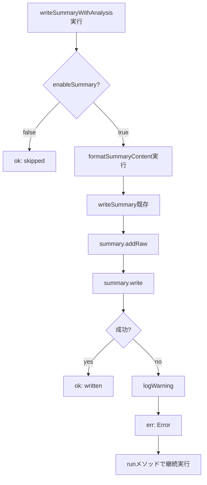
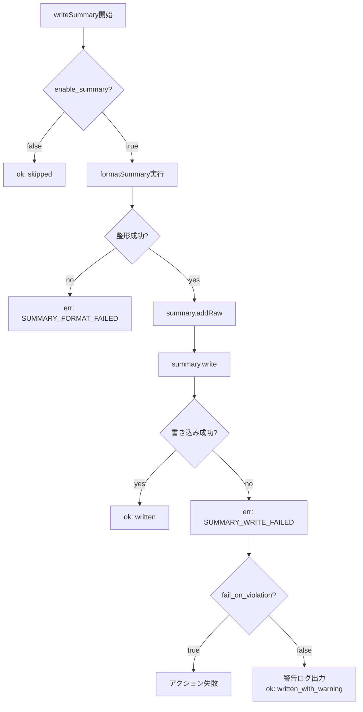
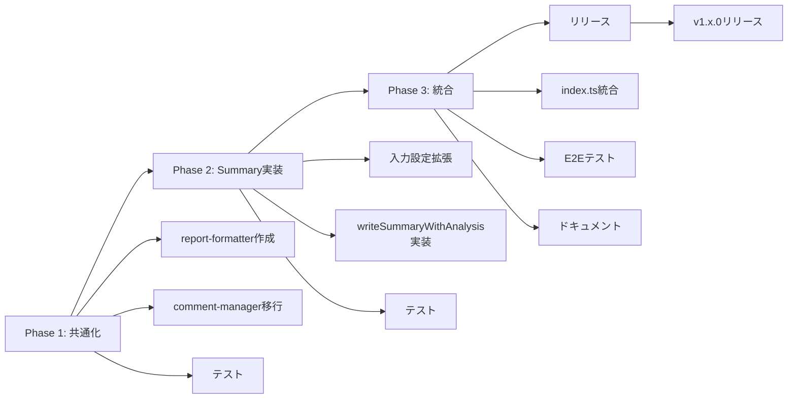

# Technical Design: Actions Summary Output

## Overview

この機能は、GitHub ActionsワークフローのサマリーページにPR分析結果を表示する機能を追加します。開発者はPRページに遷移せずとも、Actions実行結果画面から直接PRメトリクス（サイズ、追加行数、ファイル数、違反情報）を確認できるようになります。

**Purpose**: GitHub Actions Summary機能を活用し、PRメトリクスの可視性を向上させ、開発者のワークフロー効率を改善する。

**Users**: GitHub Actionsを利用してPRレビューを行う開発者、レビュワー、プロジェクト管理者。

**Impact**: 既存のラベル付け・コメント投稿機能に加えて、Actions Summary出力機能を追加します。既存機能の動作には影響を与えず、新しい出力チャネルとして動作します。

### Goals

- GitHub Actions SummaryにPR分析結果を視覚的に表示する
- 既存のラベル・コメント機能と並行して動作し、互換性を維持する
- マークダウン形式で見やすく整形された情報を提供する
- ユーザーが機能の有効/無効を設定可能にする

### Non-Goals

- Actions Summary以外の出力形式（JSON、XML等）への対応
- リアルタイム更新やインタラクティブなUI要素
- 既存機能（ラベル・コメント）の変更・改善
- Actions Summary以外のGitHub機能との統合

## Architecture

### Existing Architecture Analysis

PR Metrics Actionは以下の構造で実装されています：

- **エントリーポイント**: `src/index.ts` - メイン実行ロジック
- **分析エンジン**: `src/file-metrics.ts` - ファイル分析ロジック
- **ラベル管理**: `src/label-manager.ts` - PRラベル操作
- **コメント管理**: `src/comment-manager.ts` - PRコメント投稿
- **入出力**: `src/actions-io.ts` - GitHub Actions入出力ヘルパー
- **型定義**: `src/types.ts` - 共通型定義

**既存パターン**:

- neverthrowの`Result<T, E>`パターンによるエラーハンドリング
- 各機能モジュールは独立した責務を持つ
- `src/index.ts`のrunメソッドが各ステップを順次実行
- GitHub Actions Core APIを`src/actions-io.ts`でラップ

**統合ポイント**:

- `src/index.ts`のrunメソッドにSummary出力ステップを追加
- 既存の分析結果（`AnalysisResult`型）を再利用
- `@actions/core`の既存インポートを活用

### High-Level Architecture

```mermaid
graph TB
    A[GitHub Actions Run] --> B[index.ts: run]
    B --> C[file-metrics: analyzeFiles]
    B --> D[label-manager: updateLabels]
    B --> E[comment-manager: manageComment]
    B --> F[actions-io: writeSummaryWithAnalysis]
    F --> G[report-formatter: formatSummaryContent]
    G --> H[actions-io: writeSummary existing]
    H --> I[@actions/core.summary]
    I --> J[GitHub Actions Summary Page]

    E --> K[report-formatter: formatCommentBody]
    K --> E

    C --> L[AnalysisResult]
    L --> D
    L --> E
    L --> F
```

**Architecture Integration**:

- **既存パターン保持**: モジュラー設計、Result型によるエラーハンドリング、型安全性
- **新規コンポーネント**:
  - `report-formatter.ts`: 共通マークダウン整形ロジック（コメント/サマリー両方で使用）
  - `actions-io.ts`の拡張: 既存`writeSummary()`にエラーハンドリングとenable_summary制御を追加
- **コード再利用**:
  - `comment-manager.ts`からフォーマット関数を抽出し`report-formatter.ts`へ共通化
  - 既存の`writeSummary()`を活用してAPI重複を回避
- **Technology Alignment**: TypeScript strict mode、neverthrow、@actions/core API
- **Steering Compliance**: 既存のコードスタイル規約、エラーハンドリングパターン、テスト戦略を踏襲

### Technology Alignment

この機能は既存のPR Metrics Actionに機能追加するため、以下の技術スタックと完全に整合します：

**既存技術スタック**:

- TypeScript 5.0+ (strict mode)
- Node.js 20+
- @actions/core 1.11+ (Summary API含む)
- neverthrow (Result型パターン)

**新規依存関係**: なし（既存の@actions/coreにSummary APIが含まれる）

**パターンからの逸脱**: なし（既存パターンを完全に踏襲）

### Key Design Decisions

#### 決定1: Summary出力の実装位置

- **Decision**: 既存の`src/actions-io.ts`の`writeSummary()`を拡張し、エラーハンドリングとenable_summary制御を追加する
- **Context**: 既存にSummary書き込み関数があり、API重複を避けるべき。分析結果を異なる出力先に書き込む機能である
- **Alternatives**:
  1. 独立した新規モジュール（`summary-writer.ts`） → API重複のリスク
  2. comment-manager内に統合 → コメントとSummaryは出力先が異なる
  3. 既存`actions-io.ts`の拡張 → 選択
- **Selected Approach**: `actions-io.ts`に`writeSummaryWithAnalysis()`関数を追加し、既存の`writeSummary()`を内部で活用
- **Rationale**:
  - 既存APIを最大限活用し、コードの重複を回避
  - Summary書き込みロジックを1箇所に集約
  - 既存の入出力ヘルパー層との整合性を保つ
- **Trade-offs**:
  - `actions-io.ts`のファイルサイズが増加するが、API重複を防ぎ保守性が向上
  - Summary固有のロジック（フォーマット）は`report-formatter.ts`に分離して単一責任を維持

#### 決定2: マークダウン整形ロジックの共通化

- **Decision**: マークダウン整形ロジックを`report-formatter.ts`として分離し、コメントとサマリーの両方で利用する
- **Context**: `comment-manager.ts`にマークダウン生成ロジックが既に存在し、Summary出力でも類似のマークダウンが必要。コードの重複を避けるべき
- **Alternatives**:
  1. 独立した`summary-formatter.ts` → コメントとの重複が発生
  2. comment-manager内に統合 → 責務が曖昧になる
  3. 共通の`report-formatter.ts`を作成 → 選択
- **Selected Approach**: `report-formatter.ts`として共通フォーマッタを作成し、`comment-manager.ts`と新規Summary出力の両方から利用
- **Rationale**:
  - コメントとサマリーで重複するMarkdown生成ロジックを一元化
  - 純粋関数としてテストが容易
  - DRY原則に従い、保守性が向上
  - 既存の`formatBytes()`, `formatNumber()`などを抽出・再利用
- **Trade-offs**:
  - `comment-manager.ts`のリファクタリングが必要だが、既存テストで安全性を担保
  - 共通化により関数の引数が増える可能性があるが、オプション引数で柔軟性を確保

#### 決定3: enable_summaryパラメータのデフォルト値

- **Decision**: `enable_summary`のデフォルト値を`true`とし、オプトアウト方式を採用する
- **Context**: Summary機能は既存機能に影響を与えず、開発者体験を向上させる機能である
- **Alternatives**:
  1. デフォルト`false`（オプトイン） → ユーザーが明示的に有効化する必要がある
  2. デフォルト`true`（オプトアウト） → 選択
  3. 常に有効で設定不可 → 柔軟性が失われる
- **Selected Approach**: デフォルト`true`、ユーザーが無効化可能
- **Rationale**:
  - 新機能を自動的に享受でき、ユーザー体験が即座に向上
  - Summary出力は副作用がなく、既存機能と干渉しない
  - 必要に応じて無効化可能で柔軟性を維持
- **Trade-offs**:
  - 一部のユーザーが不要な出力を受け取る可能性があるが、無効化は容易

## System Flows

### Summary出力フロー



### エラーハンドリングフロー



## Requirements Traceability

| 要件    | 要件概要               | コンポーネント   | インターフェース           | フロー                   |
| ------- | ---------------------- | ---------------- | -------------------------- | ------------------------ |
| 1.1-1.5 | 基本メトリクス表示     | report-formatter | formatBasicMetrics()       | Summary出力フロー        |
| 2.1-2.5 | 違反情報表示           | report-formatter | formatViolations()         | Summary出力フロー        |
| 3.1-3.6 | ファイル詳細表示       | report-formatter | formatFileDetails()        | Summary出力フロー        |
| 4.1-4.6 | マークダウン整形       | report-formatter | 各種format関数             | Summary出力フロー        |
| 5.1-5.4 | GitHub Actions API統合 | actions-io       | writeSummaryWithAnalysis() | Summary出力フロー        |
| 6.1-6.5 | 既存機能互換性         | index.ts         | run()                      | エラーハンドリングフロー |
| 7.1-7.4 | 設定可能性             | actions-io       | writeSummaryWithAnalysis() | Summary出力フロー        |

## Components and Interfaces

### Summary出力層

#### actions-io (拡張)

**Responsibility & Boundaries**

- **Primary Responsibility**: GitHub Actions I/O操作全般（既存）+ Summary書き込みの拡張
- **Domain Boundary**: Actions入出力層
- **Data Ownership**: アクション入出力、ログ、Summary書き込み状態
- **Transaction Boundary**: 単一のsummary.write()呼び出し

**Dependencies**

- **Inbound**: `src/index.ts` runメソッドから呼び出される
- **Outbound**:
  - `report-formatter`: マークダウン生成
  - `@actions/core`: Actions Core API（既存）
- **External**: `@actions/core` (v1.11+)

**External Dependencies Investigation**:

@actions/core Summary APIの主要メソッド:

- `summary.addRaw(markdown: string)`: 生のマークダウンを追加
- `summary.addTable(rows: SummaryTableRow[])`: テーブルを追加
- `summary.write()`: バッファをファイルに書き込み
- `summary.clear()`: バッファをクリア

**制約**:

- `write()`は一度だけ呼び出す（複数回呼ぶとバッファが重複）
- マークダウンはGitHub Flavored Markdown仕様に準拠
- 最大サイズ制限: 1MBまでのマークダウン

**Contract Definition**

**Service Interface** (actions-io.ts に追加):

```typescript
/**
 * GitHub Actions SummaryにPR分析結果を書き込む
 *
 * @param analysis - ファイル分析結果
 * @param config - Summary出力設定
 * @returns Result<SummaryWriteResult, Error>
 *
 * @preconditions
 * - analysisが有効なAnalysisResult
 * - configにenableSummaryフラグが含まれる
 * - GitHub Actions環境で実行されている
 *
 * @postconditions
 * - enableSummary=trueの場合、Summaryが書き込まれている
 * - enableSummary=falseの場合、何も書き込まれていない
 * - エラー時にはErrを返すがアクションは継続

 *
 * @invariants
 * - 既存のlabel/comment機能に影響を与えない
 * - 冪等性を保証（同じ入力で同じ出力）
 */
export async function writeSummaryWithAnalysis(
  analysis: AnalysisResult,
  config: { enableSummary: boolean }
): Promise<Result<SummaryWriteResult, Error>>;
```

**型定義** (actions-io.ts に追加):

```typescript
export interface SummaryWriteResult {
  action: 'written' | 'skipped';
  bytesWritten?: number;
}

// エラーハンドリングは既存のResult<T, Error>パターンを使用
// 専用エラークラスは不要（シンプルなError型で十分）
```

**Integration Strategy**:

- **Modification Approach**: `src/actions-io.ts`に新関数を追加（既存関数は変更なし）
- **Backward Compatibility**: enableSummary=falseで既存動作を完全に維持
- **Migration Path**: デフォルトで有効化、ユーザーは必要に応じて無効化可能
- **既存API活用**: 内部で既存の`writeSummary(content: string)`を呼び出す

#### report-formatter (新規)

**Responsibility & Boundaries**

- **Primary Responsibility**: コメント・サマリー共通のマークダウン生成
- **Domain Boundary**: 整形・フォーマット層（input-mapperと同階層）
- **Data Ownership**: マークダウン文字列生成ロジック、数値整形ユーティリティ
- **Transaction Boundary**: なし（純粋関数）

**Dependencies**

- **Inbound**: `actions-io`, `comment-manager` から呼び出される
- **Outbound**: `src/file-metrics.ts`の型定義のみ
- **External**: なし

**Contract Definition**

**Service Interface**:

```typescript
// report-formatter.ts

/**
 * 基本メトリクスのマークダウンセクションを生成
 * コメント・サマリー共通
 */
export function formatBasicMetrics(
  metrics: AnalysisResult['metrics'],
  options?: { includeHeader?: boolean }
): string;

/**
 * 違反情報のマークダウンセクションを生成
 * コメント・サマリー共通
 */
export function formatViolations(
  violations: AnalysisResult['violations'],
  options?: { includeHeader?: boolean }
): string;

/**
 * ファイル詳細テーブルを生成
 * @param files - ファイルメトリクス配列
 * @param limit - 表示する最大ファイル数（デフォルト: 無制限）
 */
export function formatFileDetails(
  files: FileMetrics[],
  limit?: number
): string;

/**
 * バイト数を人間が読みやすい形式に変換
 * 既存のformatBytes()をcomment-managerから移動
 */
export function formatBytes(bytes: number): string;

/**
 * 数値をカンマ区切りで整形
 * 既存のformatNumber()をcomment-managerから移動
 */
export function formatNumber(num: number): string;

/**
 * Markdownエスケープ処理（新規）
 */
export function escapeMarkdown(text: string): string;
```

**State Management**: なし（ステートレスな純粋関数）

**移行方針**:

- `comment-manager.ts`の既存関数（`formatBytes`, `formatNumber`）を抽出
- コメントとサマリーで共通利用可能な純粋関数として再設計
- オプション引数で用途別のカスタマイズを可能に

### 入力層（拡張）

#### actions-io (拡張)

既存の`src/actions-io.ts`に以下のインターフェースを追加：

```typescript
/**
 * action.ymlからenable_summaryパラメータを読み取る
 */
function getEnableSummary(): boolean;
```

**既存関数への影響**: なし（新規関数追加のみ）

### 型定義層（拡張）

#### actions-io.ts (型定義含む)

Summary関連の型は`actions-io.ts`に直接定義（`types.ts`への追加は不要）：

- 既に actions-io の Contract Definition セクションで定義済み
- `SummaryWriteResult` インターフェース
- エラーハンドリングは既存の `Result<T, Error>` パターンを使用
- 専用エラークラスは導入せず、シンプルな設計を維持

## Data Models

### Logical Data Model

この機能は既存の`AnalysisResult`型を入力として受け取り、新しいデータ構造を導入しません。

**既存データ構造の活用**:

```typescript
// src/file-metrics.ts (既存)
interface AnalysisResult {
  metrics: {
    totalFiles: number;
    totalAdditions: number;
    filesAnalyzed: FileMetrics[];
    filesExcluded: string[];
    filesSkippedBinary: string[];
    filesWithErrors: string[];
  };
  violations: Violations;
}

interface FileMetrics {
  filename: string;
  size: number;
  lines: number;
  additions: number;
  deletions: number;
}

interface Violations {
  largeFiles: ViolationDetail[];
  exceedsFileLines: ViolationDetail[];
  exceedsAdditions: boolean;
  exceedsFileCount: boolean;
}

interface ViolationDetail {
  file: string;
  actualValue: number;
  limit: number;
  violationType: 'size' | 'lines';
  severity: 'critical' | 'warning';
}
```

**データフロー**:

1. `analyzeFiles()` → `AnalysisResult`生成
2. `formatSummaryContent(AnalysisResult)` → マークダウン文字列生成
3. `writeSummary(markdown)` → GitHub Actions Summaryへ出力

## Error Handling

### Error Strategy

Summary出力はメイン機能（分析、ラベル、コメント）の補助的な機能であるため、Summary書き込みエラーは以下のように処理します：

1. **非致命的エラー**: Summary出力エラーは警告ログを出力し、アクションの成功/失敗には影響させない（`fail_on_violation`設定による）
2. **エラー分類**: エラーコードによる明確な分類（`SUMMARY_WRITE_FAILED`, `SUMMARY_FORMAT_FAILED`）
3. **Result型活用**: neverthrowの`Result<T, E>`パターンで型安全なエラーハンドリング

### Error Categories and Responses

**System Errors (5xx相当)**:

- **SUMMARY_WRITE_FAILED**: `@actions/core.summary.write()`の失敗
  - 対応: エラーログ出力、`fail_on_violation=false`なら継続、`true`ならアクション失敗
  - 回復: リトライなし（GitHub Actions環境の問題である可能性が高い）

**User Errors (4xx相当)**:

- **SUMMARY_FORMAT_FAILED**: マークダウン生成の失敗（通常は発生しない）
  - 対応: エラーログ出力、分析結果の問題を示唆
  - 回復: フォールバック（簡易版Summaryを出力）

**Business Logic Errors (422相当)**:

- **enable_summary=false**: Summary出力をスキップ
  - 対応: デバッグログ出力、`ok('skipped')`を返す

### Process Flow Visualization



### Monitoring

**ログ出力**:

- Summary出力開始: `logInfo('📊 Writing GitHub Actions Summary...')`
- Summary出力成功: `logInfo('  - Summary written successfully')`
- Summary出力スキップ: `logInfo('  - Summary output skipped (enable_summary=false)')`
- Summary出力失敗: `logWarning('Failed to write summary: {error.message}')`

**デバッグ情報**:

- 書き込みバイト数: `bytesWritten`
- エラー詳細: `SummaryWriteError.cause`

## Testing Strategy

### Unit Tests

1. **report-formatter.ts**:
   - `formatBasicMetrics()`: 基本メトリクスセクション生成テスト
   - `formatViolations()`: 違反情報セクション生成テスト（違反あり/なし）
   - `formatFileDetails()`: ファイル詳細テーブル生成テスト（limit機能含む）
   - `formatBytes()`: バイト数整形テスト（既存テストの移植）
   - `formatNumber()`: 数値整形テスト（既存テストの移植）
   - `escapeMarkdown()`: Markdownエスケープテスト
   - エッジケース: 空配列、大量ファイル、特殊文字を含むファイル名

2. **actions-io.ts (拡張)**:
   - `writeSummaryWithAnalysis()`: enableSummary=true/falseのテスト
   - モック: `@actions/core.summary`をモック化
   - エラーハンドリング: `summary.write()`失敗時のテスト
   - Result型検証: `ok()`/`err()`の返却パターンテスト
   - `getActionInputs()`: enable_summaryフィールドのデフォルト値テスト

3. **comment-manager.ts (リファクタリング後)**:
   - 既存のすべてのテストが通ることを確認
   - マークダウン生成結果が以前と同じことを確認

### Integration Tests

1. **run() → writeSummaryWithAnalysis()統合**:
   - 分析結果からSummary出力までのエンドツーエンド
   - enableSummary設定による動作切り替え
   - Draft PR時のSummary出力テスト（要件1.5）
   - エラー発生時の既存機能（label/comment）への影響確認

2. **report-formatter と comment-manager の統合**:
   - リファクタリング後のコメント生成が正常動作することを確認
   - 既存のコメント統合テストがすべて通ることを確認

3. **@actions/core.summary統合**:
   - 実際のsummary APIを使用したテスト（可能であれば）
   - マークダウン出力の妥当性検証

4. **既存機能との並行実行**:
   - Summary出力が既存のlabel/comment機能に干渉しないことを確認
   - failOnViolation設定との組み合わせテスト

### E2E Tests

1. **GitHub Actions環境テスト**:
   - 実際のGitHub Actionsワークフローでの動作確認
   - Summary表示の視覚的検証（手動）
   - 各種設定パターン（enable_summary、fail_on_violation）の組み合わせテスト

## Security Considerations

**データ保護**:

- Summary出力はPRの公開情報のみを含む（機密情報なし）
- ファイルパス、行数、サイズ情報は既にPRで公開されている情報

**インジェクション対策**:

- ファイル名に特殊文字が含まれる場合のマークダウンエスケープ処理
- summary.addRaw()使用時のXSS対策（GitHub側で処理されるが念のため確認）

**権限**:

- Summary書き込みには特別な権限は不要（既存の`GITHUB_TOKEN`で十分）
- 既存のpermissions設定（pull-requests: write, issues: write, contents: read）で動作

## Performance & Scalability

**パフォーマンス目標**:

- Summary生成時間: 100ms以内（大規模PR: 1000ファイルでも）
- メモリ使用量: 追加10MB以内

**最適化戦略**:

- 文字列結合は配列joinを使用（テンプレートリテラル連結を避ける）
- ファイル詳細テーブルは最大100行まで表示（それ以上は省略+集計）

**スケーリング制約**:

- GitHub Actions Summary最大サイズ: 1MB
- 大規模PR（1000+ファイル）では詳細テーブルを要約表示

## Migration Strategy

### Phase 1: 共通フォーマッタの実装 (Phase 1)

1. `report-formatter.ts`新規作成
   - `comment-manager.ts`から`formatBytes()`, `formatNumber()`を抽出
   - `formatBasicMetrics()`, `formatViolations()`, `formatFileDetails()`を実装
   - `escapeMarkdown()`を新規実装
2. `comment-manager.ts`のリファクタリング
   - 共通フォーマッタを使用するように書き換え
   - 既存テストがすべて通ることを確認
3. ユニットテスト実装

### Phase 2: 入力設定とSummary出力実装 (Phase 2)

1. `action.yml`に`enable_summary`パラメータ追加
2. `actions-io.ts`拡張
   - `ActionInputs`に`enable_summary`フィールド追加
   - `writeSummaryWithAnalysis()`関数実装
3. `input-mapper.ts`拡張
   - `Config`に`enableSummary`フィールド追加
4. ユニットテスト実装

### Phase 3: メインフロー統合とテスト (Phase 3)

1. `src/index.ts`のrunメソッドにSummary出力ステップ追加
   - Draft PR時のSummary出力（要件1.5対応）
   - 分析後のSummary出力
2. 統合テスト実施
3. GitHub Actions環境でのE2Eテスト
4. ドキュメント更新（README.md）
5. リリースノート作成



**ロールバックトリガー**:

- Summary書き込みが頻繁に失敗する場合
- GitHub Actions Summary APIの仕様変更による不具合
- パフォーマンス劣化（Summary生成に1秒以上かかる）

**ロールバック手順**:

1. `enable_summary`のデフォルト値を`false`に変更
2. または`src/index.ts`のSummary出力ステップをコメントアウト
3. 緊急リリース発行

**検証チェックポイント**:

- [ ] Summary出力が正常に表示される
- [ ] 既存のlabel/comment機能が正常動作する
- [ ] fail_on_violation設定が正しく動作する
- [ ] enable_summary=falseで出力がスキップされる
- [ ] エラー発生時に適切なログが出力される
