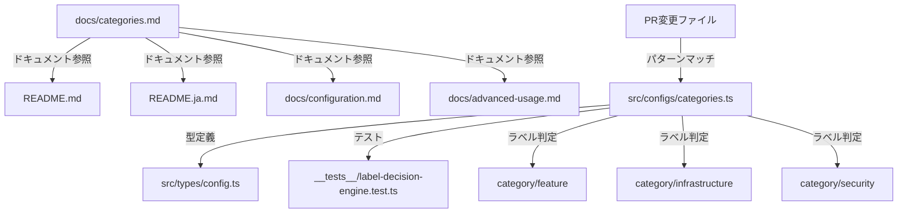
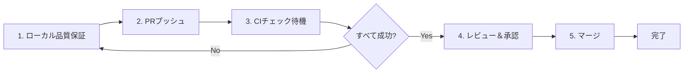

# 技術設計書

## 概要

本機能は、pr-labelerのカテゴリラベル機能を拡張し、情報を一元化したドキュメントを提供する。具体的には、専用ドキュメント`docs/categories.md`を新規作成し、3つの新カテゴリ（`category/feature`, `category/infrastructure`, `category/security`）をデフォルトカテゴリに追加する。

**目的:** ドキュメント利用者と開発者に対して、カテゴリ情報の検索性向上とプロジェクトの分類精度向上を提供する。

**利用者:**
- **ドキュメント利用者**: pr-labelerのユーザーがカテゴリ一覧と詳細説明を参照
- **開発者**: 新カテゴリのパターン定義と型安全性を維持しながらカテゴリを拡張

**影響:**
- 既存6カテゴリの動作には影響なし（加法的な変更）
- ドキュメント構造の改善（README、configuration.mdからの相互参照追加）
- デフォルトカテゴリが6種類→9種類に拡張

### ゴール

- `docs/categories.md`を新規作成し、9種類のカテゴリ情報を一元管理
- 3つの新カテゴリ（feature, infrastructure, security）をデフォルトカテゴリに追加
- 既存ドキュメント（README.md, configuration.md等）からの相互参照を整備
- テストカバレッジ93%以上を維持
- TypeScript型安全性とESLintルール遵守を維持

### 非ゴール

- 既存6カテゴリのパターン定義の変更
- `category/minor`の追加（変更の影響度であり、カテゴリではないため）
- 英語・日本語以外のドキュメント翻訳
- ブランチ名ベースのカテゴリ判定機能の追加（これはactions/labeler@v5の領域）

## アーキテクチャ

### 既存アーキテクチャの分析

pr-labelerは以下のアーキテクチャパターンを採用している：

- **設定の一元管理**: `src/configs/`配下でデフォルト設定を管理
- **型安全性**: TypeScript strict modeと`CategoryConfig`インターフェースによる型定義
- **minimatchパターンマッチング**: ファイルパスパターンの柔軟な判定
- **加法的ラベリングポリシー**: カテゴリラベルは複数同時適用可能

**既存の境界:**
- `src/configs/categories.ts`: カテゴリ定義の単一情報源
- `src/types/config.ts`: 型定義の一元管理
- `__tests__/label-decision-engine.test.ts`: カテゴリ検出ロジックのテスト

**統合ポイント:**
- 既存の`CategoryConfig`型定義を使用（変更なし）
- 既存のminimatchベースのパターンマッチング機構を使用
- 既存のテスト構造に新カテゴリのテストケースを追加

### 高レベルアーキテクチャ



**アーキテクチャ統合:**
- **既存パターンの保持**: 設定ファイルベースのカテゴリ定義、型安全性、minimatchパターンマッチング
- **新コンポーネントの根拠**: `docs/categories.md`はカテゴリ情報の一元化、3つの新カテゴリは汎用性と実用性の向上
- **技術スタックの整合性**: TypeScript、minimatch、Vitest（既存技術の継続使用）
- **ステアリング準拠**: 単一責任原則、型安全性、Railway-Oriented Programming（既存コードは変更しない）

### 技術整合性

本機能は既存の技術スタックを拡張する形で実装される。新規技術やライブラリの追加は不要。

**既存技術スタックとの整合性:**
- **TypeScript**: 既存の`CategoryConfig`型定義を使用
- **minimatch**: 既存のパターンマッチング機構を使用
- **Vitest**: 既存のテストフレームワークに新テストケースを追加
- **markdown-link-check**: 既存のドキュメント品質保証機構を使用

**新規導入する依存関係:**
- なし（既存技術のみで実装可能）

**既存パターンからの逸脱:**
- なし

### 主要な設計決定

#### 決定1: 新カテゴリの選定

**決定**: `category/feature`、`category/infrastructure`、`category/security`の3つを追加

**コンテキスト**: ASTAプロジェクトでの実績と、汎用性の高いカテゴリが必要

**代替案:**
1. **`category/performance`、`category/monitoring`等も追加**: パフォーマンス最適化、監視関連
2. **ASTAのカテゴリをすべて取り込む**: ASTAで使用されているすべてのカテゴリ
3. **最小限の追加（feature, infrastructureのみ）**: セキュリティを除外

**選択したアプローチ**: feature, infrastructure, securityの3つを追加

**根拠:**
- **feature**: 新機能の分類は多くのプロジェクトで有用（ASTAで実績あり）
- **infrastructure**: インフラ変更は影響範囲が大きく、レビュー体制が異なる（ASTAで実績あり）
- **security**: セキュリティは全プロジェクト共通の最重要関心事（ファイルパスで判定可能）

**トレードオフ:**
- **獲得**: 汎用性と実用性のバランスが取れたカテゴリセット、ファイルパスで明確に判定可能
- **犠牲**: performanceやmonitoringはプロジェクト依存が強いため、カスタム設定に委ねる

#### 決定2: ドキュメント構造

**決定**: `docs/categories.md`を新規作成し、相互参照リンクを既存ドキュメントに追加

**コンテキスト**: カテゴリ情報がREADME、configuration.md、advanced-usage.mdに分散しており、専用ページが必要

**代替案:**
1. **README.mdを拡張**: カテゴリセクションを拡大
2. **configuration.mdに統合**: 設定ガイドに統合
3. **新規ファイルを作成**: 独立したドキュメント

**選択したアプローチ**: `docs/categories.md`を新規作成

**根拠:**
- **情報の一元化**: カテゴリに関するすべての情報が一箇所に集約
- **保守性**: 将来のカテゴリ追加・変更時に単一ファイルで対応可能
- **ドキュメント設計**: Size/Complexity/Risk同様のレベルでカテゴリを扱える

**トレードオフ:**
- **獲得**: 情報の検索性向上、保守性向上、ドキュメント体系の改善
- **犠牲**: ファイル数が1つ増加（ただし、ドキュメント体系の改善により相殺）

#### 決定3: テストファイルの除外

**決定**: `category/feature`のパターンに`src/components/**`を含めるが、テストファイル（`**/*.test.*`, `**/*.spec.*`, `**/__tests__/**`）は除外

**コンテキスト**: コンポーネントファイルは新機能として分類したいが、テストファイルは`category/tests`として分類すべき

**代替案:**
1. **除外パターンなし**: すべてのコンポーネントファイルをfeatureとして分類
2. **コンポーネントを含めない**: `src/components/**`をパターンから除外
3. **テストファイルを除外**: excludeパターンを使用

**選択したアプローチ**: excludeパターンを使用してテストファイルを除外

**根拠:**
- **正確な分類**: コンポーネントファイルは新機能、テストファイルはテストとして分類
- **加法的ポリシーの維持**: 複数カテゴリの同時適用を許可（テストファイルは`category/tests`のみ）
- **既存パターンとの整合性**: `category/documentation`も同様にexcludeパターンを使用

**トレードオフ:**
- **獲得**: 正確な分類、既存パターンとの整合性
- **犠牲**: パターン定義がやや複雑化（ただし、既存の`CategoryConfig`型定義でサポート済み）

## コンポーネントとインターフェース

### ドキュメント層

#### docs/categories.md

**責任と境界:**
- **主要責任**: カテゴリ情報の一元管理（カテゴリ一覧、詳細説明、カスタマイズ方法）
- **ドメイン境界**: ドキュメント領域
- **データ所有権**: カテゴリの説明文、パターン例、YAML設定例
- **トランザクション境界**: N/A（静的ドキュメント）

**依存関係:**
- **インバウンド**: README.md、README.ja.md、docs/configuration.md、docs/advanced-usage.md（相互参照リンク）
- **アウトバウンド**: なし
- **外部**: なし

**契約定義:**

**ドキュメント構造:**

| セクション | 内容 | 形式 |
|----------|------|------|
| 概要 | カテゴリラベルとは | 説明文 |
| デフォルトカテゴリ一覧 | 9種類のカテゴリ | テーブル（ラベル名、説明、パターン、日本語名） |
| 各カテゴリの詳細説明 | 検出対象、パターン、用途、適用例 | セクション別の説明文 |
| カスタムカテゴリの作成方法 | .github/pr-labeler.yml | YAMLコード例 |
| 複数カテゴリ適用時の動作 | 加法的ポリシーの説明 | 説明文 |

**事前条件:**
- カテゴリ一覧が正確であること
- パターン例が`src/configs/categories.ts`と一致すること

**事後条件:**
- ユーザーがカテゴリ情報を理解できること
- カスタムカテゴリの作成方法を理解できること

**不変条件:**
- マークダウン記法が正しいこと
- すべてのリンクが有効であること

### 設定層

#### src/configs/categories.ts

**責任と境界:**
- **主要責任**: デフォルトカテゴリ定義の一元管理
- **ドメイン境界**: 設定領域
- **データ所有権**: `DEFAULT_CATEGORIES`配列
- **トランザクション境界**: N/A（静的設定）

**依存関係:**
- **インバウンド**: `src/label-decision-engine.ts`（カテゴリ判定ロジック）
- **アウトバウンド**: `src/types/config.ts`（`CategoryConfig`型定義）
- **外部**: minimatch（パターンマッチング）

**契約定義:**

**サービスインターフェース:**

```typescript
// エクスポートされる定数
export const DEFAULT_CATEGORIES: CategoryConfig[] = [
  // 既存6カテゴリ + 新規3カテゴリ
];
```

**事前条件:**
- すべてのカテゴリが`CategoryConfig`型に準拠すること
- パターンがminimatch形式であること

**事後条件:**
- カテゴリ定義が`label-decision-engine.ts`で使用可能であること

**不変条件:**
- `CategoryConfig[]`型を維持すること
- 既存6カテゴリの定義を変更しないこと

**統合戦略:**
- **変更アプローチ**: 拡張（既存配列に新カテゴリを追加）
- **後方互換性**: 既存6カテゴリの動作を維持
- **移行パス**: N/A（加法的な変更のため移行不要）

#### 新規カテゴリ定義

**category/feature:**

```typescript
{
  label: 'category/feature',
  patterns: [
    'src/features/**',
    'features/**',
    'src/components/**'
  ],
  exclude: [
    '**/*.test.*',
    '**/*.spec.*',
    '**/__tests__/**'
  ],
  display_name: {
    en: 'Feature',
    ja: '新機能'
  }
}
```

**category/infrastructure:**

```typescript
{
  label: 'category/infrastructure',
  patterns: [
    '.github/**',
    'Dockerfile*',
    'docker-compose*',
    'terraform/**',
    '.mise.toml',
    'mise.toml',
    '.tool-versions',
    'k8s/**',
    'kubernetes/**',
    'helm/**',
    'ansible/**'
  ],
  display_name: {
    en: 'Infrastructure',
    ja: 'インフラ'
  }
}
```

**category/security:**

```typescript
{
  label: 'category/security',
  patterns: [
    '**/auth*/**',
    '**/*auth*.ts',
    '**/*auth*.js',
    '**/*jwt*.ts',
    '**/*session*.ts',
    '**/*security*',
    '.env*',
    'secrets/**'
  ],
  display_name: {
    en: 'Security',
    ja: 'セキュリティ'
  }
}
```

### ドキュメント相互参照層

#### README.md / README.ja.md

**責任と境界:**
- **主要責任**: プロジェクトの概要とクイックリファレンスを提供
- **ドメイン境界**: ドキュメント領域
- **データ所有権**: カテゴリラベルセクション（L115-126付近）
- **トランザクション境界**: N/A（静的ドキュメント）

**統合戦略:**
- **変更アプローチ**: カテゴリラベルセクションに`docs/categories.md`への相互参照リンクを追加
- **後方互換性**: 既存の記述を維持し、リンクを追加
- **移行パス**: N/A（加法的な変更）

**契約定義:**

```markdown
詳細は[カテゴリガイド](docs/categories.md)を参照してください。
```

#### docs/configuration.md

**責任と境界:**
- **主要責任**: pr-labelerの設定方法を詳細に説明
- **ドメイン境界**: ドキュメント領域
- **データ所有権**: カテゴリ設定セクション（L358付近）
- **トランザクション境界**: N/A（静的ドキュメント）

**統合戦略:**
- **変更アプローチ**: カテゴリ設定セクションに`docs/categories.md`への相互参照リンクを追加
- **後方互換性**: 既存の設定例を維持し、リンクを追加
- **移行パス**: N/A（加法的な変更）

#### docs/advanced-usage.md

**責任と境界:**
- **主要責任**: pr-labelerの高度な使用方法を説明
- **ドメイン境界**: ドキュメント領域
- **データ所有権**: カスタムカテゴリセクション（L320付近）
- **トランザクション境界**: N/A（静的ドキュメント）

**統合戦略:**
- **変更アプローチ**: カスタムカテゴリセクションに`docs/categories.md`への相互参照リンクを追加
- **後方互換性**: 既存のカスタムカテゴリ例を維持し、リンクを追加
- **移行パス**: N/A（加法的な変更）

## データモデル

### ドメインモデル

本機能は既存のデータモデル（`CategoryConfig`）を使用し、新規データモデルは不要。

**既存エンティティ:**

```typescript
// src/types/config.ts
export interface CategoryConfig {
  label: string;          // ラベル名（例: "category/tests"）
  patterns: string[];     // minimatchパターン（例: ["__tests__/**"]）
  exclude?: string[];     // 除外パターン（例: [".kiro/**"]）
  display_name?: DisplayName; // 多言語表示名（オプション）
}

export interface DisplayName {
  en: string;  // 英語表示名
  ja: string;  // 日本語表示名
}
```

**ビジネスルールと不変条件:**
- `label`はユニークであること（`category/*`形式）
- `patterns`は少なくとも1つのパターンを含むこと
- `patterns`と`exclude`はminimatch形式であること
- `display_name`が存在する場合、`en`と`ja`の両方が存在すること

**整合性検証:**
- TypeScriptコンパイラによる型チェック
- ESLintによるコード品質チェック
- Vitestによるランタイム検証

## エラーハンドリング

### エラー戦略

本機能は既存のエラーハンドリング機構を使用する。新規のエラー処理は不要。

**既存エラー処理パターン:**
- Railway-Oriented Programming（`Result<T, E>`型）
- neverthrowライブラリによる明示的なエラーハンドリング

**想定されるエラーシナリオ:**

1. **TypeScript型エラー**
   - **発生条件**: `CategoryConfig`型に準拠しないカテゴリ定義
   - **対応**: TypeScriptコンパイラがビルド時に検出（型チェック）
   - **回復**: コンパイルエラーを修正

2. **ESLintエラー**
   - **発生条件**: コーディング規約違反（未使用変数、any型使用等）
   - **対応**: ESLintが検出（`pnpm lint`）
   - **回復**: ESLintエラーを修正

3. **ドキュメントリンク切れ**
   - **発生条件**: `docs/categories.md`への相互参照リンクが無効
   - **対応**: markdown-link-checkが検出（CIパイプライン）
   - **回復**: リンクパスを修正

### エラーカテゴリと対応

**ユーザーエラー（設定ミス）:**
- **カスタムカテゴリの設定ミス**: `.github/pr-labeler.yml`の設定エラー
- **対応**: YAML設定読み込み時に既存のバリデーション機構でエラー検出

**システムエラー:**
- **minimatchパターンマッチングエラー**: パターンが不正
- **対応**: 既存のパターンマッチング機構でエラー検出

**ビジネスロジックエラー:**
- **カテゴリ定義の重複**: 同じラベル名が複数定義される
- **対応**: TypeScript型チェックとESLintで検出

### モニタリング

**既存モニタリング機構を使用:**
- GitHub Actions CIによる品質チェック
  - `pnpm lint`: ESLintチェック
  - `pnpm type-check`: TypeScript型チェック
  - `pnpm test`: Vitestテスト実行
  - `pnpm build`: ビルド成功確認
- Documentation Qualityチェック
  - markdown-link-check: ドキュメントリンク検証

## テスト戦略

### ユニットテスト

**対象: カテゴリ検出ロジック（`__tests__/label-decision-engine.test.ts`）**

**テストケース:**

1. **category/feature検出テスト**
   - `src/features/auth.ts` → `category/feature`を適用
   - `src/components/Button.tsx` → `category/feature`を適用
   - `src/components/Button.test.tsx` → `category/tests`を適用（`category/feature`は適用しない）

2. **category/infrastructure検出テスト**
   - `.github/workflows/ci.yml` → `category/infrastructure`を適用
   - `Dockerfile` → `category/infrastructure`を適用
   - `terraform/main.tf` → `category/infrastructure`を適用
   - `k8s/deployment.yaml` → `category/infrastructure`を適用

3. **category/security検出テスト**
   - `src/lib/auth/middleware.ts` → `category/security`を適用
   - `src/utils/jwt.ts` → `category/security`を適用
   - `.env.local` → `category/security`を適用
   - `secrets/api-keys.json` → `category/security`を適用

4. **minimatchパターンマッチング検証テスト**
   - Globパターン（`**/*`）の動作確認
   - excludeパターンの動作確認

**テスト実装例:**

```typescript
describe('Category detection - new categories', () => {
  describe('category/feature', () => {
    it('should apply category/feature to feature files', () => {
      const files = ['src/features/auth.ts', 'src/components/Button.tsx'];
      const categories = decideCategoryLabels(files, DEFAULT_CATEGORIES);
      expect(categories).toContain('category/feature');
    });

    it('should not apply category/feature to test files', () => {
      const files = ['src/components/Button.test.tsx'];
      const categories = decideCategoryLabels(files, DEFAULT_CATEGORIES);
      expect(categories).not.toContain('category/feature');
      expect(categories).toContain('category/tests');
    });
  });

  describe('category/infrastructure', () => {
    it('should apply category/infrastructure to infra files', () => {
      const files = ['.github/workflows/ci.yml', 'Dockerfile', 'terraform/main.tf', 'k8s/deployment.yaml'];
      const categories = decideCategoryLabels(files, DEFAULT_CATEGORIES);
      expect(categories).toContain('category/infrastructure');
    });
  });

  describe('category/security', () => {
    it('should apply category/security to security-related files', () => {
      const files = ['src/lib/auth/middleware.ts', 'src/utils/jwt.ts', '.env.local', 'secrets/api-keys.json'];
      const categories = decideCategoryLabels(files, DEFAULT_CATEGORIES);
      expect(categories).toContain('category/security');
    });
  });
});
```

### 統合テスト

**対象: エンドツーエンドのカテゴリラベリングフロー**

**テストケース:**

1. **複数カテゴリの同時適用テスト**
   - PRに`src/features/auth.ts`と`Dockerfile`が含まれる
   - 期待結果: `category/feature`と`category/infrastructure`が同時に適用される

2. **既存カテゴリとの併用テスト**
   - PRに`src/features/auth.ts`と`__tests__/auth.test.ts`が含まれる
   - 期待結果: `category/feature`と`category/tests`が同時に適用される

3. **excludeパターンの動作確認テスト**
   - PRに`src/components/Button.tsx`と`src/components/Button.test.tsx`が含まれる
   - 期待結果: `src/components/Button.tsx`に`category/feature`、`src/components/Button.test.tsx`に`category/tests`が適用される

### ドキュメント品質テスト

**対象: docs/categories.md およびドキュメント相互参照**

**テストケース:**

1. **リンク検証テスト**
   - markdown-link-checkによる全リンクの検証
   - 期待結果: すべてのリンクが有効

2. **マークダウン記法検証テスト**
   - マークダウンリンターによる記法チェック
   - 期待結果: GitHub Flavored Markdown（GFM）に準拠

3. **相互参照リンク検証テスト**
   - README.md、README.ja.md、configuration.md、advanced-usage.mdからの`docs/categories.md`へのリンク
   - 期待結果: すべてのリンクが正確

### カバレッジ目標

- **テストカバレッジ**: 93%以上を維持
- **型カバレッジ**: 100%（TypeScript strict mode）
- **リンターカバレッジ**: 違反0件

## セキュリティ考慮事項

### category/securityの設計上の注意

**脅威モデリング:**
- **脅威**: セキュリティ関連ファイルの変更が見落とされる
- **対策**: `category/security`ラベルを適用し、レビュアーに注意を促す

**セキュリティコントロール:**
- **パターンマッチング**: ファイルパスベースで認証・JWT・セッション・環境変数ファイルを検出
- **誤検知の最小化**: `**/auth*/**`、`**/*jwt*.ts`などの明確なパターンを使用

**コンプライアンス:**
- セキュリティ関連ファイルの変更履歴をGitHubラベルで追跡可能
- セキュリティレビューの優先度付けが容易

### データ保護

本機能はファイルパスのみを使用し、ファイルの内容やセンシティブ情報にはアクセスしない。

## パフォーマンスとスケーラビリティ

### ターゲットメトリクス

**既存パフォーマンスを維持:**
- カテゴリ判定処理時間: 既存6カテゴリと同等（追加3カテゴリでの増加は無視できるレベル）
- メモリ使用量: 既存と同等（カテゴリ定義が3つ増加するが、影響は最小限）

### スケーリングアプローチ

**水平スケーリング:**
- GitHub Actions Runnerのスケーリング（既存の仕組みを使用）

**垂直スケーリング:**
- 不要（カテゴリ判定はCPU・メモリ負荷が低い）

### キャッシング戦略

不要（カテゴリ定義は静的、パターンマッチングは軽量）

## 移行戦略

本機能は加法的な変更のため、移行戦略は不要。

**デプロイメントプロセス:**



**フェーズ:**

1. **Phase 1: ローカル品質保証**
   - `pnpm lint && pnpm type-check && pnpm test && pnpm build`
   - すべてのチェックが成功することを確認

2. **Phase 2: PRプッシュとCIチェック**
   - フィーチャーブランチにプッシュ
   - PRを作成
   - GitHub Actions CIチェックの完了を待機
   - すべてのCIチェック（Code Quality, Integration Tests, Documentation Quality等）が成功することを確認

3. **Phase 3: レビュー＆承認**
   - レビュアーによる承認を取得

4. **Phase 4: マージ**
   - mainブランチにマージ（squash推奨）
   - 既存6カテゴリの動作は影響を受けない（加法的な変更）
   - 新カテゴリは即座に利用可能

**ロールバックトリガー:**
- 型エラー発生
- テストカバレッジ93%未満
- CIチェック失敗

**検証チェックポイント:**
- TypeScript型チェック: エラー0件
- ESLint: 違反0件
- Vitest: テストカバレッジ93%以上
- markdown-link-check: リンク切れ0件
