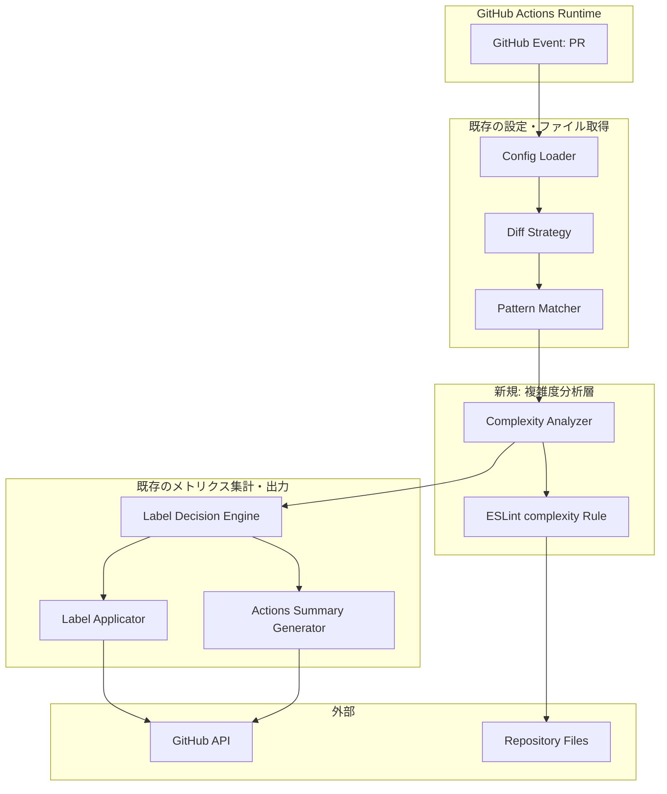
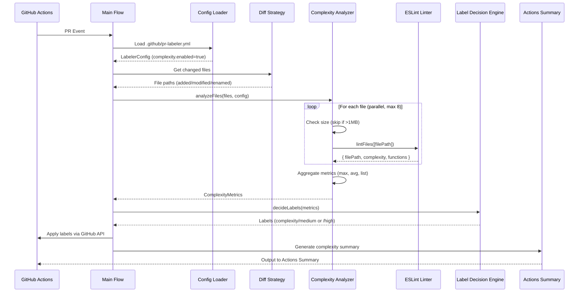
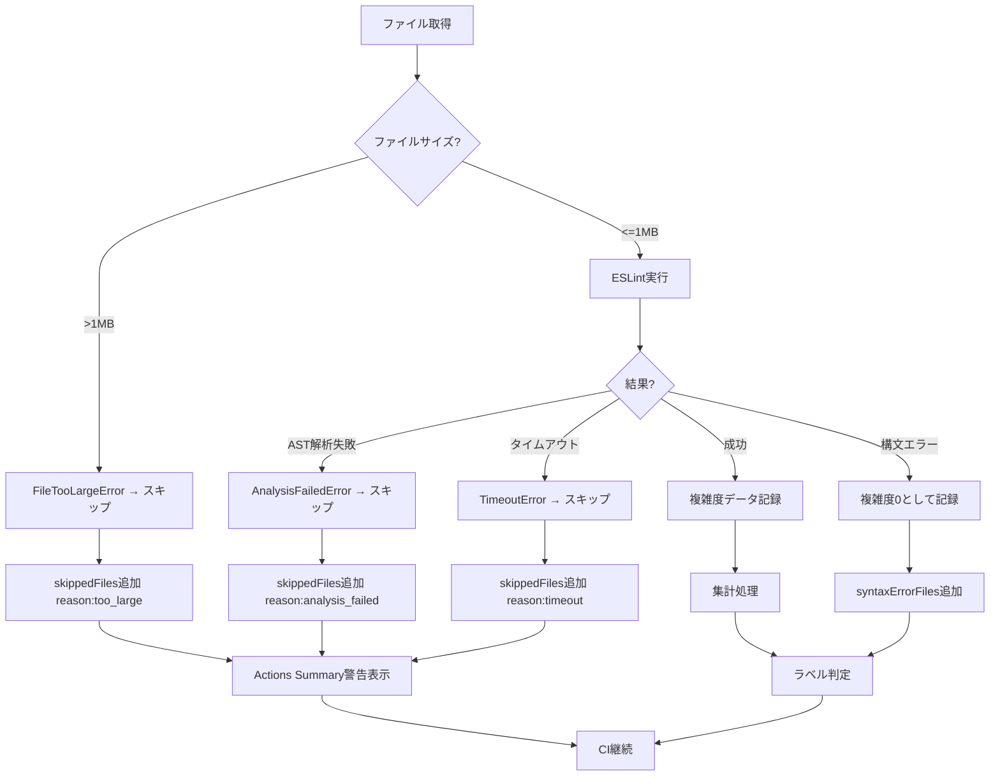

# 技術設計書: コード複雑度分析

## 概要

コード複雑度分析機能は、PR内の変更ファイルに対してESLint標準のcomplexityルールを統合し、循環的複雑度（Cyclomatic Complexity）を自動計算する拡張機能である。既存のPR Labeler機能のバックエンドとして動作し、複雑度メトリクスの計算からGitHub Actions Summary出力までを提供する。

**目的**: PR変更ファイルの複雑度を定量的に評価し、複雑なコードを早期検知して保守性向上とレビュープロセス効率化を実現する。

**ユーザー**: 開発者、テックリード、品質保証担当者は、PRレビュー、リファクタリング判断、品質管理のワークフローでこれを利用する。

**影響**: 既存のPR Labelerアーキテクチャに新しい複雑度計算層（Complexity Analyzer）を追加する拡張であり、既存のメトリクス計算フロー、ラベル判定エンジン、Actions Summary生成を活用する。

### ゴール

- ESLint標準complexityルールを使用した循環的複雑度の正確な計算
- ファイル単位および関数単位の複雑度データ収集
- PR全体の複雑度集計（最大値、平均値、高複雑度ファイルリスト）
- GitHub Actions Summaryでの詳細レポート出力
- 並列処理による大規模PR対応（100ファイル5秒以内目標）

### 非ゴール

- 他の複雑度メトリクス（Halstead指標、認知的複雑度）のサポート（将来拡張）
- 差分ベースの複雑度計算（変更行のみ対象）
- 増分複雑度の可視化（before/after比較）
- 複雑度に基づくCI失敗条件の設定

## アーキテクチャ

### 既存アーキテクチャ分析

本機能はPR Labelerの拡張として設計され、以下の既存パターンとドメイン境界を継承する：

**継承する既存パターン**:

- **Railway-Oriented Programming**: neverthrowの`Result<T, E>`型による型安全なエラーハンドリング
- **単一責任原則**: 複雑度計算、集計、出力の明確な責務分離
- **依存性注入**: ESLint、GitHub APIクライアント、設定を引数で渡すテスタブルな設計
- **Pure Functions優先**: 複雑度計算ロジックは純粋関数、副作用はI/O層で分離

**既存のドメイン境界**:

- **メトリクス計算層**: file-metrics.ts、diff-strategy.tsを再利用してファイルリスト取得
- **パターンマッチング層**: pattern-matcher.tsで除外パターン適用
- **設定管理層**: config-loader.tsでcomplexity設定を読み込み
- **GitHub API統合層**: label-decision-engine.ts、label-applicator.tsでラベル付与
- **出力生成層**: actions-io.tsでGitHub Actions Summary出力

**新規追加のドメイン境界**:

- **複雑度分析層**: 新規モジュール`complexity-analyzer.ts`で循環的複雑度計算を実装

**GitHub API統合の権限要件**:

複雑度メトリクスに基づくラベル付与は、既存のPR Labeler機能と同じGitHub API権限を必要とする：

- **必要なPermissions**: `issues: write`または`pull-requests: write`
  - PRラベルの追加・削除には`issues: write`権限が必須
  - GitHub Actionsワークフローの`permissions`セクションで明示的に付与
- **レート制限対策**: GitHub API v3のレート制限（5000リクエスト/時）を考慮
  - ラベル操作失敗時は指数バックオフで3回までリトライ（1秒 → 2秒 → 4秒）
  - `X-RateLimit-Remaining`ヘッダーで残量を監視し、枯渇時は警告ログ出力
- **エラーハンドリング**: 権限不足時（403 Forbidden）は明確なエラーメッセージでCI失敗
  - 「GitHub Actions Permissions不足: `issues: write`権限を付与してください」

### ハイレベルアーキテクチャ



**アーキテクチャ統合の理由**:

- **既存フロー活用**: PR Labelerの設定読み込み → ファイル取得 → メトリクス計算 → ラベル付与 → Summary出力のフローに複雑度計算を挿入
- **最小限の変更**: 新規モジュールは`complexity-analyzer.ts`のみ追加、既存モジュールの変更は型定義拡張（PRMetrics.complexity）のみ
- **既存テスト資産**: pattern-matcher、config-loaderのテストケースを再利用

### 技術スタック整合性

本機能は既存のpr-metrics-actionの技術スタックに完全に整合する拡張である。

**既存技術の継続利用**:

- **言語・ランタイム**: TypeScript 5.9.3 (strict mode)、Node.js 20+
- **エラーハンドリング**: neverthrow 8.2.0 (Railway-Oriented Programming)
- **パターンマッチング**: minimatch 10.0.3（除外パターン適用）
- **GitHub Actions SDK**: @actions/core 1.11.1、@actions/github 6.0.1
- **ビルド**: @vercel/ncc（単一ファイルバンドル）
- **テスト**: Vitest 3.2.4、@vitest/coverage-v8
- **品質管理**: ESLint 9、Prettier 3.6.2、typescript-eslint 8.46.1

**新規導入ライブラリ**: p-limit、@typescript-eslint/parser（ESLintは既存依存）

**実装詳細**:

- **実装ファイル**: `src/complexity-analyzer.ts`
- **複雑度計算**: ESLint標準`complexity`ルールを使用
  - complexityルールを閾値0で有効化し、全関数の複雑度を報告
  - `@typescript-eslint/parser`でTypeScript/TSX完全サポート
  - 結果はLintMessage配列として取得、正規表現でパース
- **メッセージフォーマット**: `"Function 'functionName' has a complexity of N."`
  - 正規表現: `/Function ["']([^"']+)["'] has a complexity of (\d+)\b/i`
  - 関数名、複雑度、行番号を抽出
- **戻り値変換**: `Linter.LintMessage[]` → `FileComplexity`
- **エラー検出**: `message.fatal === true`で構文エラー判定
- **型安全性**: @types/eslintで完全な型定義あり

**p-limit実装詳細**:

- **バージョン**: v7.2.0（最新ESM版）
- **公式ドキュメント**: <https://github.com/sindresorhus/p-limit>
- **実装方法**: Dynamic import（`await import('p-limit')`）でESMモジュールを読み込み
  - CommonJSプロジェクトでもESMモジュールを使用可能
  - `src/complexity-analyzer.ts:259` で実装
- **並列度制御**: `pLimit(8)` → 最大8並列
- **主要API**: `limit(() => promise)` → Promise
- **軽量**: 依存なし、軽量（数KB）、TypeScript型定義付き
- **実績**: 広く使用されている（週次ダウンロード数3000万以上）

**@typescript-eslint/parser**:

- **バージョン**: v8.46.1（既存typescript-eslintと同バージョン）
- **用途**: ESLint実行時にTypeScript/TSXファイルをパース
- **実装**: Dynamic import（`await import('@typescript-eslint/parser')`）
  - `src/complexity-analyzer.ts:72`
- **設定**: `parserOptions.tsconfigRootDir`でtsconfig.json解決（存在する場合のみ）

**tsconfig.json解決のフォールバック（レビュー反映）**:

- **tsconfig.jsonが見つからない場合**: `ecmaVersion: 'latest'`, `sourceType: 'module'` を既定設定として使用
- **警告ログ出力**: `@actions/core`の`warning()`で「tsconfig.json not found. Using default parser options.」を出力
- **Summary注記**: 複雑度サマリーに「⚠️ tsconfig.jsonが見つからなかったため、既定の設定を使用しました」を追加
- **性能優先**: `project`オプションは無効化（型チェック不要、AST解析のみ）

**実装段階で要調査事項**:

- 大規模PR（100ファイル以上）でのメモリ使用量とGCプレッシャー
- ESLint Linterインスタンスの並列実行時の安全性（p-limit並列実行時の状態管理）

### 重要な設計判断

#### 判断1: ESLint APIの直接統合 vs ラッパー層

**決定**: ESLint APIを直接統合せず、`ComplexityAnalyzer`ラッパークラスで抽象化する

**コンテキスト**: ESLint APIは将来変更される可能性があり、テストでのモック化も必要

**代替案**:

1. ESLint Linterを直接呼び出す（シンプルだが疎結合性が低い）
2. ラッパークラスで抽象化（抽象化レイヤー追加）
3. 独自の複雑度計算実装（メンテナンスコスト高）

**選択したアプローチ**: ラッパークラス`ComplexityAnalyzer`を実装

```typescript
interface ComplexityAnalyzer {
  analyzeFile(filePath: string, options: AnalysisOptions): ResultAsync<FileComplexity, ComplexityError>;
  analyzeFiles(filePaths: string[], options: AnalysisOptions): ResultAsync<ComplexityMetrics, ComplexityError>;
}
```

**理論的根拠**:

- ESLint設定変更に対する耐性（設定を一箇所に集約）
- テスト時のモック差し替えが容易
- 将来の他のメトリクス追加時に統一インタフェース提供

**トレードオフ**:

- **獲得**: API変更耐性、テスタビリティ、将来の拡張性
- **犠牲**: 薄い抽象化レイヤーのオーバーヘッド（パフォーマンス影響は微小）

#### 判断2: 並列処理の実装方式

**決定**: p-limitライブラリによる並列度制御、Worker Threadsは不使用

**コンテキスト**: 大規模PRで100ファイルを5秒以内に処理する必要がある

**代替案**:

1. 逐次処理（シンプルだがパフォーマンス不足）
2. Promise.allSettledのチャンク分割（並列度制御が不正確）
3. p-limitライブラリ（並列度を正確に制御）
4. Worker Threads（真の並列だがオーバーヘッド大）

**選択したアプローチ**: p-limitライブラリで並列度制御（既定8並列、最大8並列）

**実装方法: p-limitライブラリを使用した並列度制御**

```typescript
import pLimit from 'p-limit';

/**
 * p-limitライブラリを使用した並列度制御
 * 一定の併発数を維持し、完了次第次のタスクを開始することでスループットを最大化
 *
 * @param filePaths - 分析対象ファイルパスのリスト
 * @param options - 並列度等のオプション（デフォルト: concurrency=8）
 * @returns 各ファイルの解析結果（成功/失敗）
 */
async function analyzeFilesWithLimit(
  filePaths: string[],
  options: AnalysisOptions
): Promise<PromiseSettledResult<FileComplexity>[]> {
  // 並列度制限を作成（デフォルト8、最大8）
  const concurrency = Math.min(options.concurrency ?? 8, 8);
  const limit = pLimit(concurrency);

  // 各ファイルの解析をlimitでラップ
  const promises = filePaths.map(filePath =>
    limit(() => complexityAnalyzer.analyzeFile(filePath, options))
  );

  // Promise.allSettledで全ファイルの解析完了を待機
  return Promise.allSettled(promises);
}
```

**理論的根拠**:

- ESLint分析はCPU集約的だがI/Oも発生するため、Promise並列で十分
- Worker Threadsは起動コストが高く、GitHub Actionsランナー（2コア）では効果薄
- p-limitライブラリは並列度を正確に制御し、メモリ消費を抑制
- 既定値8並列はGitHub Actions 2コアCPU × I/O待ち時間を考慮した最適値

**トレードオフ**:

- **獲得**: 正確な並列度制御、メモリ効率、GitHubランナーとの相性、シンプルなAPI
- **犠牲**: 外部ライブラリ依存（ただしp-limitは軽量で広く使用されている）

#### 判断3: 大容量ファイルのスキップ戦略

**決定**: 1MB超のファイルは事前スキップ、構文エラーは0扱い、AST解析失敗はスキップ

**コンテキスト**: 大容量ファイルや生成コードで解析が遅延またはクラッシュするリスク

**代替案**:

1. すべてのファイルを解析試行（クラッシュリスク）
2. タイムアウトでスキップ（時間浪費）
3. サイズでの事前スキップ（解析前に判断）

**選択したアプローチ**: `fs.stat`による事前サイズチェック + エラー分類

```typescript
/**
 * ファイル解析の前処理: サイズチェック
 * fs.statで事前判定し、巨大ファイルは読み込まずにスキップ
 */
async function analyzeFile(filePath: string): ResultAsync<FileComplexity, ComplexityError> {
  // fs.statでファイルサイズを取得（ファイル読み込み前）
  let stats;
  try {
    stats = await fs.promises.stat(filePath);
  } catch (error) {
    return err(new AnalysisFailedError(filePath, error as Error));
  }

  // サイズ上限チェック（1MB = 1024 * 1024バイト）
  const maxFileSize = 1024 * 1024; // AnalysisOptions.maxFileSizeから取得
  if (stats.size > maxFileSize) {
    return err(new FileTooLargeError(filePath, stats.size, maxFileSize));
  }

  // ファイル内容を読み込み（サイズチェック済み）
  let content;
  try {
    content = await fs.promises.readFile(filePath, 'utf-8');
  } catch (error) {
    return err(new AnalysisFailedError(filePath, error as Error));
  }

  // ESLint complexityルールで複雑度を計算
  const linter = new Linter();
  const config = createESLintConfig(parserOptions);
  try {
    const results = await linter.lintText(content, { filePath });
    return ok(convertESLintResult(results[0]));
  } catch (error) {
    if (isSyntaxError(error)) {
      // 構文エラー→複雑度0として扱う
      return ok({ path: filePath, complexity: 0, functions: [], analysisTime: 0 });
    }
    // AST解析失敗→スキップ
    return err(new AnalysisFailedError(filePath, error as Error));
  }
}
```

**理論的根拠**:

- 1MBは99.9%のTypeScript/JavaScriptファイルをカバー
- 構文エラーファイルも統計に含める（リファクタリング対象として可視化）
- AST解析失敗は予期しないケースのみ（エラーログで通知）

**トレードオフ**:

- **獲得**: 安定性、予測可能な実行時間、透明なエラー処理
- **犠牲**: 極稀に1MB超の正常ファイルがスキップされる（Summary警告で通知）

## システムフロー

### 複雑度分析のシーケンス



### エラーハンドリングフロー

**失敗時の基本方針**:

1. **構文エラー（SyntaxError）**: 複雑度0として記録し、集計対象に含む。`syntaxErrorFiles`リストに追加し、Summary警告表示
2. **AST解析失敗（ParseError）**: スキップし、集計対象外。`skippedFiles`リストに追加（reason: 'analysis_failed'）、Summary警告表示
3. **ファイルサイズ超過**: スキップし、集計対象外。`skippedFiles`リストに追加（reason: 'too_large'）、Summary警告表示
4. **タイムアウト**: スキップし、集計対象外。`skippedFiles`リストに追加（reason: 'timeout'）、Summary警告表示
5. **バイナリファイル**: スキップし、集計対象外。`skippedFiles`リストに追加（reason: 'binary'）、Summary警告表示
6. **エンコーディングエラー**: スキップし、集計対象外。`skippedFiles`リストに追加（reason: 'encoding_error'）、Summary警告表示

**全体失敗の扱い**: 一部ファイルの失敗では全体を失敗させず、CI継続。`runtime.fail_on_error=true`の場合のみCI失敗。



## 要件トレーサビリティ

| 要件     | 概要                | コンポーネント               | インタフェース                     | フロー         |
| -------- | ------------------- | ---------------------------- | ---------------------------------- | -------------- |
| 1.1-1.13 | 循環的複雑度計算    | ComplexityAnalyzer           | analyzeFile()                      | シーケンス図   |
| 2.1-2.9  | PR全体の集計        | ComplexityAnalyzer           | analyzeFiles(), aggregateMetrics() | シーケンス図   |
| 3.1-3.8  | 設定ベース制御      | Config Loader (既存)         | loadConfig()                       | -              |
| 4.1-4.9  | PR Labeler統合      | Label Decision Engine (既存) | decideComplexityLabel()            | シーケンス図   |
| 5.1-5.12 | Actions Summary出力 | Actions Summary Generator    | generateComplexitySummary()        | シーケンス図   |
| 6.1-6.12 | エラーハンドリング  | すべてのコンポーネント       | Result<T, E>                       | エラーフロー図 |
| 7.1-7.5  | 後方互換性          | Config Loader (既存)         | enable_complexity_analysis入力     | -              |
| 8.1-8.6  | テスト方針          | テスト層                     | Vitest統合テスト                   | -              |

## コンポーネントとインタフェース

### 複雑度分析層

#### ComplexityAnalyzer

**責務と境界**

- **主要責務**: PR内のTypeScript/JavaScriptファイルの循環的複雑度を計算し、集計する
- **ドメイン境界**: 複雑度計算のビジネスロジック層（純粋関数中心）
- **データ所有**: 一時的な複雑度計算結果（永続化なし）
- **トランザクション境界**: 単一ファイルごとの複雑度計算は独立

**依存関係**

- **インバウンド**: Main Flow (index.ts)から呼び出される
- **アウトバウンド**: ESLint Linter（既存依存）、fs（Node.js標準）
- **外部**: ESLint、@typescript-eslint/parser

**ESLintの外部依存性調査**:

- **バージョン互換性**: ESLint標準complexityルール、eslint 8.x/9.x系、@typescript-eslint/parser 8.x系をサポート
- **API署名**: `new Linter(options)` → `lintFiles(patterns)` → `Promise<Report[]>`
- **認証**: 不要（ローカルファイル解析）
- **レート制限**: なし（ローカル処理）
- **エラーパターン**: 構文エラー（SyntaxError）、AST解析失敗（ParseError）、メモリ不足（OutOfMemoryError）
- **パフォーマンス**: TypeScript AST解析で100-500ms/ファイル（GitHub Actions 2コアCPU基準）
- **設定要件**: `parserOptions.ecmaVersion: 'latest'`、`sourceType: 'module'`、`tsconfigRootDir`必須
- **既知の問題**: tsconfig.jsonが巨大な場合にメモリ消費増加、projectオプション有効時は型チェックで遅延
- **実装時の注意**: `project`オプションは性能優先で無効化、型情報不要な複雑度計算のみ実行

**契約定義**

```typescript
/**
 * 複雑度分析サービスインタフェース
 *
 * I/O層の設計方針:
 * - analyzeFileは内部でfs.stat、fs.readFileを実行（ESLintがファイルパスを前提とするため）
 * - サイズチェックは内部で実施し、巨大ファイルは読み込まずにスキップ
 * - この設計によりESLint API（ファイルパス渡し）と整合性を保つ
 */
interface ComplexityAnalyzerService {
  /**
   * 単一ファイルの複雑度を計算
   * @param filePath - リポジトリルートからの相対パス
   * @param options - 解析オプション（maxFileSize等）
   * @returns 複雑度計算結果またはエラー
   *
   * 事前条件: filePathが有効なTypeScript/JavaScriptファイル
   * 事後条件: 成功時はFileComplexityを返却、失敗時はComplexityErrorを返却
   * 不変条件: ファイルサイズが1MB以下（超過時はFileTooLargeError）、構文エラーの場合は複雑度0を返却
   * I/O層: この関数内でfs.stat、fs.readFileを実行
   */
  analyzeFile(filePath: string, options: AnalysisOptions): ResultAsync<FileComplexity, ComplexityError>;

  /**
   * 複数ファイルの複雑度を並列計算し、集計
   * @param filePaths - 分析対象ファイルパスのリスト
   * @param options - 並列度、タイムアウト等のオプション
   * @returns PR全体の複雑度メトリクスまたはエラー
   *
   * 事前条件: filePathsが空でない、各ファイルが有効なTypeScript/JavaScript
   * 事後条件: 成功時はComplexityMetrics（max, avg, files）を返却
   * 不変条件: 並列度は2-8、タイムアウトは60秒、構文エラーファイルは複雑度0として集計対象
   */
  analyzeFiles(filePaths: string[], options: AnalysisOptions): ResultAsync<ComplexityMetrics, ComplexityError>;
}

/**
 * 分析オプション（レビュー反映: 設定キー追加）
 *
 * config-loaderで以下の設定キーから安全にマージされる：
 * - complexity.concurrency: 並列度（任意、デフォルト: 8）
 * - complexity.timeout_ms: 全体タイムアウト（任意、デフォルト: 60000）
 * - complexity.file_timeout_ms: 個別ファイルタイムアウト（任意、デフォルト: 5000）
 * - complexity.max_file_size_bytes: 最大ファイルサイズ（任意、デフォルト: 1048576 = 1MB）
 */
interface AnalysisOptions {
  concurrency: number;         // 並列度（2-8、デフォルト: 8、最大: 8）
  timeout: number;             // 全体タイムアウト（秒、デフォルト: 60）
  fileTimeout: number;         // 個別ファイルタイムアウト（秒、デフォルト: 5）
  maxFileSize: number;         // 最大ファイルサイズ（バイト、デフォルト: 1MB = 1048576）
  parserOptions: ParserOptions; // ESLint parserOptions
}

/**
 * ファイル複雑度結果
 */
interface FileComplexity {
  path: string;
  complexity: number;              // ファイル全体の複雑度（関数複雑度の合計）
  functions: FunctionComplexity[]; // 関数ごとの複雑度
  analysisTime: number;            // 解析時間（ミリ秒）
}

/**
 * PR全体の複雑度メトリクス（要件2.9のインタフェース準拠）
 */
interface ComplexityMetrics {
  maxComplexity: number;           // PR全体の最大複雑度
  avgComplexity: number;           // PR全体の平均複雑度（小数第1位）
  analyzedFiles: number;           // 複雑度計算対象ファイル数
  files: FileComplexity[];         // ファイルごとの詳細データ
  skippedFiles: SkippedFile[];     // スキップされたファイル（大容量、解析失敗）
  syntaxErrorFiles: string[];      // 構文エラーファイル（複雑度0として扱われた）
  truncated: boolean;              // PRファイル数がGitHub API上限（3000件）により切り詰められた場合true
  totalPRFiles?: number;           // PR全体のファイル数（truncated時のみ設定）
  hasTsconfig: boolean;            // tsconfig.jsonが見つかったかどうか（Summary注記用）
}

/**
 * スキップされたファイル情報
 */
interface SkippedFile {
  path: string;
  reason: 'too_large' | 'analysis_failed' | 'timeout' | 'binary' | 'encoding_error';
  details?: string; // エラー詳細（オプショナル）
}
```

**状態管理**

本コンポーネントはステートレス（状態なし）。計算結果は関数の戻り値として返却し、永続化しない。

**統合戦略**

- **修正アプローチ**: 新規モジュール追加（complexity-analyzer.ts）
- **後方互換性**: PRMetrics型にcomplexityフィールド追加（オプショナル）、既存コードは影響なし
- **移行パス**: enable_complexity_analysisフラグで段階的有効化

#### ESLint統合層（ComplexityAnalyzerの内部実装）

**責務**: ESLint Linter APIのラッパー、設定管理、エラー変換、パス正規化、バイナリ/エンコーディング検出

**バイナリ/エンコーディング検出戦略**:

解析前のフィルタリングで、バイナリファイルやエンコーディングエラーを検出してスキップする。

**アプローチ1: 拡張子ベースの除外（推奨、初期実装）**

```typescript
/**
 * バイナリ/非テキストファイルの拡張子リスト
 * 画像、動画、音声、アーカイブ、バイナリ実行ファイル等
 */
const BINARY_EXTENSIONS = new Set([
  // 画像
  '.png', '.jpg', '.jpeg', '.gif', '.bmp', '.ico', '.webp', '.svg',
  // 動画・音声
  '.mp4', '.avi', '.mov', '.wmv', '.flv', '.mp3', '.wav', '.ogg',
  // アーカイブ
  '.zip', '.tar', '.gz', '.7z', '.rar', '.bz2',
  // バイナリ実行ファイル
  '.exe', '.dll', '.so', '.dylib', '.bin',
  // ドキュメント（バイナリ形式）
  '.pdf', '.doc', '.docx', '.xls', '.xlsx', '.ppt', '.pptx',
  // フォント
  '.ttf', '.otf', '.woff', '.woff2', '.eot',
  // その他
  '.pyc', '.class', '.o', '.a', '.lib',
]);

/**
 * ファイルがバイナリかどうかを拡張子で判定
 */
function isBinaryFileByExtension(filePath: string): boolean {
  const ext = path.extname(filePath).toLowerCase();
  return BINARY_EXTENSIONS.has(ext);
}
```

**アプローチ2: テキスト判定ライブラリの採用（将来の最適化）**

拡張子ベースで漏れが発生する場合、`istextorbinary`ライブラリの採用を検討：

```typescript
import { isText, isBinary } from 'istextorbinary';

/**
 * ファイル内容がテキストかどうかを判定（先頭8KBをサンプリング）
 * 注意: fs.readFileで一部読み込みが必要（I/Oオーバーヘッドあり）
 */
async function isBinaryFileByContent(filePath: string): Promise<boolean> {
  const buffer = await fs.promises.readFile(filePath, { encoding: null, flag: 'r' });
  return isBinary(filePath, buffer);
}
```

**実装時の推奨**: 初期実装ではアプローチ1（拡張子ベース）を採用し、問題が見られた場合のみアプローチ2を検討する。

**エンコーディングエラー検出**:

`fs.promises.readFile(filePath, 'utf-8')`でUTF-8デコードに失敗した場合、`encoding_error`として分類：

```typescript
try {
  const content = await fs.promises.readFile(filePath, 'utf-8');
} catch (error) {
  if (error.code === 'ERR_INVALID_CHAR' || error.message.includes('invalid')) {
    return err(new EncodingError(filePath, 'UTF-8 decoding failed'));
  }
  throw error;
}
```

**パス正規化関数**:

```typescript
/**
 * パス正規化関数
 * Windows環境でのバックスラッシュ区切りをスラッシュに統一
 * minimatch適用前に必ず実行（除外パターンマッチングで重要）
 *
 * @param filePath - 正規化するファイルパス
 * @returns スラッシュ区切りに統一されたパス
 */
function normalizePath(filePath: string): string {
  // バックスラッシュをスラッシュに変換
  return filePath.replace(/\\/g, '/');
}

/**
 * フィルタリングの優先順位（レビュー反映）
 *
 * ファイルのフィルタリングは以下の順序で適用される：
 *
 * 1. additionalExcludePatterns: 設定ファイルのcomplexity.excludeで指定された除外パターン（デフォルト除外パターンを含む）
 * 2. pattern-matcher: GitHubのPR差分からファイルリストを取得する際の除外パターン（既存のPR Labeler機能）
 * 3. complexity.extensions: 複雑度計算対象の拡張子フィルタ（デフォルト: [.ts, .tsx, .js, .jsx]）
 *
 * この順序により、最も広範な除外（additionalExcludePatterns）から最も狭い対象絞り込み（extensions）へと段階的にフィルタリングされる。
 */

/**
 * パターンマッチング前の前処理
 * ファイルパスを正規化してから除外パターンと照合
 *
 * @param filePath - チェックするファイルパス
 * @param excludePatterns - 除外パターン（minimatch形式）
 * @returns パターンにマッチする場合true
 */
function shouldExcludeFile(filePath: string, excludePatterns: string[]): boolean {
  const normalizedPath = normalizePath(filePath);
  return excludePatterns.some(pattern => minimatch(normalizedPath, pattern));
}

/**
 * フィルタリングの実装例（優先順位順）
 *
 * @param allFiles - PR内の全ファイルリスト
 * @param config - 複雑度設定
 * @returns フィルタリング後のファイルリスト
 */
function filterFilesForComplexityAnalysis(
  allFiles: string[],
  config: ComplexityConfig
): string[] {
  // 1. additionalExcludePatterns: 設定ファイルの除外パターン適用
  const afterExclude = allFiles.filter(file => !shouldExcludeFile(file, config.exclude));

  // 2. pattern-matcher: GitHubのPR差分取得時に既に適用済み（この段階では不要）

  // 3. complexity.extensions: 拡張子フィルタ適用
  const afterExtensions = afterExclude.filter(file => {
    const ext = path.extname(file);
    return config.extensions.includes(ext);
  });

  return afterExtensions;
}

/**
 * ESLint設定生成（tsconfig.jsonフォールバック付き）
 *
 * tsconfig.json解決のフォールバック（レビュー反映）:
 * - tsconfig.jsonが見つからない場合は、ecmaVersion: 'latest', sourceType: 'module' を既定とする
 * - 警告ログを出力し、Summary に注記を追加する
 * - projectオプションは性能優先で無効化（型情報不要）
 */
function createESLintConfig(parserOptions: ParserOptions): Linter.Config {
  // tsconfig.jsonの存在チェック
  const tsconfigPath = path.join(process.cwd(), 'tsconfig.json');
  const hasTsconfig = fs.existsSync(tsconfigPath);

  if (!hasTsconfig) {
    core.warning('tsconfig.json not found. Using default parser options for complexity analysis.');
    // Summaryに注記を追加するため、結果に含める（実装時にComplexityMetricsに追加）
  }

  return {
    rules: 'logic', // 循環的複雑度ルール適用
    eslintOptions: {
      useEslintrc: false, // プロジェクトのeslintrcを無視
      overrideConfig: {
        parser: '@typescript-eslint/parser',
        parserOptions: {
          ecmaVersion: 'latest', // 既定値（tsconfig.jsonなしでも動作）
          sourceType: 'module', // 既定値（tsconfig.jsonなしでも動作）
          tsconfigRootDir: hasTsconfig ? process.cwd() : undefined, // tsconfig.jsonがある場合のみ設定
          ecmaFeatures: {
            jsx: true, // JSX/TSXサポート
          },
          // projectオプションは性能優先で無効化（型情報不要）
        },
        plugins: ['@typescript-eslint'],
      },
    },
  };
}

/**
 * ESLintレポートをFileComplexityに変換
 */
function convertESLintResult(result: Linter.LintMessage[]): FileComplexity {
  return {
    path: report.filePath,
    complexity: report.complexity || 0,
    functions: report.functions.map(fn => ({
      name: fn.name,
      complexity: fn.complexity,
      loc: {
        start: fn.loc.start.line,
        end: fn.loc.end.line,
      },
    })),
    analysisTime: report.analysisTime || 0,
  };
}
```

### メトリクス集計層（ComplexityAnalyzer内部）

#### aggregateMetrics関数

**責務**: 個別ファイルの複雑度結果を集計し、PR全体のメトリクスを生成

```typescript
/**
 * ファイル複雑度結果を集計（基本的な数値計算のみ）
 * @param results - 各ファイルの複雑度結果
 * @returns 基本的な集計メトリクス、0件の場合はundefined（要件2.6準拠）
 *
 * 注意: skippedFiles, truncated, totalPRFilesは呼び出し側で追加する
 */
function aggregateMetrics(results: FileComplexity[]): Omit<ComplexityMetrics, 'skippedFiles' | 'truncated' | 'totalPRFiles'> | undefined {
  // 0件時は早期リターン（Math.max([])で-Infinity、0除算を回避）
  if (results.length === 0) {
    return undefined;
  }

  // 構文エラーファイル（複雑度0）は集計対象に含む
  const validFiles = results.filter(r => r.complexity >= 0);

  // validFilesが0件の場合もundefined（全ファイルがスキップされた場合）
  if (validFiles.length === 0) {
    return undefined;
  }

  // 最大複雑度
  const maxComplexity = Math.max(...validFiles.map(f => f.complexity));

  // 平均複雑度（小数第1位で四捨五入）
  const avgComplexity = Math.round(
    (validFiles.reduce((sum, f) => sum + f.complexity, 0) / validFiles.length) * 10
  ) / 10;

  return {
    maxComplexity,
    avgComplexity,
    analyzedFiles: validFiles.length,
    files: validFiles,
    syntaxErrorFiles: validFiles.filter(f => f.complexity === 0).map(f => f.path),
  };
}
```

### Actions Summary生成層（拡張）

#### generateComplexitySummary関数

**責務**: ComplexityMetricsをMarkdown形式のGitHub Actions Summaryに変換

```typescript
/**
 * Summary生成のコンテキスト情報
 */
interface SummaryContext {
  owner: string;  // GitHubリポジトリのオーナー（@actions/github contextから取得）
  repo: string;   // GitHubリポジトリ名（@actions/github contextから取得）
  sha: string;    // コミットSHA（@actions/github contextから取得）
}

/**
 * 複雑度サマリーのMarkdown生成
 * @param metrics - 複雑度メトリクス
 * @param config - 複雑度設定（閾値）
 * @param context - Summary生成のコンテキスト情報（URL生成用）
 * @returns Markdown形式のサマリー
 */
function generateComplexitySummary(
  metrics: ComplexityMetrics,
  config: ComplexityConfig,
  context: SummaryContext
): string {
  const { maxComplexity, avgComplexity, analyzedFiles } = metrics;
  const { thresholds } = config;
  const { owner, repo, sha } = context;

  let markdown = `## 📊 コード複雑度分析\n\n`;

  // 基本メトリクス
  markdown += `| メトリクス | 値 |\n`;
  markdown += `|-----------|-----|\n`;
  markdown += `| 最大複雑度 | ${maxComplexity.toLocaleString()} |\n`;
  markdown += `| 平均複雑度 | ${avgComplexity} |\n`;
  markdown += `| 分析ファイル数 | ${analyzedFiles.toLocaleString()} |\n\n`;

  // 高複雑度ファイル（閾値超過、最大10件に変更）
  const highComplexityFiles = metrics.files
    .filter(f => f.complexity >= thresholds.medium)
    .sort((a, b) => b.complexity - a.complexity)
    .slice(0, 10); // レビュー反映: 20件 → 10件

  if (highComplexityFiles.length > 0) {
    markdown += `### 高複雑度ファイル（上位10件）\n\n`;
    highComplexityFiles.forEach(file => {
      const level = file.complexity >= thresholds.high ? 'high' : 'medium';
      const fileUrl = `https://github.com/${owner}/${repo}/blob/${sha}/${file.path}`;
      markdown += `- [${file.path}](${fileUrl}): ${file.complexity} (${level})\n`;

      // 関数別複雑度の詳細表示（上位5件）
      if (file.functions.length > 0) {
        const topFunctions = file.functions
          .sort((a, b) => b.complexity - a.complexity)
          .slice(0, 5); // レビュー反映: 関数上位5件
        markdown += `  <details><summary>関数別複雑度（上位5件）</summary>\n\n`;
        topFunctions.forEach(fn => {
          const fnUrl = `https://github.com/${owner}/${repo}/blob/${sha}/${file.path}#L${fn.loc.start}`;
          markdown += `  - [${fn.name}](${fnUrl}): ${fn.complexity} (L${fn.loc.start}-${fn.loc.end})\n`;
        });
        if (file.functions.length > 5) {
          markdown += `  - *+${file.functions.length - 5}個の関数（表示省略）*\n`;
        }
        markdown += `  </details>\n`;
      }
    });

    const remaining = metrics.files.filter(f => f.complexity >= thresholds.medium).length - 10;
    if (remaining > 0) {
      markdown += `\n*+${remaining}件のファイルが複雑度閾値を超過（表示省略）*\n\n`;
    }
  } else {
    markdown += `✅ すべてのファイルが複雑度閾値以下です（medium閾値: ${thresholds.medium}未満）\n\n`;
  }

  // スキップファイル警告（詳細な理由付き）
  if (metrics.skippedFiles.length > 0) {
    markdown += `### ⚠️ スキップされたファイル\n\n`;
    markdown += `以下のファイルは複雑度計算から除外されました（集計対象外）：\n\n`;
    metrics.skippedFiles.forEach(file => {
      const reasonText = {
        too_large: 'ファイルサイズ超過（1MB以上）',
        analysis_failed: 'AST解析失敗',
        timeout: 'タイムアウト',
        binary: 'バイナリファイル',
        encoding_error: 'エンコーディングエラー',
      }[file.reason] || file.reason;
      markdown += `- \`${file.path}\`: ${reasonText}`;
      if (file.details) {
        markdown += ` - ${file.details}`;
      }
      markdown += `\n`;
    });
    markdown += `\n`;
  }

  // 構文エラーファイル警告（集計対象に含まれることを強調）
  if (metrics.syntaxErrorFiles.length > 0) {
    markdown += `### ⚠️ 構文エラーファイル\n\n`;
    markdown += `以下のファイルは構文エラーのため、**複雑度0として集計対象に含まれています**：\n\n`;
    metrics.syntaxErrorFiles.forEach(path => {
      markdown += `- \`${path}\`\n`;
    });
    markdown += `\n> **注意**: 構文エラーは開発者の修正対象であり、PRの品質評価に含まれます。\n\n`;
  }

  // PRファイル数トランケーション警告
  if (metrics.truncated) {
    markdown += `\n### ⚠️ PRファイル数制限\n\n`;
    markdown += `GitHub APIの制限により、PR内の一部ファイルが分析対象外となりました。\n`;
    if (metrics.totalPRFiles) {
      markdown += `- PR全体のファイル数: ${metrics.totalPRFiles.toLocaleString()}\n`;
      markdown += `- 分析対象ファイル数: ${metrics.analyzedFiles.toLocaleString()}\n`;
      markdown += `- 未分析ファイル数: ${(metrics.totalPRFiles - metrics.analyzedFiles).toLocaleString()}\n\n`;
    }
    markdown += `> **注意**: 大規模PRでは、GitHub APIの3000ファイル制限により全ファイルを分析できない場合があります。\n`;
  }

  // tsconfig.json未検出警告
  if (!metrics.hasTsconfig) {
    markdown += `\n### ⚠️ tsconfig.json未検出\n\n`;
    markdown += `tsconfig.jsonが見つからなかったため、既定の設定（ecmaVersion: 'latest', sourceType: 'module'）を使用しました。\n`;
    markdown += `> **注意**: TypeScriptプロジェクトの場合、tsconfig.jsonがあるとより正確な解析が可能です。\n`;
  }

  return markdown;
}
```

## データモデル

### ドメインモデル

本機能の中核となるドメインモデルは、要件2.9で定義された`ComplexityMetrics`インタフェース群である。

**集約ルート**: ComplexityMetrics

- **エンティティ**: FileComplexity（ファイルごとの複雑度データ）
- **値オブジェクト**: FunctionComplexity（関数ごとの複雑度データ、不変）
- **ドメインイベント**: なし（この機能は計算と出力のみ、状態変更なし）

**ビジネスルールと不変条件**:

- ファイル複雑度 = 関数複雑度の合計（常に非負整数）
- PR最大複雑度 = 全ファイル複雑度の最大値
- PR平均複雑度 = 全ファイル複雑度の算術平均（小数第1位で四捨五入）
- 構文エラーファイルは複雑度0として集計対象に含む
- スキップファイル（大容量、解析失敗）は集計対象外

**クロス集約の整合性戦略**:

本機能は単一の集約（ComplexityMetrics）内で完結し、他の集約との依存なし。Label Decision Engineへの入力として使用されるが、これは読み取り専用の参照渡し。

### データ契約と統合

**API Data Transfer**: PR Labelerの既存PRMetrics型を拡張

```typescript
/**
 * PR全体のメトリクス（既存の型に複雑度を追加）
 */
interface PRMetrics {
  totalAdditions: number;
  files: FileMetrics[];
  complexity?: ComplexityMetrics; // オプショナル: 複雑度分析が無効の場合はundefined
}
```

**イベントスキーマ**: なし（この機能はイベント駆動ではない）

**クロスサービスデータ管理**: なし（単一Actionの内部処理）

## エラーハンドリング

### エラー戦略

本機能はRailway-Oriented Programmingパターンに従い、すべてのエラーを`Result<T, E>`型で表現する。エラーは3つのカテゴリに分類され、それぞれ異なる回復戦略を適用する。

### エラー分類の境界と集計への影響

**失敗時方針の整理（レビュー反映）**:

構文エラー/解析失敗の扱いを以下のように整理する：

1. **構文エラー（SyntaxError）**:
   - **集計への影響**: 複雑度0として**集計対象に含む**
   - **記録先**: `syntaxErrorFiles`リスト（文字列配列）
   - **Summary表示**: ⚠️ セクションで警告表示（「構文エラーファイル（複雑度0として扱われました）」）
   - **理由**: 構文エラーは開発者の修正対象であり、PRの品質評価に含めるべき

2. **AST解析失敗/その他システムエラー**:
   - **集計への影響**: **集計対象外（スキップ）**
   - **記録先**: `skippedFiles`リスト（`{ path, reason, details? }`形式）
   - **Summary表示**: ⚠️ セクションで警告表示（「スキップされたファイル」）
   - **理由**: 予期しないエラーは複雑度評価とは無関係

3. **CI全体の挙動**:
   - 一部ファイルの失敗では**CI全体は失敗させない**（継続）
   - `runtime.fail_on_error=true`の場合のみCI失敗

**要件6.6準拠のエラー分類**:

| エラー種別                | 分類                   | 集計への影響                    | Summary表示                    | CI動作 |
| ------------------------- | ---------------------- | ------------------------------- | ------------------------------ | ------ |
| 構文エラー（SyntaxError） | ビジネスロジックエラー | **複雑度0として集計対象に含む** | 構文エラーファイルリストに表示 | 継続   |
| AST解析失敗（ParseError） | システムエラー         | **集計対象外（スキップ）**      | スキップファイルリストに表示   | 継続   |
| ファイルサイズ超過        | システムエラー         | **集計対象外（スキップ）**      | スキップファイルリストに表示   | 継続   |
| タイムアウト              | システムエラー         | **集計対象外（スキップ）**      | スキップファイルリストに表示   | 継続   |
| バイナリファイル          | システムエラー         | **集計対象外（スキップ）**      | スキップファイルリストに表示   | 継続   |
| エンコーディングエラー    | システムエラー         | **集計対象外（スキップ）**      | スキップファイルリストに表示   | 継続   |

**集計計算の詳細**:

```typescript
// aggregateMetrics内での処理
const validFiles = results.filter(r => r.complexity >= 0); // 構文エラー（複雑度0）を含む

// 最大複雑度: 構文エラーファイル（0）も対象
const maxComplexity = Math.max(...validFiles.map(f => f.complexity));

// 平均複雑度: 構文エラーファイル（0）も分母に含む
const avgComplexity = validFiles.reduce((sum, f) => sum + f.complexity, 0) / validFiles.length;

// 分析ファイル数: 構文エラーファイルを含む、スキップファイルは除外
const analyzedFiles = validFiles.length;
```

**要件へのトレーサビリティ**:

- **要件6.3**: 「構文エラーのファイルは複雑度0として扱い、集計・ラベル判定に含める」→ `validFiles`に含まれる
- **要件6.4**: 「解析失敗ファイルはスキップし、Summaryで通知」→ `skippedFiles`に分類
- **要件6.5**: 「スキップされたファイルは平均複雑度の計算から除外」→ `validFiles`に含まれない

### エラーカテゴリと対応

**ユーザーエラー（4xx相当）**:

- **InvalidConfigurationError**: YAML設定の不正（閾値が負、medium >= high等）
  - 対応: エラーメッセージを表示してCI失敗、設定修正を促す
- **UnsupportedFileTypeError**: 対象外のファイル拡張子
  - 対応: 警告ログを出力してスキップ、CI継続

**システムエラー（5xx相当）**:

- **FileTooLargeError**: ファイルサイズが1MB超過
  - 対応: スキップファイルリストに追加、Summary警告表示、CI継続
- **AnalysisFailedError**: ESLint AST解析失敗（予期しないエラー）
  - 対応: スキップファイルリストに追加、エラーログ出力、CI継続
- **TimeoutError**: 個別ファイルまたは全体のタイムアウト
  - 対応: 部分的な結果を返却、Summary警告表示、CI継続
- **OutOfMemoryError**: メモリ不足
  - 対応: 処理中断、エラーログ出力、CI失敗（回復不能）

**ビジネスロジックエラー（422相当）**:

- **SyntaxError**: ファイルの構文エラー
  - 対応: 複雑度0として記録、構文エラーファイルリストに追加、Summary警告表示、CI継続

### エラー型定義

```typescript
/**
 * 複雑度分析エラーの基底型
 */
abstract class ComplexityError extends Error {
  abstract readonly code: string;
  abstract readonly recoverable: boolean;
}

/**
 * ファイルサイズ超過エラー
 */
class FileTooLargeError extends ComplexityError {
  readonly code = 'FILE_TOO_LARGE';
  readonly recoverable = true;

  constructor(
    public readonly filePath: string,
    public readonly fileSize: number,
    public readonly maxSize: number
  ) {
    super(`File ${filePath} exceeds max size (${fileSize} > ${maxSize})`);
  }
}

/**
 * 解析失敗エラー
 */
class AnalysisFailedError extends ComplexityError {
  readonly code = 'ANALYSIS_FAILED';
  readonly recoverable = true;

  constructor(
    public readonly filePath: string,
    public readonly cause: Error
  ) {
    super(`Failed to analyze ${filePath}: ${cause.message}`);
  }
}

/**
 * タイムアウトエラー
 */
class TimeoutError extends ComplexityError {
  readonly code = 'TIMEOUT';
  readonly recoverable = true;

  constructor(
    public readonly context: 'file' | 'overall',
    public readonly timeoutSeconds: number
  ) {
    super(`${context} analysis timeout (${timeoutSeconds}s)`);
  }
}

/**
 * エンコーディングエラー
 */
class EncodingError extends ComplexityError {
  readonly code = 'ENCODING_ERROR';
  readonly recoverable = true;

  constructor(
    public readonly filePath: string,
    public readonly details: string
  ) {
    super(`File ${filePath} encoding error: ${details}`);
  }
}
```

### タイムアウト実装戦略

**二層タイムアウト**: ファイル単位と全体の二層でタイムアウトを適用

**ファイル単位タイムアウト（5秒）**:

```typescript
/**
 * Promise.raceを使用したシンプルなタイムアウト実装
 * ESLint LinterはAbortControllerを直接サポートしていないため、Promise.raceで実装
 */
async function analyzeFileWithTimeout(
  filePath: string,
  options: AnalysisOptions,
  timeoutMs: number
): ResultAsync<FileComplexity, ComplexityError> {
  const timeoutPromise = new Promise<never>((_, reject) => {
    setTimeout(() => {
      reject(new TimeoutError('file', timeoutMs / 1000));
    }, timeoutMs);
  });

  try {
    const result = await Promise.race([
      complexityAnalyzer.analyzeFile(filePath, options),
      timeoutPromise,
    ]);
    return ok(result);
  } catch (error) {
    if (error instanceof TimeoutError) {
      return err(error);
    }
    return err(new AnalysisFailedError(filePath, error as Error));
  }
}
```

**全体タイムアウト（60秒）**:

```typescript
/**
 * 全体の解析処理にタイムアウトを適用
 * タイムアウト時は部分的な結果を返却（すでに完了した分のみ）
 */
async function analyzeFilesWithOverallTimeout(
  filePaths: string[],
  options: AnalysisOptions
): ResultAsync<ComplexityMetrics, ComplexityError> {
  const startTime = Date.now();
  const overallTimeoutMs = options.timeout * 1000;

  const results: FileComplexity[] = [];
  const skippedFiles: SkippedFile[] = [];

  for (const filePath of filePaths) {
    // 全体タイムアウトチェック
    const elapsedTime = Date.now() - startTime;
    if (elapsedTime >= overallTimeoutMs) {
      core.warning(`Overall timeout reached (${options.timeout}s), returning partial results`);
      break;
    }

    // 残り時間を計算してファイル単位タイムアウトを調整
    const remainingTime = Math.min(
      options.fileTimeout * 1000,
      overallTimeoutMs - elapsedTime
    );

    const result = await analyzeFileWithTimeout(filePath, options, remainingTime);

    if (result.isOk()) {
      results.push(result.value);
    } else if (result.error instanceof TimeoutError) {
      skippedFiles.push({
        path: filePath,
        reason: 'timeout',
        details: `File analysis timeout (${options.fileTimeout}s)`,
      });
    }
  }

  // 基本的な集計を実行
  const baseMetrics = aggregateMetrics(results);

  // 0件の場合はエラーを返す
  if (!baseMetrics) {
    return err(new AnalysisFailedError('overall', new Error('No files could be analyzed')));
  }

  // skippedFiles, truncated, totalPRFilesを追加して完全なComplexityMetricsを構築
  const completeMetrics: ComplexityMetrics = {
    ...baseMetrics,
    skippedFiles,
    truncated: false, // 呼び出し元（Main Flow）でPRファイル数制限を検知して設定
    totalPRFiles: undefined, // truncated=trueの場合のみ設定される
  };

  return ok(completeMetrics);
}
```

### 監視

**エラートラッキング**:

- すべてのComplexityErrorは`@actions/core`の`warning()`または`error()`でログ出力
- エラーコード、ファイルパス、スタックトレースを含む構造化ログ

**ロギング**:

```typescript
function logComplexityError(error: ComplexityError): void {
  if (error.recoverable) {
    core.warning(`[${error.code}] ${error.message}`);
  } else {
    core.error(`[${error.code}] ${error.message}`);
  }
}
```

**ヘルスモニタリング**:

- 複雑度計算の開始/終了時刻をログ出力
- 10秒超過時はGitHub Actions annotationsで警告表示
- スキップファイル数、構文エラーファイル数をSummaryに表示

```typescript
const startTime = Date.now();
const result = await analyzeFiles(files, options);
const elapsedTime = Date.now() - startTime;

if (elapsedTime > 10000) {
  core.warning(`Complexity analysis took ${elapsedTime}ms (target: <5000ms for 100 files)`);
}

core.info(`Complexity analysis completed: ${result.analyzedFiles} files, ${elapsedTime}ms`);
```

## テスト戦略

### ユニットテスト

**ComplexityAnalyzer**:

1. `analyzeFile`: 正常なTypeScriptファイルで正確な複雑度を計算
2. `analyzeFile`: 構文エラーファイルで複雑度0を返却
3. `analyzeFile`: 1MB超ファイルでFileTooLargeErrorを返却
4. `aggregateMetrics`: 複数ファイルの集計で正確なmax/avgを計算
5. `aggregateMetrics`: 構文エラーファイルを集計対象に含む

**ESLint統合層**:

1. `createESLintConfig`: parserOptionsの正確な生成
2. `convertESLintResult`: ESLintレポートの正確な変換
3. エラー分類: SyntaxError、ParseError、OutOfMemoryErrorの正確な識別

### 統合テスト

**E2Eフロー**:

1. PR作成 → 複雑度計算 → ラベル付与 → Summary出力の完全なフロー
2. 大規模PR（100ファイル）での並列処理とタイムアウト動作
3. 構文エラーファイルと正常ファイル混在時の正確な集計
4. complexity.enabled=falseでの複雑度計算スキップ
5. 閾値境界（medium-1、medium、high-1、high）での正確なラベル判定
6. **0件時の`undefined`戻り**: 全ファイルがスキップされた場合に`aggregateMetrics`が`undefined`を返すことを確認
7. **`fs.stat`ベースのサイズスキップ**: 1MB超のファイルが読み込まれずにスキップされることを確認（`fs.readFile`呼び出しなし）
8. **Complexityインスタンス並列安全性**: 各ファイル解析で新規インスタンスを生成し、並列実行時に副作用がないことを確認

### パフォーマンステスト

1. 100ファイルのPRで5秒以内に完了（目標値）
2. 並列度（2、4、8）での実行時間比較
3. メモリ使用量の測定（GitHubランナー2GBメモリ制約）
4. CPU使用率の測定（GitHubランナー2コアCPU基準）

### スナップショットテスト

1. ComplexityMetrics JSONの構造と値の一貫性
2. Actions Summary Markdownの形式と内容の一貫性

## パフォーマンスとスケーラビリティ

### ターゲットメトリクス

| メトリクス            | 目標値                        | 測定戦略                  |
| --------------------- | ----------------------------- | ------------------------- |
| 100ファイルの処理時間 | 5秒以内（ベストエフォート）   | Vitest performance test   |
| 個別ファイル解析時間  | 500ms以内（95パーセンタイル） | ログ出力で測定            |
| メモリ使用量          | 1GB以内                       | Node.jsヒープサイズ監視   |
| 並列度                | 2-8（CPU×2、最大8）           | 設定可能、デフォルトCPU×2 |

### スケーリング戦略

**水平スケーリング**: なし（GitHub Actions単一ランナーで実行）

**垂直スケーリング**: 並列度調整でCPU活用率を最適化

```typescript
const cpuCount = os.cpus().length;
const concurrency = Math.max(2, Math.min(cpuCount * 2, 8));
```

### キャッシング戦略

**ファイル内容キャッシュ**: なし（PRごとに新規計算、キャッシュのメリット薄）

**ESLint Linterインスタンスの管理戦略**:

ESLint `Linter`インスタンスは並列実行時のスレッド安全性が保証されていないため、以下のいずれかのアプローチを採用する：

**アプローチ1: 各解析で都度インスタンス生成（推奨）**

```typescript
/**
 * 各ファイル解析時に新規インスタンスを生成
 * メリット: シンプル、スレッドセーフ、副作用なし
 * デメリット: インスタンス生成のオーバーヘッド（軽微）
 */
async function analyzeFile(filePath: string, content: string): ResultAsync<FileComplexity, ComplexityError> {
  const complexityInstance = new Linter(createESLintConfig(parserOptions));
  const report = await complexityInstance.lintFiles([filePath]);
  return ok(convertESLintResult(report[0]));
}
```

**アプローチ2: 並列度分のインスタンスプール（最適化版）**

```typescript
/**
 * 並列度分のComplexityインスタンスをプール
 * メリット: インスタンス生成回数を削減、並列安全
 * デメリット: やや複雑、メモリ使用量増加（並列度×インスタンスサイズ）
 */
class LinterPool {
  private instances: Complexity[] = [];
  private available: Complexity[] = [];

  constructor(poolSize: number, options: ComplexityOptions) {
    for (let i = 0; i < poolSize; i++) {
      const instance = new Linter(options);
      this.instances.push(instance);
      this.available.push(instance);
    }
  }

  async acquire(): Promise<Complexity> {
    while (this.available.length === 0) {
      await new Promise(resolve => setTimeout(resolve, 10));
    }
    return this.available.pop()!;
  }

  release(instance: Complexity): void {
    this.available.push(instance);
  }
}

// 使用例
const pool = new LinterPool(concurrency, createESLintConfig(parserOptions));
const instance = await pool.acquire();
try {
  const report = await instance.lintFiles([filePath]);
  return ok(convertESLintResult(report[0]));
} finally {
  pool.release(instance);
}
```

**実装時の推奨**: 初期実装ではアプローチ1を採用し、パフォーマンステストで問題が見られた場合のみアプローチ2を検討する。

### 最適化テクニック

1. **Promise.allSettledによる並列実行**: I/O待ち時間を最小化
2. **チャンク化またはp-limit**: 並列度制御でメモリ消費を抑制
3. **fs.statによる事前サイズチェック**: 巨大ファイルは読み込まずにスキップ（判断3参照）
4. **事前フィルタリング**: 拡張子チェック、バイナリ/エンコーディングチェックで不要な解析をスキップ
5. **projectオプション無効**: ESLintのparserOptions.tsconfigRootDirは指定するがprojectは無効化、型チェック不要
6. **Linterインスタンス戦略**: 各解析で都度生成（安全性優先）、必要に応じてプール化を検討

**I/OとESLintの統合方針**:

- `linter.lintText()`を使用して、ファイル内容を文字列で渡す
- ファイル読み込みとサイズチェックは`fs.promises.readFile()`/`fs.stat()`で事前実行
- 巨大ファイルはESLint呼び出し前にスキップし、`skippedFiles`に記録
