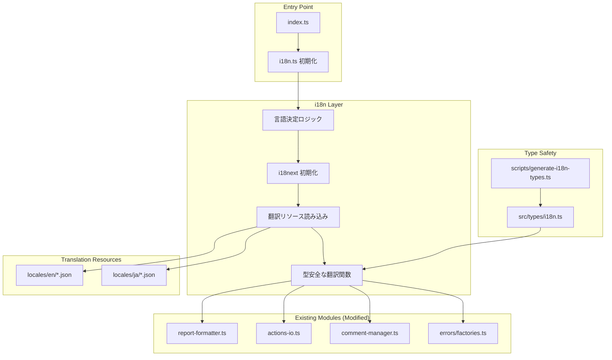
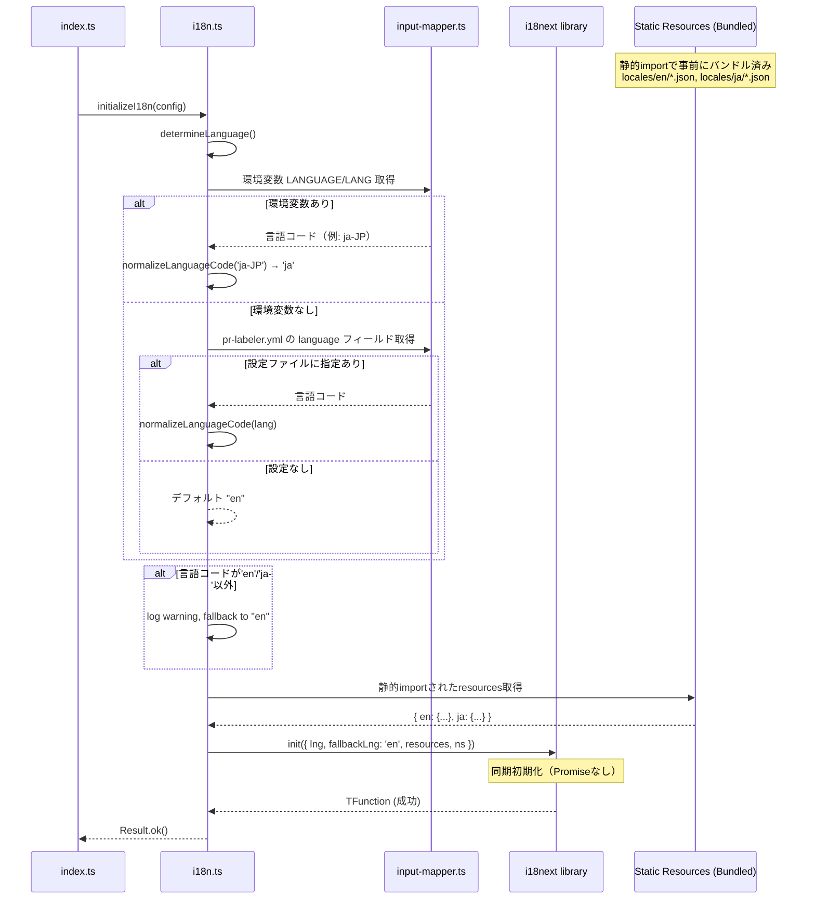

# Technical Design: i18n Support

## Overview

この機能は、PR Labelerに多言語対応（i18n: internationalization）を導入し、GitHub Actions Summary、エラーメッセージ、ログメッセージ、PRコメントを英語と日本語で提供します。現在の英語のみの出力を多言語化することで、日本語ユーザーの利用体験を向上させ、グローバルな採用を促進します。

**目的**: PR Labelerのすべてのユーザー向けテキストを多言語化し、言語選択の柔軟性を提供します。

**対象ユーザー**: 日本語を優先する開発チームおよび将来的に他言語を必要とするグローバルチームが、環境変数または設定ファイルで言語を指定して利用します。

**影響範囲**: 既存の出力モジュール（report-formatter.ts、actions-io.ts、comment-manager.ts）、エラーハンドリング（errors/）、ログ出力（actions-io.ts）に対して、翻訳レイヤーを追加します。後方互換性を保持し、既存の英語のみの設定でも動作継続します。

### Goals

- GitHub Actions Summary、PRコメント、エラーメッセージ、ログを英語・日本語で出力
- 環境変数または設定ファイルによる言語選択
- 型安全な翻訳キーシステムによる開発者体験の向上
- 既存の英語環境での動作を完全に保持（後方互換性）
- 翻訳リソース追加によるバンドルサイズ増加を50KB以内に抑制

### Non-Goals

- ドキュメント（README.md等）の多言語化（Phase 1対象外）
- 英語・日本語以外の言語サポート（Phase 2以降）
- 動的な言語切り替え（再起動が必要）
- 複数形対応、日付/時刻の完全なロケール対応
- カテゴリ名の多言語化（カテゴリ名は英語固定、ラベル表示名のみ多言語対応）

## Architecture

### Existing Architecture Analysis

PR Labelerは、GitHub Actionとして動作する単一プロセスのTypeScriptアプリケーションです。@vercel/nccでバンドルされた`dist/index.js`が実行エントリーポイントであり、以下の主要モジュールで構成されています：

**出力関連モジュール**（i18n統合対象）:

- `report-formatter.ts`: Markdownレポート生成、Summary/コメントのメッセージ文字列を生成
- `actions-io.ts`: GitHub Actions Summary出力、ログ出力（info/warning/error）
- `comment-manager.ts`: PRコメント生成・更新・削除
- `errors/types.ts`: 統一されたエラー型定義、エラーメッセージ文字列

**既存の設計パターン**:

- Railway-Oriented Programming: neverthrowの`Result<T, E>`による明示的エラーハンドリング
- 型安全性の徹底: `any`型禁止、厳格なTypeScript設定
- 純粋関数優先: 副作用と純粋関数の分離
- 依存性注入: テスタビリティを確保するための引数渡し

**統合制約**:

- ビルドプロセス: `pnpm build` → 型生成 → TSコンパイル → nccバンドル
- バンドルサイズ: 現在約200KB、翻訳追加後も250KB以内を目標
- Node.js 20以上、TypeScript 5.9以上の環境
- GitHub Actions Summaryの

Markdown形式出力

### High-Level Architecture



**アーキテクチャ統合**:

- **既存パターン保持**: Railway-Oriented Programming、型安全性、純粋関数の原則を維持
- **新規コンポーネントの必要性**: i18n初期化モジュール、翻訳リソース、型生成スクリプト、数値/サイズフォーマットユーティリティ
- **技術スタック整合**: i18next（TypeScript完全対応）、既存のTypeScript/Node.js/nccバンドル環境と統合
- **ステアリング準拠**: structure.mdの純粋関数・依存性注入、tech.mdの型安全性・neverthrowパターン、product.mdの品質保証（テストカバレッジ90%以上）

### Technology Alignment

本機能は既存システムの拡張であり、確立された技術スタックに新規ライブラリを追加します。

**新規依存関係**:

- **i18next v23.x以上**: Node.js環境での国際化ライブラリ、TypeScript完全対応、バンドルサイズ約10KB（gzip後）
  - 選定理由: Node.js環境での安定性、TypeScript型定義の充実、将来的な複数形対応・変数補間の拡張性、GitHub Actionsでの実績
  - バージョン要件: TypeScript v5対応のため v23以上

**既存スタックとの統合**:

- TypeScript 5.9: i18nextの型拡張（`CustomTypeOptions`）で型安全性を実現
- @vercel/ncc: 翻訳JSONの静的importを自動バンドル（追加設定不要）
  - **ncc動作**: TypeScriptの静的import (`import json from './file.json'`) を検出し、自動的にバンドルに含める
  - **FS依存排除**: `fs.readFileSync()`等のFS依存は不要、静的importで完結
  - **確実なリソース同梱**: ビルド時にJSONがバンドルされ、実行時の欠落リスクゼロ
  - **設定不要**: `--asset`等のオプション指定は不要、デフォルトでJSON対応
- neverthrow: i18n初期化のエラーハンドリングに`Result<T, E>`を使用
- Vitest: 翻訳キー整合性テスト、スナップショットテストを追加

**ディレクトリ構成（新規追加）**:

```
src/
├── i18n.ts                      # i18next初期化とヘルパー関数
├── locales/                     # 翻訳リソース
│   ├── en/
│   │   ├── summary.json
│   │   ├── errors.json
│   │   ├── labels.json
│   │   ├── logs.json
│   │   └── common.json
│   └── ja/
│       ├── summary.json
│       ├── errors.json
│       ├── labels.json
│       ├── logs.json
│       └── common.json
├── types/
│   └── i18n.ts                  # 自動生成される型定義
└── utils/
    └── formatting.ts            # 数値・サイズフォーマットユーティリティ

scripts/
└── generate-i18n-types.ts       # 翻訳JSON→型定義生成スクリプト

__tests__/
├── i18n-integrity.test.ts       # 翻訳キー整合性テスト
├── i18n-snapshot.test.ts        # スナップショットテスト
└── i18n-fallback.test.ts        # フォールバックテスト
```

### Key Design Decisions

#### Decision 1: i18next型拡張による型安全性の実現

**Context**: TypeScriptで翻訳キーの存在をコンパイル時に検証し、エディタ補完を有効化する必要があります。

**Alternatives**:

1. **手動型定義**: 翻訳JSONとは別に型定義ファイルを手書き
2. **typesafe-i18n**: 専用の型安全i18nライブラリを使用
3. **i18next + 型生成スクリプト**: JSONから型を自動生成してi18nextに適用

**Selected Approach**: **i18next + 型生成スクリプト**

実装方法:

```typescript
// scripts/generate-i18n-types.ts
// 英語翻訳JSONを読み込み、型定義を生成
import enSummary from '../src/locales/en/summary.json';
import enErrors from '../src/locales/en/errors.json';
// ...他の名前空間

// src/types/i18n.ts に型定義を出力
export type TranslationKeys = typeof enSummary & typeof enErrors & ...;

// i18next.d.ts でモジュール拡張
declare module 'i18next' {
  interface CustomTypeOptions {
    defaultNS: 'summary';
    resources: {
      summary: typeof enSummary;
      errors: typeof enErrors;
      // ...
    };
  }
}
```

**Rationale**:

- **型の自動生成**: 翻訳JSON更新時に型定義も自動更新、手動メンテナンス不要
- **i18nextエコシステム活用**: 既存のi18nextプラグイン、ツールチェーンを利用可能
- **エディタ統合**: VSCodeでの補完、GoTo Definition、型チェックがフル機能
- **CI統合**: ビルドプロセスに型生成を組み込み、型エラーで即座に検出

**Trade-offs**:

- **ビルド時間増加**: 型生成ステップ追加により数秒の増加（許容範囲内）
- **型定義ファイルの肥大化**: 翻訳が増えるほど型ファイルも増加（nccバンドルには影響なし）
- **スクリプトメンテナンス**: 型生成スクリプトの保守が必要（初期実装のみ、その後は安定）

#### Decision 2: 名前空間によ翻訳リソースの分割

**Context**: 翻訳キーが数百に及ぶ可能性があり、単一ファイルでは管理が困難になります。

**Alternatives**:

1. **単一ファイル**: `locales/en/translation.json` に全キーを集約
2. **ドメイン別**: `locales/en/pr-labeler.json`, `locales/en/directory-labeler.json`
3. **機能別**: `locales/en/summary.json`, `locales/en/errors.json`, `locales/en/labels.json`, `locales/en/logs.json`, `locales/en/common.json`

**Selected Approach**: **機能別（名前空間5つ）**

名前空間定義:

- `summary`: GitHub Actions Summaryの見出し、説明、テーブルヘッダー
- `errors`: エラーメッセージ（型別にグループ化）
- `labels`: ラベル関連のメッセージ、説明
- `logs`: 情報ログ、警告ログのメッセージ
- `common`: 共通メッセージ（ボタンラベル、単位等）

**Rationale**:

- **関心の分離**: 出力先・用途ごとに翻訳を整理、コンテキストが明確
- **並行開発**: チームメンバーが異なる名前空間を同時編集可能
- **部分ロード**: 将来的にオンデマンドロードを実装する際の基盤
- **テスト容易性**: 名前空間ごとにスナップショットテストを実施

**Trade-offs**:

- **ファイル数増加**: 5名前空間 × 2言語 = 10ファイル（管理は容易）
- **キー競合リスク**: 名前空間間で同名キーが存在可能（意図的な設計）
- **初期設定複雑化**: i18next初期化時に5名前空間を登録

#### Decision 3: 表示名と実体名の分離による後方互換性

**Context**: GitHubラベルの実体名（API名）を多言語化すると既存設定やGitHub UIとの整合性が失われます。

**Alternatives**:

1. **ラベル名も多言語化**: GitHub API呼び出し時に翻訳されたラベル名を使用
2. **表示名のみ多言語化**: GitHub APIは英語固定、Summary/コメントの表示のみ翻訳
3. **両方サポート**: 設定で選択可能

**Selected Approach**: **表示名のみ多言語化**

実装例:

```yaml
# pr-labeler.yml
labels:
  size_small:
    name: "size/small"              # GitHub実ラベル名（英語固定）
    display_name:                   # 表示名（多言語対応）
      en: "Size: Small"
      ja: "サイズ: 小"
```

翻訳使用箇所:

- GitHub Actions Summary: `display_name`から選択言語を表示
- PRコメント: `display_name`から選択言語を表示
- GitHub API（ラベル適用）: `name`を使用（英語固定）

**Rationale**:

- **GitHub慣習準拠**: ラベル名は英語が一般的、多言語ラベルは混乱を招く
- **後方互換性**: 既存の英語ラベル設定がそのまま機能
- **検索性**: GitHub UI検索、フィルタリングで英語ラベルが一貫
- **移行容易性**: `display_name`フィールド追加のみ、既存設定は変更不要

**Trade-offs**:

- **設定複雑化**: `name`と`display_name`の2つのフィールド管理
- **部分多言語化**: ラベル自体は英語のまま（意図的な制約）
- **ユーザー理解**: ラベル実体名と表示名の違いをドキュメント化が必要

## System Flows

### i18n Initialization Flow



### Translation Key Resolution Flow

```mermaid
flowchart TD
    A[翻訳関数呼び出し: t\('summary.overview.title'\)] --> B{キーが選択言語に存在?}
    B -->|はい| C[選択言語の翻訳を返す]
    B -->|いいえ| D{キーが英語に存在?}
    D -->|はい| E[英語の翻訳を返す + warning log]
    D -->|いいえ| F[キー文字列をそのまま返す + error log]

    C --> G[翻訳テキスト]
    E --> G
    F --> G

    G --> H{補間変数あり?}
    H -->|はい| I[変数を値に置換]
    H -->|いいえ| J[そのまま返す]

    I --> J
    J --> K[最終翻訳テキスト]
```

## Requirements Traceability

| Requirement | Summary                | Components                                             | Interfaces                       | Flows               |
| ----------- | ---------------------- | ------------------------------------------------------ | -------------------------------- | ------------------- |
| 1.1         | i18next採用            | i18n.ts                                                | initializeI18n()                 | Initialization Flow |
| 1.2         | 翻訳リソース読み込み   | i18n.ts, locales/                                      | loadResources()                  | Initialization Flow |
| 1.3         | 言語決定優先順位       | i18n.ts                                                | determineLanguage()              | Initialization Flow |
| 1.4         | 英語フォールバック     | i18next                                                | t() with fallbackLng             | Resolution Flow     |
| 1.7         | ディレクトリ構成       | locales/{lang}/{ns}.json                               | -                                | -                   |
| 1.8         | 名前空間整理           | summary/errors/labels/logs/common                      | -                                | -                   |
| 1.9         | キー命名規則           | locales/\*.json                                        | lowerCamel dot-separated         | -                   |
| 2.1-2.5     | 出力メッセージ翻訳     | report-formatter.ts, actions-io.ts, comment-manager.ts | t(namespace:key)                 | -                   |
| 2.6-2.7     | ロケール表記           | utils/formatting.ts                                    | formatNumber(), formatFileSize() | -                   |
| 3.1-3.7     | 設定ファイル多言語対応 | config-loader.ts, label-decision-engine.ts             | getDisplayName()                 | -                   |
| 4.1-4.5     | 後方互換性             | 全既存モジュール                                       | デフォルト英語, フォールバック   | -                   |
| 5.1-5.9     | 開発者体験             | scripts/generate-i18n-types.ts, types/i18n.ts          | TranslationKeys, Namespace       | -                   |

## Components and Interfaces

### Core / i18n Initialization

#### i18n.ts

**Responsibility & Boundaries**

- **Primary Responsibility**: i18nextライブラリの初期化、言語決定、翻訳関数の提供
- **Domain Boundary**: i18n層（アプリケーション全体で使用される横断的関心事）
- **Data Ownership**: 選択言語、翻訳リソースの管理
- **Transaction Boundary**: なし（ステートレス、初期化は1回のみ）

**Dependencies**

- **Inbound**: index.ts（アプリケーションエントリーポイント）、全出力モジュール
- **Outbound**: i18next、input-mapper.ts（設定取得）、locales/（静的import）
- **External**: i18next v23.x以上

**External Dependencies Investigation**:

- **i18next公式ドキュメント調査結果**:
  - TypeScript v5完全対応、型拡張による型安全性
  - `CustomTypeOptions`インターフェースで型定義をカスタマイズ
  - `init()`メソッドで同期初期化可能（非同期不要）
  - `fallbackLng`オプションでフォールバック言語を指定
  - 名前空間（namespace）による翻訳リソース分割サポート
  - バンドルサイズ: 約10KB（gzip後）、tree-shakingに対応
- **設定オプション**:
  - `lng`: 選択言語（例: 'en', 'ja'）
  - `fallbackLng`: フォールバック言語（デフォルト: 'en'）
  - `ns`: 名前空間配列（例: ['summary', 'errors']）
  - `defaultNS`: デフォルト名前空間
  - `resources`: 翻訳リソースオブジェクト
  - `debug`: デバッグログ有効化（開発時のみ）
- **リソース読み込み方式**:
  - 静的importでJSONを読み込み、`resources`オプションに渡す（同期初期化可能）
  - nccが自動的にバンドルに含めるため、追加設定不要
  - FS依存を排除し、確実なリソース同梱を保証

  ```typescript
  // 静的importでリソース読み込み
  import summaryEn from './locales/en/summary.json';
  import summaryJa from './locales/ja/summary.json';

  i18next.init({
    lng: 'ja',
    fallbackLng: 'en',
    resources: {
      en: { summary: summaryEn, errors: errorsEn, ... },
      ja: { summary: summaryJa, errors: errorsJa, ... }
    }
  });
  ```

- **API署名**（同期版）:

  ```typescript
  init(options: InitOptions): TFunction;  // 同期初期化（Promiseなし）
  t(key: string, options?: TOptions): string;
  ```

- **既知の制約**:
  - TypeScript v5未満はサポート外
  - 大規模翻訳（1000キー以上）ではコンパイル時間増加の可能性
  - `enableSelector: true`で型パフォーマンス最適化可能

**Contract Definition**

```typescript
// Service Interface
interface I18nService {
  /**
   * i18nextを初期化し、翻訳準備を完了する
   * @param config - アプリケーション設定（言語指定を含む）
   * @returns 初期化結果（成功/失敗）
   */
  initializeI18n(config: AppConfig): Result<void, ConfigurationError>;

  /**
   * 翻訳キーから翻訳テキストを取得
   * @param namespace - 名前空間（summary/errors/labels/logs/common）
   * @param key - 翻訳キー（ドット区切り lowerCamel）
   * @param options - 補間変数等のオプション
   * @returns 翻訳されたテキスト
   */
  t(namespace: Namespace, key: string, options?: Record<string, unknown>): string;

  /**
   * 言語を決定（優先順位: 環境変数 > 設定ファイル > デフォルト）
   * @param config - アプリケーション設定
   * @returns 言語コード（'en' | 'ja'）
   * @remarks
   * - 言語コードを正規化（'ja-JP' → 'ja', 'en-US' → 'en'）
   * - 'en'/'ja'以外は警告ログを出力してデフォルト'en'にフォールバック
   * @example
   * determineLanguage({ language: 'ja-JP' }) // => 'ja'
   * determineLanguage({ language: 'en-US' }) // => 'en'
   * determineLanguage({ language: 'fr' })    // => 'en' (warning logged)
   */
  determineLanguage(config: AppConfig): LanguageCode;

  /**
   * 言語コードを正規化（実装補助）
   * @internal
   * @param lang - 言語コード（例: 'ja-JP', 'en-US', 'ja', 'en'）
   * @returns 正規化された言語コード（'en' | 'ja'）、不正な場合はデフォルト'en'
   */
  normalizeLanguageCode(lang: string): LanguageCode;

  /**
   * 数値をロケール形式でフォーマット
   * @param value - 数値
   * @param locale - ロケール（'en-US' | 'ja-JP'）
   * @returns フォーマットされた文字列（例: "1,000"）
   */
  formatNumber(value: number, locale: string): string;

  /**
   * ファイルサイズをロケール形式でフォーマット
   * @param bytes - バイト数
   * @param locale - ロケール
   * @returns フォーマットされた文字列（例: "100 KB"）
   */
  formatFileSize(bytes: number, locale: string): string;
}

// 型定義
type Namespace = 'summary' | 'errors' | 'labels' | 'logs' | 'common';
type LanguageCode = 'en' | 'ja';

interface AppConfig {
  language?: string;  // pr-labeler.ymlのlanguageフィールド
  // ...他の設定
}
```

**Preconditions**:

- アプリケーション起動時、他のモジュール初期化前に`initializeI18n()`を呼び出す
- `locales/en/`配下に英語翻訳JSONが存在する（必須）

**Postconditions**:

- `initializeI18n()`成功後、`t()`関数で翻訳取得が可能
- 選択言語が確定し、すべての出力で一貫した言語が使用される

**Invariants**:

- 英語翻訳は常にフォールバックとして利用可能
- 初期化は1回のみ実行（再初期化は不要）

**Integration Strategy**:

- **Modification Approach**: 既存モジュール（report-formatter等）に`t()`関数呼び出しを追加（ラップ）
- **Backward Compatibility**: `initializeI18n()`が失敗しても英語で動作継続（フォールバック）
- **Migration Path**: 段階的に翻訳キーを追加、既存の英語文字列リテラルを置換

### Output / Report Formatting

#### report-formatter.ts (Modified)

**Responsibility & Boundaries**

- **Primary Responsibility**: GitHub Actions Summary、PRコメントのMarkdownレポート生成
- **Domain Boundary**: 出力層（プレゼンテーション）
- **Data Ownership**: フォーマット済みMarkdownテキスト
- **Transaction Boundary**: なし（ステートレス、純粋関数）

**Dependencies**

- **Inbound**: actions-io.ts、comment-manager.ts
- **Outbound**: i18n.ts（翻訳関数）、utils/formatting.ts（数値・サイズフォーマット）
- **External**: なし

**Contract Definition**

```typescript
// 既存関数の型シグネチャ（変更なし、内部実装で t() 使用）
interface ReportFormatterService {
  formatBasicMetrics(metrics: Metrics, options: FormatBasicMetricsOptions): string;
  formatViolations(violations: Violations, options: FormatViolationsOptions): string;
  formatFileDetails(files: FileInfo[]): string;
  formatBestPractices(violations: Violations, metrics?: Metrics): string;
  generateComplexitySummary(analysis: ComplexityAnalysis): string;
}

// 内部実装例（翻訳関数使用）
function formatBasicMetrics(metrics: Metrics, options: FormatBasicMetricsOptions): string {
  const title = t('summary', 'basicMetrics.title'); // "Basic Metrics" / "基本メトリクス"
  const totalAdditions = t('summary', 'basicMetrics.totalAdditions'); // "Total Additions"
  // ...既存ロジックで翻訳テキストを使用
}
```

**Preconditions**:

- `i18n.ts`の初期化が完了している
- `metrics`, `violations`等の入力データが有効

**Postconditions**:

- 選択言語でフォーマットされたMarkdownテキストを返す
- 数値、ファイルサイズはロケール形式でフォーマット

**Integration Strategy**:

- **Modification Approach**: 既存の文字列リテラルを`t()`関数呼び出しに置換（最小限の変更）
- **Backward Compatibility**: `t()`関数が失敗しても英語文字列が返る（フォールバック）

**Translation Granularity Guidelines**（翻訳粒度の指針）:

- **文単位でキー化**: 長文テンプレートは文ごとに分割してキー化（例: `summary.overview.intro`, `summary.overview.description`）
- **変数は補間で対応**: `t('summary.filesAnalyzed', { count: 10 })` → "Analyzed {{count}} files" / "{{count}}個のファイルを分析しました"
- **Markdown構造はコード側で合成**: 見出し（`##`, `###`）、リスト記号（`-`, `1.`）、表構造はコード側で生成、テキスト部分のみ翻訳
- **適切な粒度の例**:

  ```typescript
  // ✅ Good: 文単位でキー化、変数補間
  const intro = t('summary', 'overview.intro');
  const fileCount = t('summary', 'overview.filesAnalyzed', { count: metrics.totalFiles });
  return `## ${intro}\n\n${fileCount}`;

  // ❌ Bad: Markdown構造全体をキーに含める
  const fullTemplate = t('summary', 'overview.fullTemplate'); // "## Overview\n\nAnalyzed {{count}} files..."
  ```

### Output / GitHub Actions I/O

#### actions-io.ts (Modified)

**Responsibility & Boundaries**

- **Primary Responsibility**: GitHub Actions Summary書き込み、ログ出力（info/warning/error）
- **Domain Boundary**: 出力層（GitHub Actions統合）
- **Data Ownership**: GitHub Actions Summary HTML、コンソールログ
- **Transaction Boundary**: なし（副作用あり、GitHub API呼び出し）

**Dependencies**

- **Inbound**: index.ts、各種モジュール（エラーハンドリング等）
- **Outbound**: @actions/core（GitHub Actions SDK）、i18n.ts、report-formatter.ts
- **External**: @actions/core v1.11.1

**Contract Definition**

```typescript
// 既存関数（ログ出力に翻訳適用）
interface ActionsIOService {
  logInfo(messageKey: string, params?: Record<string, unknown>): void;
  logWarning(messageKey: string, params?: Record<string, unknown>): void;
  logError(messageKey: string, params?: Record<string, unknown>): void;
  writeSummary(markdown: string): Result<void, Error>;
}

// 使用例
logInfo('logs.initializationSuccess', { language: 'ja' });
// Output: "Initialized with language: ja" / "言語で初期化されました: ja"
```

**Integration Strategy**:

- **Modification Approach**: ログメッセージを翻訳キー + パラメータで渡す方式に変更
- **Backward Compatibility**: 既存の文字列直接指定も引き続きサポート

### Utility / Formatting

#### utils/formatting.ts (New)

**Responsibility & Boundaries**

- **Primary Responsibility**: 数値、ファイルサイズのロケール形式フォーマット
- **Domain Boundary**: ユーティリティ層
- **Data Ownership**: フォーマット済み文字列
- **Transaction Boundary**: なし（純粋関数）

**Dependencies**

- **Inbound**: report-formatter.ts、actions-io.ts
- **Outbound**: Intl.NumberFormat（標準API）
- **External**: なし（Node.js標準）

**Contract Definition**

```typescript
interface FormattingService {
  /**
   * 数値をロケール形式でフォーマット
   * @param value - 数値
   * @param lang - 言語コード（'en' | 'ja'）、省略時は現在の選択言語
   * @returns フォーマットされた文字列
   * @example formatNumber(1000, 'en') // "1,000"
   * @example formatNumber(1000, 'ja') // "1,000"
   */
  formatNumber(value: number, lang?: 'en' | 'ja'): string;

  /**
   * ファイルサイズをロケール形式でフォーマット（1024基数）
   * @param bytes - バイト数
   * @param lang - 言語コード（'en' | 'ja'）、省略時は現在の選択言語
   * @returns フォーマットされた文字列（数値と単位の間に半角スペース1つ）
   * @remarks
   * - 基数: 1024（バイナリ単位）
   * - 単位: B, KB, MB, GB（英語・日本語共通）
   * - フォーマット: "{数値} {単位}" （例: "1 KB", "100.5 MB"）
   * - 小数点以下: 最大1桁
   * @example formatFileSize(1024, 'en') // "1 KB"
   * @example formatFileSize(1536, 'ja') // "1.5 KB"
   * @example formatFileSize(1048576, 'en') // "1 MB"
   */
  formatFileSize(bytes: number, lang?: 'en' | 'ja'): string;
}

// 実装詳細
function formatNumber(value: number, lang: 'en' | 'ja' = 'en'): string {
  // 言語コードからロケール文字列へ変換
  const locale = lang === 'ja' ? 'ja-JP' : 'en-US';
  return new Intl.NumberFormat(locale).format(value);
}

function formatFileSize(bytes: number, lang: 'en' | 'ja' = 'en'): string {
  const units = ['B', 'KB', 'MB', 'GB']; // 英語・日本語共通の単位
  let size = bytes;
  let unitIndex = 0;

  // 1024基数で単位を上げる
  while (size >= 1024 && unitIndex < units.length - 1) {
    size /= 1024;
    unitIndex++;
  }

  // 数値をロケール形式でフォーマット（小数点以下最大1桁）
  const locale = lang === 'ja' ? 'ja-JP' : 'en-US';
  const formatted = new Intl.NumberFormat(locale, {
    maximumFractionDigits: 1
  }).format(size);

  // 数値と単位の間に半角スペース1つ
  return `${formatted} ${units[unitIndex]}`;
}
```

### Build / Type Generation

#### scripts/generate-i18n-types.ts (New)

**Responsibility & Boundaries**

- **Primary Responsibility**: 翻訳JSONから TypeScript型定義を自動生成
- **Domain Boundary**: ビルド時ツール
- **Data Ownership**: 生成される`src/types/i18n.ts`
- **Transaction Boundary**: なし（ビルド時実行）

**Dependencies**

- **Inbound**: `pnpm build`, `pnpm dev`スクリプト
- **Outbound**: File System（翻訳JSON読み込み、型ファイル書き込み）
- **External**: なし

**Contract Definition**

```typescript
// スクリプト実行結果
interface TypeGenerationResult {
  /**
   * 型生成スクリプトを実行
   * @returns 成功/失敗
   */
  generateTypes(): Result<void, Error>;
}

// 生成される型定義例（src/types/i18n.ts）
import type enSummary from '../locales/en/summary.json';
import type enErrors from '../locales/en/errors.json';

// DotPath型ユーティリティ（ネストされたオブジェクトからドット区切りキーを生成）
export type DotPath<T, Prefix extends string = ''> = T extends object
  ? {
      [K in keyof T & string]: T[K] extends object
        ? DotPath<T[K], `${Prefix}${K}.`>
        : `${Prefix}${K}`;
    }[keyof T & string]
  : never;

// 段階的導入方針:
// Phase 1: resources形状型のみ（初期実装）
export type TranslationResources = {
  summary: typeof enSummary;
  errors: typeof enErrors;
  labels: typeof enLabels;
  logs: typeof enLogs;
  common: typeof enCommon;
};

// Phase 2: DotPath型によるキーのunion生成（将来拡張）
export type TranslationKey =
  | `summary.${DotPath<typeof enSummary>}`
  | `errors.${DotPath<typeof enErrors>}`
  | `labels.${DotPath<typeof enLabels>}`
  | `logs.${DotPath<typeof enLogs>}`
  | `common.${DotPath<typeof enCommon>}`;

export type Namespace = 'summary' | 'errors' | 'labels' | 'logs' | 'common';

// i18next型拡張（i18next.d.ts）
declare module 'i18next' {
  interface CustomTypeOptions {
    defaultNS: 'summary';
    resources: TranslationResources;
  }
}
```

**Preconditions**:

- `src/locales/en/*.json`が存在する

**Postconditions**:

- `src/types/i18n.ts`が生成される
- TypeScriptコンパイル時に翻訳キーの型チェックが有効化

**Integration Strategy**:

- **ビルドプロセス統合**: `pnpm build`の最初のステップで実行
- **Watch mode**: `pnpm dev`時も翻訳JSON変更を監視して再生成

## Data Models

### Translation Resource Structure

翻訳リソースはJSON形式で定義し、名前空間ごとに分割します。

#### Summary Namespace (locales/en/summary.json)

```json
{
  "overview": {
    "title": "PR Metrics Overview",
    "subtitle": "Automated analysis of pull request metrics"
  },
  "basicMetrics": {
    "title": "Basic Metrics",
    "totalAdditions": "Total Additions",
    "totalFiles": "Total Files Changed",
    "excludedFiles": "Excluded Files"
  },
  "violations": {
    "title": "Violations",
    "largeFiles": "Large Files",
    "tooManyFiles": "Too Many Files",
    "excessiveAdditions": "Excessive Additions"
  },
  "complexity": {
    "title": "Code Complexity",
    "highComplexityFiles": "High Complexity Files",
    "averageComplexity": "Average Complexity"
  },
  "recommendations": {
    "title": "Recommendations",
    "splitPr": "Consider splitting this PR into smaller changes",
    "reviewCarefully": "Review carefully due to high complexity"
  }
}
```

#### Errors Namespace (locales/en/errors.json)

```json
{
  "configuration": {
    "invalidLanguage": "Invalid language code: {{code}}. Falling back to English.",
    "missingTranslation": "Translation file not found: {{path}}",
    "parsingFailed": "Failed to parse configuration file: {{file}}"
  },
  "github": {
    "apiError": "GitHub API error: {{message}}",
    "rateLimitExceeded": "Rate limit exceeded. Retry after: {{resetTime}}",
    "authenticationFailed": "Authentication failed. Check GITHUB_TOKEN."
  },
  "fileSystem": {
    "fileNotFound": "File not found: {{path}}",
    "permissionDenied": "Permission denied: {{path}}",
    "readError": "Failed to read file: {{path}}"
  }
}
```

#### Logs Namespace (locales/en/logs.json)

```json
{
  "initialization": {
    "starting": "Initializing PR Labeler...",
    "languageDetected": "Detected language: {{language}}",
    "i18nInitialized": "i18n system initialized successfully",
    "configLoaded": "Configuration loaded from: {{path}}"
  },
  "analysis": {
    "analyzingFiles": "Analyzing {{count}} files...",
    "complexityAnalysis": "Running complexity analysis...",
    "labelDecision": "Determining labels based on metrics..."
  },
  "completion": {
    "success": "PR analysis completed successfully",
    "labelsApplied": "Applied {{count}} labels",
    "summaryWritten": "Summary written to Actions output"
  }
}
```

### Configuration Schema Extension

既存の`pr-labeler.yml`スキーマに多言語対応フィールドを追加します。

```yaml
# pr-labeler.yml
language: ja  # 新規フィールド: 言語選択（'en' | 'ja'）

labels:
  size_small:
    name: "size/small"                  # GitHub実ラベル名（英語固定）
    display_name:                       # 新規フィールド: 表示名（多言語対応）
      en: "Size: Small"
      ja: "サイズ: 小"
    threshold:
      max_additions: 100

  complexity_high:
    name: "complexity/high"
    display_name:
      en: "Complexity: High"
      ja: "複雑度: 高"
    threshold:
      min_complexity: 10
```

**型定義**:

```typescript
interface PRLabelerConfig {
  language?: 'en' | 'ja';  // 新規フィールド
  labels: Record<string, LabelConfig>;
  // ...既存フィールド
}

interface LabelConfig {
  name: string;  // 既存: GitHub実ラベル名
  display_name?: {  // 新規: 多言語表示名
    en: string;
    ja: string;
  };
  threshold?: ThresholdConfig;
}
```

## Error Handling

### Error Strategy

i18n機能のエラーハンドリングは、既存のRailway-Oriented Programmingパターン（neverthrow）に従います。エラー発生時も可能な限り英語フォールバックで動作を継続します。

### Error Categories and Responses

**Configuration Errors (初期化失敗)**:

- **言語コード不正**: 警告ログ出力 → 次の優先順位にフォールバック → デフォルト英語
- **翻訳ファイル欠落**: 警告ログ出力 → 英語フォールバックで継続
- **JSON パースエラー**: エラーログ出力 → 該当名前空間を英語で継続

**Translation Key Errors (翻訳キー欠落)**:

- **選択言語にキーなし**: 英語フォールバック → 警告ログ（開発時のみ）
- **英語にもキーなし**: キー文字列をそのまま返す → エラーログ

**File System Errors (ファイル読み込み失敗)**:

- **翻訳ファイル読み込み失敗**: 英語フォールバック → 警告ログ
- **英語ファイルも失敗**: 初期化エラー → アプリケーション停止（致命的エラー）

### Error Flow Visualization

```mermaid
flowchart TD
    A[i18n初期化開始] --> B{言語コード取得}
    B -->|成功| C{翻訳ファイル読み込み}
    B -->|失敗/不正| D[警告ログ出力]
    D --> E[デフォルト英語にフォールバック]
    E --> C

    C -->|選択言語成功| F[選択言語で初期化完了]
    C -->|選択言語失敗| G[警告ログ出力]
    G --> H{英語フォールバック試行}

    H -->|英語成功| I[英語で初期化完了]
    H -->|英語も失敗| J[致命的エラー]
    J --> K[アプリケーション停止]

    F --> L[翻訳関数 t\(\) 呼び出し]
    I --> L

    L --> M{キーが選択言語に存在?}
    M -->|はい| N[翻訳テキスト返却]
    M -->|いいえ| O{キーが英語に存在?}

    O -->|はい| P[英語翻訳返却 + 警告ログ]
    O -->|いいえ| Q[キー文字列返却 + エラーログ]

    P --> N
    Q --> N
```

### Monitoring

**エラーログ出力**:

- **警告レベル**: 翻訳キー欠落、ファイル読み込み失敗（フォールバック成功）
- **エラーレベル**: 英語翻訳も欠落、致命的な初期化失敗

**ログ抑制方針**（過剰ログ防止）:

- **初回発生キー**: warning レベルでログ出力（フォールバック通知）
- **2回目以降**: debug レベルで集計のみ（重複警告を抑制）
- **Summary末尾**: オプションで欠落キー数を表示可能（`show_missing_translations: true`）

**ログ形式** (actions-io.ts経由):

```typescript
// 初回発生キー
logWarning('i18n.fallback', { key: 'summary.overview.title', language: 'ja', fallback: 'en' });
// Output: "[i18n] Translation key 'summary.overview.title' not found in 'ja', using English fallback"

// 2回目以降（同じキー）
logDebug('i18n.fallbackCount', { key: 'summary.overview.title', count: 2 });
// Output (debug): "[i18n] Fallback count for 'summary.overview.title': 2"

// 英語にも存在しないキー（常にerror）
logError('i18n.keyMissing', { key: 'unknown.key', language: 'en' });
// Output: "[i18n] Translation key 'unknown.key' not found in any language"
```

**CI統合**:

- 翻訳キー整合性テスト（`__tests__/i18n-integrity.test.ts`）で欠落キーを検出
- テスト失敗時は明確なエラーメッセージで該当キー・言語を表示

**オプション機能**:

- Summary末尾に欠落翻訳のサマリを表示（設定で有効化）
- 例: "Note: 3 translation keys fell back to English during this run"

## Testing Strategy

### Unit Tests

**i18n Core Functions** (`__tests__/i18n.test.ts`):

- `determineLanguage()`: 言語決定の優先順位（環境変数 > 設定ファイル > デフォルト）
- `initializeI18n()`: 正常初期化、エラーハンドリング、フォールバック
- `t()`: 翻訳キー解決、補間変数、フォールバック動作

**Formatting Utilities** (`__tests__/formatting.test.ts`):

- `formatNumber()`: 英語・日本語での数値フォーマット（桁区切り）
- `formatFileSize()`: 1024基数でのファイルサイズフォーマット、単位表記

**Type Generation** (`__tests__/generate-i18n-types.test.ts`):

- スクリプト実行成功、型定義ファイル生成確認
- 翻訳JSON変更時の型再生成

### Integration Tests

**End-to-End Translation Flow** (`__tests__/i18n-integration.test.ts`):

- 環境変数指定 → Summary/コメント出力が指定言語
- 設定ファイル指定 → Summary/コメント出力が指定言語
- 言語未指定 → 英語で出力

**Report Formatter Integration** (`__tests__/report-formatter-i18n.test.ts`):

- `formatBasicMetrics()`が選択言語で出力
- 数値・サイズが各ロケールでフォーマット
- エラーメッセージが翻訳される

**Actions IO Integration** (`__tests__/actions-io-i18n.test.ts`):

- `logInfo()`/`logWarning()`/`logError()`が翻訳される
- `writeSummary()`のMarkdownが選択言語

### Snapshot Tests

**Language-Specific Snapshots** (`__tests__/i18n-snapshot.test.ts`):

```typescript
describe.each(['en', 'ja'])('Snapshot Tests (%s)', (lang) => {
  beforeEach(() => {
    process.env.LANGUAGE = lang;
    initializeI18n(mockConfig);
  });

  it('Summary output snapshot', () => {
    const summary = formatSummary(mockMetrics);
    expect(summary).toMatchSnapshot(`summary-${lang}`);
  });

  it('PR comment snapshot', () => {
    const comment = generateCommentBody(mockViolations);
    expect(comment).toMatchSnapshot(`comment-${lang}`);
  });

  it('Error message snapshot', () => {
    const error = createConfigurationError('Invalid config');
    expect(error.message).toMatchSnapshot(`error-${lang}`);
  });
});
```

### Translation Integrity Tests

**Key Completeness Check** (`__tests__/i18n-integrity.test.ts`):

```typescript
describe('Translation Integrity', () => {
  const languages = ['en', 'ja'];
  const namespaces = ['summary', 'errors', 'labels', 'logs', 'common'];

  it('All keys exist in all languages', () => {
    const enKeys = getAllKeys('en', namespaces);

    languages.forEach(lang => {
      if (lang === 'en') return;

      const langKeys = getAllKeys(lang, namespaces);
      const missingKeys = enKeys.filter(key => !langKeys.includes(key));

      expect(missingKeys).toEqual([]);
      // エラーメッセージ: "Missing keys in 'ja': summary.overview.title, errors.github.apiError"
    });
  });

  it('No orphaned keys in non-English languages', () => {
    const enKeys = getAllKeys('en', namespaces);

    languages.forEach(lang => {
      if (lang === 'en') return;

      const langKeys = getAllKeys(lang, namespaces);
      const orphanedKeys = langKeys.filter(key => !enKeys.includes(key));

      expect(orphanedKeys).toEqual([]);
    });
  });
});
```

### Fallback Behavior Tests

**Fallback Scenarios** (`__tests__/i18n-fallback.test.ts`):

```typescript
describe('Fallback Behavior', () => {
  it('Falls back to English when key missing in selected language', () => {
    initializeI18n({ language: 'ja' });
    const result = t('summary', 'nonexistent.key');

    expect(result).toBe('English fallback text');
    expect(mockLogWarning).toHaveBeenCalledWith(expect.stringContaining('fallback'));
  });

  it('Returns key string when missing in all languages', () => {
    initializeI18n({ language: 'en' });
    const result = t('summary', 'completely.missing.key');

    expect(result).toBe('completely.missing.key');
    expect(mockLogError).toHaveBeenCalled();
  });

  it('Falls back to English when invalid language code', () => {
    const lang = determineLanguage({ language: 'invalid-lang' });

    expect(lang).toBe('en');
    expect(mockLogWarning).toHaveBeenCalledWith(expect.stringContaining('Invalid language'));
  });
});
```

### Performance Tests

**Initialization Performance** (`__tests__/i18n-performance.test.ts`):

```typescript
describe('Performance', () => {
  it('Initialization completes within 100ms', () => {
    const start = performance.now();
    initializeI18n(mockConfig);
    const duration = performance.now() - start;

    expect(duration).toBeLessThan(100);
  });

  it('Translation lookup is under 1ms', () => {
    initializeI18n(mockConfig);

    const start = performance.now();
    for (let i = 0; i < 1000; i++) {
      t('summary', 'overview.title');
    }
    const duration = performance.now() - start;

    expect(duration / 1000).toBeLessThan(1); // 平均1ms以下
  });
});
```

### Test Coverage Goals

- **全体カバレッジ**: 90%以上（既存水準維持）
- **i18n関連モジュール**: 95%以上
  - `i18n.ts`: 100%（初期化・翻訳関数）
  - `utils/formatting.ts`: 100%（フォーマット関数）
  - `scripts/generate-i18n-types.ts`: 90%以上
- **翻訳キー整合性**: 100%（すべてのキーをチェック）
- **統合テスト**: 主要フロー（Summary/コメント/エラー）を網羅

## Migration Strategy

既存システムへの影響を最小限に抑え、段階的に多言語対応を導入します。

### Phase 1: 基盤構築（Week 1-2）


**タスク**:

1. i18next依存関係追加、`i18n.ts`実装
2. 型生成スクリプト`generate-i18n-types.ts`実装
3. `locales/en/summary.json`作成、GitHub Actions Summary翻訳
4. `locales/ja/summary.json`作成、日本語翻訳
5. 翻訳キー整合性テスト実装
6. CI/CDパイプラインに型生成とテストを統合

**検証ポイント**:

- 英語環境で既存動作が変化しないこと
- 日本語環境でSummaryが日本語表示されること
- 型チェックがエディタで機能すること

### Phase 2: 全出力の多言語化（Week 3-4）


**タスク**:

1. `locales/*/errors.json`, `locales/*/logs.json`作成
2. `errors/factories.ts`, `actions-io.ts`に翻訳適用
3. `locales/*/labels.json`, `locales/*/common.json`作成
4. `report-formatter.ts`, `comment-manager.ts`に翻訳適用
5. スナップショットテスト実装（英語・日本語）
6. 全モジュールの回帰テスト実行

**検証ポイント**:

- すべての出力が選択言語で表示されること
- フォールバックが正常に機能すること
- テストカバレッジ90%以上を維持

### Phase 3: 設定ファイル多言語対応（Week 5）


**タスク**:

1. `pr-labeler.yml`に`language`フィールド追加
2. `LabelConfig`に`display_name`フィールド追加
3. `config-loader.ts`, `label-decision-engine.ts`に多言語対応
4. README.md、docs/API.mdに多言語設定例を追加
5. 既存設定での後方互換性テスト

**検証ポイント**:

- 既存設定（`display_name`なし）が正常動作
- 新規設定（`display_name`あり）で多言語表示
- ドキュメントが明確で理解しやすい

### Rollback Triggers

以下の条件でロールバックを検討：

- **CI失敗率50%以上**: テスト失敗、ビルドエラーが頻発
- **バンドルサイズ超過**: dist/が50KB以上増加（目標30-40KB）
- **パフォーマンス劣化**: 初期化時間が100ms以上増加
- **重大な回帰バグ**: 既存機能が動作しなくなる

**Rollback手順**:

1. i18n関連のPRをrevert
2. `i18next`依存関係を削除
3. 既存テストスイートが全て通過することを確認
4. 問題分析後、修正版を再実装

### Validation Checkpoints

**Phase 1完了時**:

- [ ] 英語環境で既存動作が変化しない
- [ ] 日本語環境でSummaryが日本語表示
- [ ] 型生成スクリプトが正常動作
- [ ] CI/CDパイプラインが成功

**Phase 2完了時**:

- [ ] すべての出力が多言語化
- [ ] フォールバックが正常動作
- [ ] テストカバレッジ90%以上
- [ ] スナップショットテストが通過

**Phase 3完了時**:

- [ ] 設定ファイル多言語対応完了
- [ ] ドキュメント更新完了
- [ ] 既存設定での後方互換性確認
- [ ] リリース準備完了

---

## References

- **Requirements Document**: `.kiro/specs/i18n-support/requirements.md`
- **i18next Official Documentation**: <https://www.i18next.com/>
- **TypeScript i18next Integration**: <https://www.i18next.com/overview/typescript>
- **Steering Documents**:
  - `.kiro/steering/structure.md` - プロジェクト構造、コーディング規約
  - `.kiro/steering/tech.md` - 技術スタック、ビルドプロセス
  - `.kiro/steering/product.md` - プロダクト概要、品質基準
