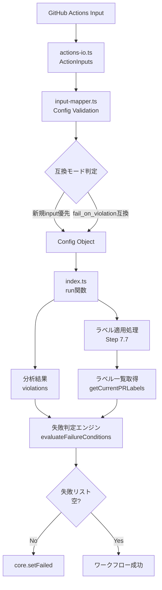
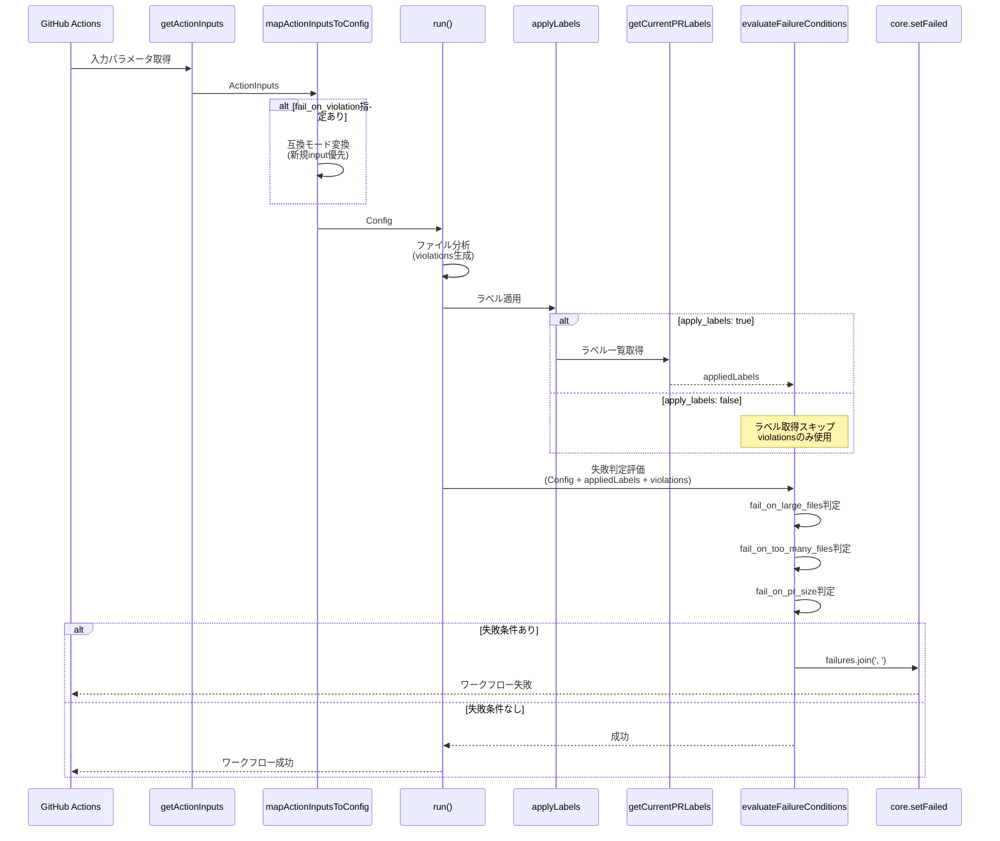
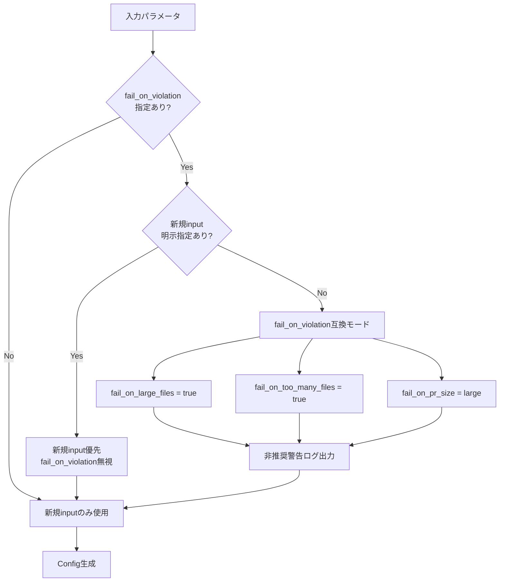
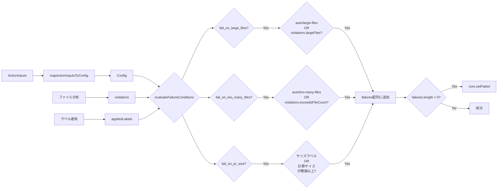
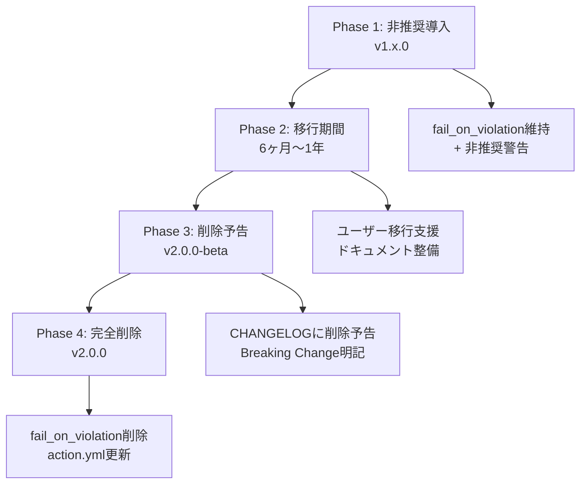

# Technical Design: Label-Based Workflow Failure Control

## Overview

Label-Based Workflow Failure Control機能は、PR Labelerアクションにおいて、適用されたラベルに基づいて個別にワークフローの成否を制御する新しい仕組みを提供します。現在の`fail_on_violation`による一括制御を、より柔軟で直感的なラベルベース制御に進化させ、チームの品質ポリシーを技術的に担保します。

**Purpose**: この機能は、GitHubワークフローの実行者に対して、PRのサイズ、ファイル数、複雑度などの品質指標に応じた細かな失敗制御を提供します。

**Users**: GitHub Actionsを使用してPRの品質管理を行う開発チーム、DevOpsエンジニア、プロジェクトメンテナーがこの機能を活用し、段階的なポリシー導入（警告→エラーへの移行）や、チーム固有の品質基準の強制に利用します。

**Impact**: 本機能は既存の`fail_on_violation`を非推奨として維持しつつ、3つの新規inputを追加することで、既存ユーザーへの影響を最小化しながら、より柔軟な運用を実現します。既存の一括制御から、ラベル種別ごとの個別制御への移行を促進します。

### Goals

- **柔軟な失敗制御**: ラベル種別（large-files、too-many-files、PRサイズ）ごとに個別に失敗判定を制御可能にする
- **後方互換性の維持**: 既存の`fail_on_violation`を非推奨として維持し、既存ユーザーの挙動を保ちながら移行を促す
- **ラベル非依存の動作**: `apply_labels: false`やラベル付与失敗時でも、分析結果（violations）に基づいて失敗判定を継続
- **直感的な設定**: ラベル名に対応したinput名（`fail_on_large_files`等）により、ユーザーの意図を明確にする
- **段階的なポリシー導入**: 警告のみ→エラーへの段階的な移行を支援

### Non-Goals

- 既存の`fail_on_violation`の即時削除（非推奨として維持し、将来のメジャーバージョンで削除）
- カスタムラベルに基づく失敗制御（固定のラベル名のみサポート）
- 複雑な条件式による失敗制御（AND/OR条件の組み合わせは将来対応）
- リアルタイムなポリシー変更（ワークフロー実行時の設定は固定）

## Architecture

### Existing Architecture Analysis

PR Labelerは、GitHub Actions上で動作するTypeScriptベースの単一プロセスアプリケーションです。既存アーキテクチャは以下の特徴を持ちます:

- **Railway-Oriented Programming (ROP)**: neverthrowの`Result<T, E>`型による明示的なエラーハンドリング
- **レイヤー分離**: Input層（actions-io.ts）、Validation層（input-mapper.ts）、Business Logic層（index.ts）の3層構造
- **冪等性保証**: ラベル適用、コメント投稿の重複実行を防止
- **既存の失敗判定**: `hasViolations && config.failOnViolation`による一括判定（src/index.ts Line 503）

本機能は、これらの既存パターンを尊重しつつ、以下のポイントで拡張します:

1. **Input層の拡張**: `ActionInputs`に3つの新規フィールドを追加、`fail_on_violation`を非推奨として維持
2. **Validation層の拡張**: `Config`インターフェースに新規フィールドを追加、互換ロジックを実装
3. **Business Logic層の置き換え**: 既存の一括判定を、ラベルと分析結果の両方を考慮した新しい判定ロジックに置き換え

### High-Level Architecture



### Architecture Integration

**Existing patterns preserved**:

- neverthrowの`Result<T, E>`パターンを継続使用
- 型安全性の徹底（`any`型禁止、`noUncheckedIndexedAccess`有効）
- 3層アーキテクチャ（Input → Validation → Business Logic）の維持
- i18nサポート（`src/locales/{language}/logs.json`）

**New components rationale**:

- **Failure Evaluation Engine**: ラベルと分析結果の両方を評価する新しいロジック層
  - 理由: 既存の単一条件判定から、複数条件（ラベル、violations）を統合的に評価する必要があるため
- **PR Label Fetcher**: ラベル適用後のPRラベル一覧を取得するヘルパー
  - 理由: ラベルベース判定にはラベル一覧の取得が必須だが、既存コードには該当処理がないため
- **Size Comparison Utility**: PRサイズラベルと閾値を比較するユーティリティ
  - 理由: `size/small` vs `"medium"`といった文字列比較を、サイズ順序定義に基づいて正確に行うため

**Technology alignment**: 既存のTypeScript 5.9.3、Node20、neverthrow 8.2.0、@actions/core 1.11.1を継続使用

**Steering compliance**:

- `structure.md`: 単一責任原則に従ったモジュール分離を維持
- `tech.md`: neverthrowによるRailway-Oriented Programmingを継続
- `product.md`: ゼロ設定で即利用可能（デフォルトは`false`）、既存ユーザーの挙動維持

## System Flows

### Sequence Diagram: 失敗判定フロー



### Process Flow: 互換モード処理



### Data Flow: 失敗判定のデータフロー



## Requirements Traceability

| Requirement | Requirement Summary      | Components                            | Interfaces                                                         | Flows                        |
| ----------- | ------------------------ | ------------------------------------- | ------------------------------------------------------------------ | ---------------------------- |
| 1.1-1.3     | 新規input定義            | ActionInputs, Config, action.yml      | `fail_on_large_files`, `fail_on_too_many_files`, `fail_on_pr_size` | Input処理フロー              |
| 1.4-1.5     | 互換モード維持           | mapActionInputsToConfig               | `fail_on_violation` (deprecated)                                   | 互換モード処理フロー         |
| 2.1-2.3     | Input検証とマッピング    | mapActionInputsToConfig, parseBoolean | Config型定義                                                       | Input → Config変換           |
| 2.4         | size_enabled依存チェック | mapActionInputsToConfig               | ConfigurationError                                                 | バリデーションフロー         |
| 3.1         | ラベル一覧取得           | getCurrentPRLabels                    | Octokit API                                                        | 失敗判定フロー（Sequence図） |
| 3.2-3.4     | 失敗条件評価             | evaluateFailureConditions             | ラベル + violations → failures                                     | 失敗判定のデータフロー       |
| 3.5         | 失敗メッセージ結合       | evaluateFailureConditions             | `failures.join(', ')`                                              | 失敗判定フロー               |
| 3.8         | ラベル非依存動作         | evaluateFailureConditions             | violations fallback                                                | 失敗判定のデータフロー       |
| 4.1-4.5     | サイズ閾値比較           | compareSizeThreshold                  | SIZE_ORDER定義                                                     | サイズ比較ロジック           |
| 5.1-5.4     | i18n対応                 | logWarningI18n, t('failures', ...)    | `src/locales/{lang}/logs.json`                                     | ログ出力フロー               |

## Components and Interfaces

### Input Layer

#### ActionInputs インターフェース

**Responsibility & Boundaries**

- **Primary Responsibility**: GitHub Actions入力パラメータの型定義
- **Domain Boundary**: Input層（actions-io.ts）
- **Data Ownership**: アクション実行時の生の入力値（文字列形式）

**Dependencies**

- **Inbound**: GitHub Actions runtime（`@actions/core`）
- **Outbound**: なし（純粋なデータ構造）
- **External**: `@actions/core` v1.11.1

**Contract Definition**

```typescript
export interface ActionInputs {
  // 既存フィールド（省略）
  fail_on_violation: string; // 非推奨（互換性維持）

  // 新規フィールド
  fail_on_large_files: string; // "" | "true" | "false"
  fail_on_too_many_files: string; // "" | "true" | "false"
  fail_on_pr_size: string; // "" | "small" | "medium" | "large" | "xlarge" | "xxlarge"
}
```

**Integration Strategy**:

- **Modification Approach**: 既存インターフェースに3つのフィールドを追加
- **Backward Compatibility**: `fail_on_violation`を削除せず非推奨として維持
- **Migration Path**: action.ymlに非推奨警告を記載し、実行時ログで移行を促す
- **🔧 Default Value Strategy**: action.ymlのデフォルト値を**空文字列("")**に設定することで、ユーザーが明示的に指定した値（"true"/"false"）とデフォルト値（""）を確実に区別できるようにする

---

#### getActionInputs 関数

**Responsibility & Boundaries**

- **Primary Responsibility**: GitHub Actions inputsから`ActionInputs`オブジェクトを生成
- **Domain Boundary**: Input層（actions-io.ts）
- **Data Ownership**: なし（データ変換のみ）

**Dependencies**

- **Inbound**: run関数（src/index.ts）
- **Outbound**: `core.getInput()` from `@actions/core`
- **External**: `@actions/core` v1.11.1

**Contract Definition**

```typescript
function getActionInputs(): ActionInputs {
  // 既存のgetInput呼び出しに加えて、以下を追加
  fail_on_large_files: core.getInput('fail_on_large_files'),
  fail_on_too_many_files: core.getInput('fail_on_too_many_files'),
  fail_on_pr_size: core.getInput('fail_on_pr_size'),
  // fail_on_violationは既存のまま維持
}
```

- **Preconditions**: GitHub Actions実行環境が存在すること
- **Postconditions**: すべてのinputが文字列として取得される（未指定の場合は空文字列）
- **Invariants**: inputの取得順序は結果に影響しない

**Integration Strategy**:

- **Modification Approach**: 既存関数に3行のgetInput呼び出しを追加
- **Backward Compatibility**: 既存のgetInput呼び出しをすべて維持

---

#### action.yml 変更

**Responsibility & Boundaries**

- **Primary Responsibility**: GitHub Actions入力パラメータの定義とデフォルト値の設定
- **Domain Boundary**: GitHub Actions定義ファイル
- **Data Ownership**: アクション実行時の入力パラメータ定義

**Contract Definition**

```yaml
inputs:
  # 既存のfail_on_violationは維持（非推奨）
  fail_on_violation:
    description: "(Deprecated) Use 'fail_on_large_files', 'fail_on_too_many_files', or 'fail_on_pr_size' instead"
    required: false
    default: "false"

  # 🔧 新規追加: デフォルト値を空文字列("")に設定
  fail_on_large_files:
    description: "Fail workflow if large files are detected (labeled with auto/large-files or auto:too-many-lines)"
    required: false
    default: ""  # 空文字列 = 未指定

  fail_on_too_many_files:
    description: "Fail workflow if too many files are detected (labeled with auto/too-many-files)"
    required: false
    default: ""  # 空文字列 = 未指定

  fail_on_pr_size:
    description: "Fail workflow if PR size exceeds threshold (values: '', 'small', 'medium', 'large', 'xlarge', 'xxlarge')"
    required: false
    default: ""  # 空文字列 = 未指定
```

**Integration Strategy**:

- **Default Value Rationale**: 空文字列("")をデフォルト値とすることで、ユーザーが明示的に"false"を指定した場合と未指定の場合を確実に区別できる
- **Backward Compatibility**: `fail_on_violation`のデフォルト値は"false"のまま維持（既存の挙動を変更しない）
- **Migration Path**: descriptionに非推奨の旨を明記し、ユーザーに新しいinputへの移行を促す

---

### Validation Layer

#### Config インターフェース

**Responsibility & Boundaries**

- **Primary Responsibility**: 検証済み・型変換済みの設定値の型定義
- **Domain Boundary**: Validation層（input-mapper.ts）
- **Data Ownership**: アプリケーション実行時の設定状態

**Dependencies**

- **Inbound**: mapActionInputsToConfig関数
- **Outbound**: なし（純粋なデータ構造）
- **External**: なし

**Contract Definition**

```typescript
export interface Config {
  // 既存フィールド（省略）

  // 新規フィールド
  failOnLargeFiles: boolean;
  failOnTooManyFiles: boolean;
  failOnPrSize: string; // "" | "small" | "medium" | "large" | "xlarge" | "xxlarge"

  // 互換フラグ（内部使用）
  legacyFailOnViolation: boolean;
}
```

**Integration Strategy**:

- **Modification Approach**: 既存インターフェースに4つのフィールドを追加
- **Backward Compatibility**: `failOnViolation`を削除せず`legacyFailOnViolation`に名前変更
- **Migration Path**: 新規フィールド優先、互換フラグは内部的なフォールバック用

---

#### mapActionInputsToConfig 関数

**Responsibility & Boundaries**

- **Primary Responsibility**: `ActionInputs`から`Config`への検証・変換、互換モードのロジック実装
- **Domain Boundary**: Validation層（input-mapper.ts）
- **Data Ownership**: なし（データ変換のみ）

**Dependencies**

- **Inbound**: run関数（src/index.ts）
- **Outbound**: parseBoolean, parseBooleanStrict
- **External**: neverthrow v8.2.0（`Result<T, E>`）

**Contract Definition**

```typescript
function mapActionInputsToConfig(
  inputs: ActionInputs
): Result<Config, ConfigurationError> {
  // 🔧 FIX: ユーザーが明示的に指定したかを判定
  // action.ymlのデフォルト値（空文字列""）と、ユーザーが明示的に指定した値（"true"/"false"）を区別
  // 空文字列でない = ユーザーが明示的に指定した
  const hasExplicitLargeFiles = inputs.fail_on_large_files.trim() !== '';
  const hasExplicitTooManyFiles = inputs.fail_on_too_many_files.trim() !== '';
  const hasExplicitPrSize = inputs.fail_on_pr_size.trim() !== '';

  const hasNewInputs = hasExplicitLargeFiles ||
                       hasExplicitTooManyFiles ||
                       hasExplicitPrSize;

  // 互換モード判定ロジック
  const useLegacyMode = parseBoolean(inputs.fail_on_violation) === true;

  let failOnLargeFiles: boolean;
  let failOnTooManyFiles: boolean;
  let failOnPrSize: string;

  if (hasNewInputs) {
    // 🔧 新規input優先（ユーザーが明示的に指定した場合）
    // "true"/"false"の両方を明示的な指定として扱う
    failOnLargeFiles = hasExplicitLargeFiles
      ? parseBoolean(inputs.fail_on_large_files) === true
      : false;
    failOnTooManyFiles = hasExplicitTooManyFiles
      ? parseBoolean(inputs.fail_on_too_many_files) === true
      : false;
    failOnPrSize = hasExplicitPrSize ? inputs.fail_on_pr_size.trim() : '';
  } else if (useLegacyMode) {
    // 互換モード（fail_on_violation: trueが指定され、新規inputなし）
    failOnLargeFiles = true;
    failOnTooManyFiles = true;
    failOnPrSize = 'large';
    // 非推奨警告をログ出力
    logWarningI18n('deprecation.failOnViolation');
  } else {
    // デフォルト値（何も指定されていない場合）
    failOnLargeFiles = false;
    failOnTooManyFiles = false;
    failOnPrSize = '';
  }

  // fail_on_pr_size検証
  const validSizes = ['', 'small', 'medium', 'large', 'xlarge', 'xxlarge'];
  if (!validSizes.includes(failOnPrSize)) {
    return err(new ConfigurationError(
      t('errors', 'invalidFailOnPrSize', { valid: validSizes.join(', ') })
    ));
  }

  // size_enabled依存チェック
  if (failOnPrSize !== '' && !sizeEnabled) {
    return err(new ConfigurationError(
      t('errors', 'failOnPrSizeRequiresSizeEnabled')
    ));
  }

  return ok({
    ...existingConfig,
    failOnLargeFiles,
    failOnTooManyFiles,
    failOnPrSize,
    legacyFailOnViolation: useLegacyMode,
  });
}
```

- **Preconditions**: `inputs`が有効な`ActionInputs`オブジェクトであること
- **Postconditions**: 成功時は検証済みの`Config`、失敗時は`ConfigurationError`
- **Invariants**: 新規input優先度 > 互換モード > デフォルト値

**Integration Strategy**:

- **Modification Approach**: 既存関数内に互換ロジックと検証ロジックを追加
- **Backward Compatibility**: `fail_on_violation: true`の挙動を完全に再現

---

### Business Logic Layer

#### evaluateFailureConditions 関数（新規）

**Responsibility & Boundaries**

- **Primary Responsibility**: Config、appliedLabels、violationsを統合評価し、失敗条件リストを生成
- **Domain Boundary**: Business Logic層（src/index.ts または src/failure-evaluator.ts）
- **Data Ownership**: なし（純粋関数）

**Dependencies**

- **Inbound**: run関数（src/index.ts）
- **Outbound**: compareSizeThreshold, t関数（i18n）
- **External**: なし

**Contract Definition**

```typescript
interface FailureEvaluationInput {
  config: Config;
  appliedLabels: string[] | undefined; // ラベル取得失敗時はundefined
  violations: {
    largeFiles: ViolationDetail[];         // ファイルサイズ超過リスト
    exceedsFileLines: ViolationDetail[];   // 🔧 追加: per-file行数超過リスト（auto:too-many-lines）
    exceedsAdditions: boolean;             // 🔧 追加: PR追加行数超過フラグ（auto:excessive-changes）
    exceedsFileCount: boolean;             // PRファイル数超過フラグ
  };
  metrics: {
    totalAdditions: number;
  };
  sizeThresholds: SizeThresholdsV2;
}

function evaluateFailureConditions(
  input: FailureEvaluationInput
): string[] {
  const failures: string[] = [];
  // 🔧 i18n対応: 重複検出のために失敗タイプをキーで追跡
  const failureKeys = new Set<string>();

  // fail_on_large_files判定
  if (config.failOnLargeFiles) {
    const hasLargeFilesLabel = appliedLabels?.includes(config.largeFilesLabel) ?? false;
    const hasLargeFilesViolation = violations.largeFiles.length > 0;
    if (hasLargeFilesLabel || hasLargeFilesViolation) {
      failureKeys.add('largeFiles');
      failures.push(t('failures', 'largeFiles'));
    }
  }

  // fail_on_too_many_files判定
  if (config.failOnTooManyFiles) {
    const hasTooManyFilesLabel = appliedLabels?.includes(config.tooManyFilesLabel) ?? false;
    const hasTooManyFilesViolation = violations.exceedsFileCount;
    if (hasTooManyFilesLabel || hasTooManyFilesViolation) {
      failureKeys.add('tooManyFiles');
      failures.push(t('failures', 'tooManyFiles'));
    }
  }

  // 🔧 追加: fail_on_large_files が有効な場合、per-file行数超過もチェック
  if (config.failOnLargeFiles) {
    const hasTooManyLinesLabel = appliedLabels?.includes('auto:too-many-lines') ?? false;
    const hasTooManyLinesViolation = violations.exceedsFileLines.length > 0;
    if (hasTooManyLinesLabel || hasTooManyLinesViolation) {
      // 🔧 FIX: tooManyLinesは独立した違反理由なので、largeFilesとは別に追加
      // 同じキーでの重複のみを防ぐ
      if (!failureKeys.has('tooManyLines')) {
        failureKeys.add('tooManyLines');
        failures.push(t('failures', 'tooManyLines'));
      }
    }
  }

  // 🔧 追加: fail_on_pr_size が設定されている場合、PR追加行数超過もチェック
  if (config.failOnPrSize !== '') {
    const hasExcessiveChangesLabel = appliedLabels?.includes('auto:excessive-changes') ?? false;
    const hasExcessiveChangesViolation = violations.exceedsAdditions;
    if (hasExcessiveChangesLabel || hasExcessiveChangesViolation) {
      // 🔧 FIX: excessiveChangesは独立した違反理由なので、prSizeとは別に追加
      // 同じキーでの重複のみを防ぐ
      if (!failureKeys.has('excessiveChanges')) {
        failureKeys.add('excessiveChanges');
        failures.push(t('failures', 'excessiveChanges'));
      }
    }
  }

  // fail_on_pr_size判定
  if (config.failOnPrSize !== '') {
    const sizeLabel = appliedLabels?.find(l => l.startsWith('size/'));
    let actualSize: string;

    if (sizeLabel) {
      actualSize = sizeLabel; // "size/large"
    } else {
      // ラベルがない場合、totalAdditionsから算出
      actualSize = calculateSizeCategory(input.metrics.totalAdditions, input.sizeThresholds);
    }

    if (compareSizeThreshold(actualSize, config.failOnPrSize)) {
      failureKeys.add('prSize');
      failures.push(t('failures', 'prSize', { size: actualSize, threshold: config.failOnPrSize }));
    }
  }

  return failures;
}
```

- **Preconditions**: `input`が有効なデータを含むこと
- **Postconditions**: 失敗条件リスト（空配列または1つ以上の文字列）
- **Invariants**: 同じinputに対して常に同じ結果を返す（純粋関数）

**State Management**: なし（ステートレス関数）

---

#### compareSizeThreshold 関数（新規）

**Responsibility & Boundaries**

- **Primary Responsibility**: サイズラベル（または算出サイズ）と閾値を比較し、閾値以上かどうかを判定
- **Domain Boundary**: Utility層（src/utils/size-comparison.ts または src/index.ts）
- **Data Ownership**: なし（純粋関数）

**Dependencies**

- **Inbound**: evaluateFailureConditions
- **Outbound**: なし
- **External**: なし

**Contract Definition**

```typescript
const SIZE_ORDER = ['small', 'medium', 'large', 'xlarge', 'xxlarge'] as const;
type SizeValue = typeof SIZE_ORDER[number];

function compareSizeThreshold(
  appliedSize: string, // "size/large" or "large"
  threshold: string // "medium"
): boolean {
  // "size/"プレフィックス除去
  const sizeValue = appliedSize.startsWith('size/')
    ? appliedSize.replace('size/', '')
    : appliedSize;

  const appliedIndex = SIZE_ORDER.indexOf(sizeValue as SizeValue);
  const thresholdIndex = SIZE_ORDER.indexOf(threshold as SizeValue);

  // インデックスが-1の場合はfalse（不正な値）
  if (appliedIndex === -1 || thresholdIndex === -1) {
    return false;
  }

  return appliedIndex >= thresholdIndex;
}
```

- **Preconditions**: `threshold`が有効なサイズ値であること（バリデーション済み）
- **Postconditions**: `appliedSize >= threshold`の場合`true`、それ以外`false`
- **Invariants**: `SIZE_ORDER`の順序は不変

---

#### calculateSizeCategory 関数（新規）

**Responsibility & Boundaries**

- **Primary Responsibility**: PR追加行数からサイズカテゴリを算出
- **Domain Boundary**: Utility層（src/utils/size-comparison.ts）
- **Data Ownership**: なし（純粋関数）

**Dependencies**

- **Inbound**: evaluateFailureConditions
- **Outbound**: なし
- **External**: なし

**Contract Definition**

```typescript
function calculateSizeCategory(
  totalAdditions: number,
  thresholds: SizeThresholdsV2
): string {
  if (totalAdditions < thresholds.small) return 'size/small';
  if (totalAdditions < thresholds.medium) return 'size/medium';
  if (totalAdditions < thresholds.large) return 'size/large';
  if (totalAdditions < thresholds.xlarge) return 'size/xlarge';
  return 'size/xxlarge';
}
```

- **Preconditions**: `totalAdditions >= 0`、`thresholds`が有効な値であること
- **Postconditions**: "size/{category}"形式の文字列
- **Invariants**: 閾値の順序（small < medium < large < xlarge）

---

#### getCurrentPRLabels 関数（新規）

**Responsibility & Boundaries**

- **Primary Responsibility**: GitHub APIを使用して、現在のPRに適用されているラベル一覧を取得
- **Domain Boundary**: GitHub API連携層（src/label-manager.ts または src/index.ts）
- **Data Ownership**: なし（APIクライアント）

**Dependencies**

- **Inbound**: run関数（src/index.ts）
- **Outbound**: Octokit API (`octokit.rest.issues.listLabelsOnIssue`)
- **External**: `@octokit/rest` v22.0.0、`@actions/github` v6.0.1

**External Dependencies Investigation**:

- **API**: `GET /repos/{owner}/{repo}/issues/{issue_number}/labels`
- **認証**: `GITHUB_TOKEN`（自動提供、`pull-requests: read`権限必要）
- **レート制限**: 5000 requests/hour（authenticated）
- **ページネーション**: 最大100ラベル/ページ、PR Labelerでは通常10個以下のため1ページで十分
- **エラーケース**:
  - 401 Unauthorized: トークン無効
  - 403 Forbidden: 権限不足
  - 404 Not Found: PR不存在
  - 503 Service Unavailable: GitHub一時的障害

**Contract Definition**

```typescript
function getCurrentPRLabels(
  octokit: Octokit,
  context: { owner: string; repo: string; pullNumber: number }
): Promise<Result<string[], GitHubAPIError>> {
  try {
    const { data } = await octokit.rest.issues.listLabelsOnIssue({
      owner: context.owner,
      repo: context.repo,
      issue_number: context.pullNumber,
    });

    const labelNames = data.map(label => label.name);
    return ok(labelNames);
  } catch (error) {
    return err(new GitHubAPIError('Failed to fetch PR labels', error));
  }
}
```

- **Preconditions**: Octokitが認証済みであること、PRが存在すること
- **Postconditions**: 成功時はラベル名の配列、失敗時は`GitHubAPIError`
- **Invariants**: ラベル名の順序は不定（Set扱い）

**Integration Strategy**:

- **Modification Approach**: 新規関数として追加（既存のlabel-manager.tsに配置）
- **Backward Compatibility**: N/A（新規機能）
- **Migration Path**: N/A

---

### Integration with Existing System

#### run関数の修正

既存の`run`関数（src/index.ts）のStep 10（失敗判定ロジック）を以下のように置き換えます:

**既存コード（Line 503-508）**:

```typescript
// Step 10: Fail if violations and fail_on_violation is true
if (hasViolations && config.failOnViolation) {
  const failMessage = t('logs', 'completion.failedViolations');
  setFailed(`🚫 ${failMessage}`);
} else {
  logInfoI18n('completion.success');
}
```

**新コード**:

```typescript
// Step 10: Label-based failure control
let appliedLabels: string[] | undefined;
if (config.applyLabels) {
  const labelsResult = await getCurrentPRLabels(
    github.getOctokit(token),
    { owner: prContext.owner, repo: prContext.repo, pullNumber: prContext.pullNumber }
  );
  appliedLabels = labelsResult.isOk() ? labelsResult.value : undefined;
  if (labelsResult.isErr()) {
    logWarningI18n('labels.fetchFailed', { message: labelsResult.error.message });
  }
}

const failures = evaluateFailureConditions({
  config,
  appliedLabels,
  violations: analysis.violations,
  metrics: analysis.metrics,
  sizeThresholds: config.sizeThresholdsV2,
});

if (failures.length > 0) {
  const failMessage = failures.join(', ');
  setFailed(`🚫 ${failMessage}`);
} else {
  logInfoI18n('completion.success');
}
```

**Integration Strategy**:

- **Modification Approach**: 既存の条件分岐を完全に置き換え
- **Backward Compatibility**: 互換モード（`legacyFailOnViolation`）により既存の挙動を再現
- **Migration Path**: 非推奨警告により新規inputへの移行を促す

## Data Models

### Logical Data Model

#### Config拡張

```typescript
export interface Config {
  // 既存フィールド（省略）

  // 新規: ラベルベース失敗制御
  failOnLargeFiles: boolean;
  failOnTooManyFiles: boolean;
  failOnPrSize: '' | 'small' | 'medium' | 'large' | 'xlarge' | 'xxlarge';

  // 互換フラグ（内部使用）
  legacyFailOnViolation: boolean;
}
```

**Consistency & Integrity**:

- `failOnPrSize`が空でない場合、`sizeEnabled`は`true`でなければならない（Validation層で保証）
- 新規inputが明示指定されている場合、`legacyFailOnViolation`は無視される

---

#### FailureEvaluationInput（新規型定義）

```typescript
export interface FailureEvaluationInput {
  config: Config;
  appliedLabels: string[] | undefined; // ラベル取得失敗時はundefined
  violations: {
    largeFiles: ViolationDetail[];         // ファイルサイズ超過リスト
    exceedsFileLines: ViolationDetail[];   // 🔧 追加: per-file行数超過リスト（auto:too-many-lines）
    exceedsAdditions: boolean;             // 🔧 追加: PR追加行数超過フラグ（auto:excessive-changes）
    exceedsFileCount: boolean;             // PRファイル数超過フラグ
  };
  metrics: {
    totalAdditions: number;
  };
  sizeThresholds: SizeThresholdsV2;
}
```

**Purpose**: `evaluateFailureConditions`関数の入力パラメータを構造化し、将来の拡張に備える

---

#### SIZE_ORDER定数

```typescript
export const SIZE_ORDER = ['small', 'medium', 'large', 'xlarge', 'xxlarge'] as const;
export type SizeValue = typeof SIZE_ORDER[number];
```

**Purpose**: サイズ値の順序を定義し、比較ロジックで使用

**Invariants**: 順序は不変、追加・削除は破壊的変更

### Data Contracts & Integration

#### i18n メッセージキー拡張

**English (`src/locales/en/logs.json`)**:

```json
{
  "failures": {
    "largeFiles": "Large files detected",
    "tooManyFiles": "Too many files in PR",
    "tooManyLines": "Files with too many lines detected",
    "excessiveChanges": "PR additions exceed limit",
    "prSize": "PR size ({size}) exceeds threshold ({threshold})"
  },
  "deprecation": {
    "failOnViolation": "⚠️  'fail_on_violation' is deprecated. Use 'fail_on_large_files', 'fail_on_too_many_files', or 'fail_on_pr_size' instead."
  },
  "errors": {
    "invalidFailOnPrSize": "Invalid fail_on_pr_size value. Valid values: {valid}",
    "failOnPrSizeRequiresSizeEnabled": "fail_on_pr_size requires size_enabled to be true"
  }
}
```

**Japanese (`src/locales/ja/logs.json`)**:

```json
{
  "failures": {
    "largeFiles": "大きなファイルが検出されました",
    "tooManyFiles": "PRのファイル数が多すぎます",
    "tooManyLines": "行数が多すぎるファイルが検出されました",
    "excessiveChanges": "PRの追加行数が制限を超えています",
    "prSize": "PRサイズ（{size}）が閾値（{threshold}）を超えています"
  },
  "deprecation": {
    "failOnViolation": "⚠️  'fail_on_violation'は非推奨です。'fail_on_large_files'、'fail_on_too_many_files'、または'fail_on_pr_size'を使用してください。"
  },
  "errors": {
    "invalidFailOnPrSize": "fail_on_pr_sizeの値が無効です。有効な値: {valid}",
    "failOnPrSizeRequiresSizeEnabled": "fail_on_pr_sizeはsize_enabled: trueが必要です"
  }
}
```

**Schema Versioning Strategy**: メッセージキーの追加のみ（既存キーは保持）

## Error Handling

### Error Strategy

本機能は、既存のneverth rowベースのRailway-Oriented Programming (ROP)パターンを継承し、以下のエラーハンドリング戦略を採用します:

1. **ConfigurationError**: 入力検証エラー（無効な`fail_on_pr_size`値、`size_enabled`依存違反）
2. **GitHubAPIError**: ラベル取得失敗（401, 403, 404, 503等）
3. **Graceful Degradation**: ラベル取得失敗時は`violations`のみで失敗判定を継続

### Error Categories and Responses

#### User Errors (4xx相当)

**ConfigurationError: 無効な`fail_on_pr_size`値**

- **Trigger**: `fail_on_pr_size`に有効なサイズ値以外が指定された場合
- **Response**: `mapActionInputsToConfig`が`Result::err`を返し、ワークフローを即座に失敗
- **Message**: "Invalid fail_on_pr_size value. Valid values: '', 'small', 'medium', 'large', 'xlarge', 'xxlarge'"（i18n対応）
- **Recovery**: ユーザーがワークフロー設定を修正して再実行

**ConfigurationError: `size_enabled`依存違反**

- **Trigger**: `fail_on_pr_size`が指定されているが`size_enabled: false`の場合
- **Response**: `mapActionInputsToConfig`が`Result::err`を返し、ワークフローを即座に失敗
- **Message**: "fail_on_pr_size requires size_enabled to be true"（i18n対応）
- **Recovery**: ユーザーが`size_enabled: true`に設定して再実行

#### System Errors (5xx相当)

**GitHubAPIError: ラベル取得失敗**

- **Trigger**: `getCurrentPRLabels`でGitHub API呼び出しが失敗（401, 403, 404, 503等）
- **Response**:
  - 警告ログを出力（`logWarningI18n('labels.fetchFailed')`）
  - `appliedLabels = undefined`として`evaluateFailureConditions`に渡す
  - **Graceful Degradation**: `violations`のみで失敗判定を継続
- **Message**: "Failed to fetch PR labels: {API error message}"（i18n対応）
- **Recovery**: 自動リトライなし（GitHub API一時障害の場合はワークフロー再実行）

### Monitoring

**Error Tracking**:

- ConfigurationError: GitHub Actionsログに即座に出力、ワークフロー失敗
- GitHubAPIError: 警告ログ出力後、処理継続（Graceful Degradation）

**Logging Strategy**:

- デバッグレベル: 各失敗条件の評価結果（`failures`配列への追加理由）
- インフォレベル: 最終的な失敗判定結果（`failures.length > 0`の場合）
- 警告レベル: ラベル取得失敗、非推奨input使用

**Health Monitoring**:

- GitHub Actionsの標準出力にすべてのログを出力
- `core.setFailed()`によりワークフローステータスを制御

## Testing Strategy

### Unit Tests

**src/input-mapper.test.ts**:

1. `fail_on_pr_size`バリデーション: 有効な値（空文字列、各サイズ値）のパーステスト
2. `fail_on_pr_size`バリデーション: 無効な値（"huge", "tiny", "123"）でのエラーthrow検証
3. `fail_on_pr_size`と`size_enabled`の依存関係: `size_enabled: false`時のエラーthrow検証
4. 互換モード: `fail_on_violation: true`時の自動変換（`failOnLargeFiles = true`等）
5. 新規input優先度: 新規inputと`fail_on_violation`の両方が指定された場合、新規inputが優先されることを検証

**src/utils/size-comparison.test.ts**（新規）:

1. `compareSizeThreshold`: 各サイズの境界値テスト（small vs medium, large vs xlarge等）
2. `compareSizeThreshold`: "size/"プレフィックス除去のテスト
3. `compareSizeThreshold`: 無効なサイズ値（"invalid"）でのfalse返却テスト
4. `calculateSizeCategory`: totalAdditionsから正しいサイズカテゴリが算出されることを検証
5. `calculateSizeCategory`: 境界値（thresholds.small - 1, thresholds.small等）でのカテゴリ判定テスト

**src/failure-evaluator.test.ts**（新規）:

1. `evaluateFailureConditions`: `fail_on_large_files: true` + ラベルありの場合に失敗リスト追加
2. `evaluateFailureConditions`: `fail_on_large_files: true` + ラベルなし + violationsありの場合に失敗リスト追加
3. `evaluateFailureConditions`: `fail_on_too_many_files: true` + violationsありの場合に失敗リスト追加
4. `evaluateFailureConditions`: `fail_on_pr_size: "medium"` + `size/large`ラベルの場合に失敗リスト追加
5. `evaluateFailureConditions`: 複数の失敗条件が同時に満たされた場合、すべての失敗理由が追加されることを検証

### Integration Tests

\***\*tests**/integration.test.ts\*\*:

1. パターン1: `fail_on_large_files: true`のみ指定、大きいファイルありの場合にワークフロー失敗
2. パターン2: `fail_on_pr_size: "large"`指定、`size/xlarge`ラベル適用時にワークフロー失敗
3. パターン3: `fail_on_pr_size: "large"`指定、`size/medium`ラベル適用時にワークフロー成功
4. パターン4: 複数フラグ組み合わせ（`fail_on_large_files: true` + `fail_on_pr_size: "xlarge"`）でのワークフロー失敗
5. 互換モード: `fail_on_violation: true`指定時に既存の挙動が再現されることを検証（大きいファイル + 多数ファイル + largeサイズで失敗）
6. Graceful Degradation: `apply_labels: false`時にviolationsのみで失敗判定が行われることを検証

### E2E Tests

**GitHub Actions実環境テスト**（`.github/workflows/self-test.yml`）:

1. 実際のPRを作成し、`fail_on_large_files: true`でワークフロー失敗を確認
2. 小さいPRで`fail_on_pr_size: "xxlarge"`を指定し、ワークフロー成功を確認
3. `fail_on_violation: true`（互換モード）でワークフローを実行し、非推奨警告ログが出力されることを確認

### Performance Tests

**パフォーマンス要件**（Requirement 10）:

1. ラベル取得のAPI呼び出し時間を計測（期待値: < 500ms）
2. `evaluateFailureConditions`の実行時間を計測（期待値: < 10ms、純粋関数のため高速）
3. 全体の失敗判定ロジック追加オーバーヘッドを計測（期待値: < 100ms）

## Migration Strategy

### Migration Phases



### Process

**Phase 1: 非推奨導入（v1.x.0リリース時）**

- `action.yml`に`fail_on_violation`の非推奨記載
- 実行時に`logWarningI18n('deprecation.failOnViolation')`で警告出力
- README.mdに移行ガイド追加
- 新規input 3つの追加とドキュメント整備

**Phase 2: 移行期間（6ヶ月〜1年）**

- ユーザーが新規inputに移行する時間を提供
- GitHub Discussions/Issuesで移行支援
- 移行事例の共有（ユースケースパターン1〜4）

**Phase 3: 削除予告（v2.0.0-betaリリース時）**

- CHANGELOG.mdにBreaking Change記載
- v2.0.0で`fail_on_violation`が削除されることを明記
- 最終移行猶予期間の設定

**Phase 4: 完全削除（v2.0.0リリース時）**

- `action.yml`から`fail_on_violation`を削除
- `ActionInputs`、`Config`から関連フィールドを削除
- 互換ロジックを完全除去

### Rollback Triggers

- **Phase 1でのロールバック条件**: 重大なバグ（既存ユーザーの挙動が変わる、ワークフローが不正に失敗する）
- **Phase 3でのロールバック条件**: ユーザーからの強い反対（移行が困難、Breaking Changeの影響が大きすぎる）

### Validation Checkpoints

- **Phase 1完了時**: 統合テストですべてのパターンが成功、非推奨警告が適切に出力される
- **Phase 2中間**: GitHub Discussionsで移行状況をヒアリング、ユーザーフィードバック収集
- **Phase 3前**: 既存ユーザーの50%以上が新規inputに移行していることを確認
- **Phase 4前**: GitHub Actionsのセルフテストで`fail_on_violation`なしでの動作を検証

---

**設計完了**: 本設計書は、既存システムへの影響を最小化しつつ、柔軟で拡張可能なラベルベース失敗制御を実現する包括的な技術設計を提供します。互換性維持、Graceful Degradation、段階的な移行戦略により、既存ユーザーと新規ユーザーの両方に価値を提供します。
