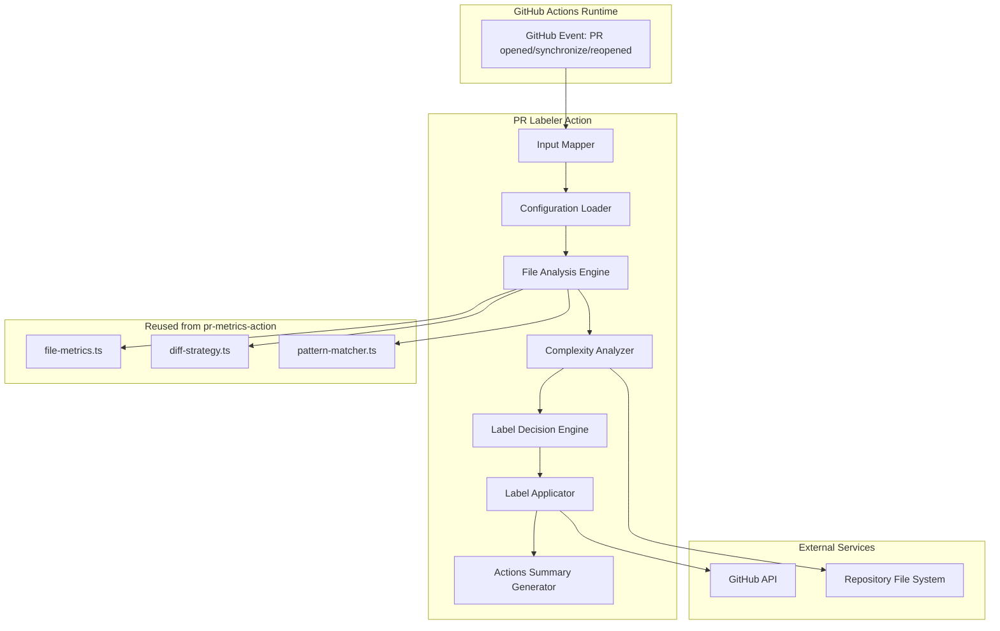
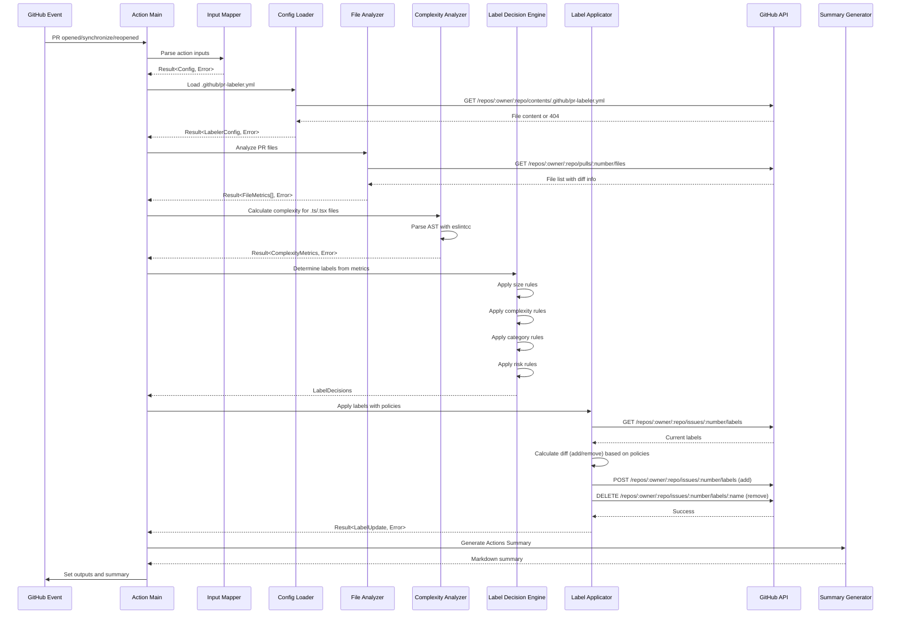
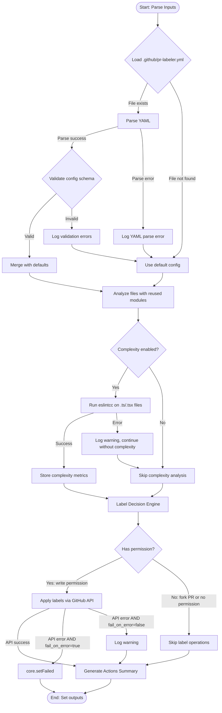
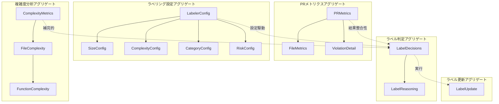
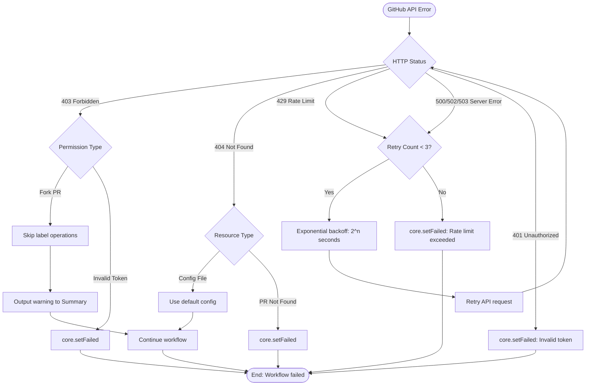

# 技術設計書: PR Labeler

## 概要

PR Labelerは、PRのメトリクス分析に基づいて自動的にラベルを付与するGitHub Actionである。既存のpr-metrics-actionで計算されたメトリクス（サイズ、複雑度、リスク、カテゴリ）を活用し、GitHub Actions labelerでは実現できないインテリジェントなラベル付けを提供する。

**目的**: 本機能は、PRの特性を可視化し、レビュープロセスの効率化と品質管理の自動化を開発者、テックリード、プロジェクトマネージャーに提供する。

**ユーザー**: 開発者、テックリード、プロジェクトマネージャー、品質保証担当者、CI/CD管理者は、PRレビュー、品質管理、プロセス可視化のワークフローでこれを利用する。

**影響**: 現在の手動ラベル付けプロセスを、pr-metrics-actionのメトリクス計算インフラに新しいラベル付与エンジンを統合することで、完全自動化されたインテリジェントなラベル管理システムに変更する。

### ゴール

- PRのサイズ、複雑度、リスク、カテゴリに基づく自動ラベル付けの実現
- pr-metrics-actionの既存メトリクス計算ロジックの再利用による開発効率化
- YAML設定ファイルによる柔軟なカスタマイズ性の提供
- 冪等性とエラーハンドリングの堅牢性を備えたGitHub Actions統合

### 非ゴール

- PR自動マージ機能（将来拡張として検討）
- レビュアー自動アサイン機能（既存のCODEOWNERS機能を利用）
- Slack/Teams等への通知機能（他のGitHub Actionsとの組み合わせで実現）
- GitHub Enterprise Server対応（初期フェーズではGitHub.com/GitHub Enterprise Cloudのみ）

## アーキテクチャ

### 既存アーキテクチャ分析

pr-metrics-actionは、以下のアーキテクチャパターンを採用している：

- **Railway-Oriented Programming (ROP)**: neverthrowの`Result<T, E>`型による型安全なエラーハンドリング
- **単一責任原則**: 各モジュールが明確な境界を持ち、ビジネスロジックとI/Oを分離
- **依存性注入**: GitHub APIクライアントや設定を引数で渡し、テスタビリティを確保
- **Pure Functions優先**: 副作用（API呼び出し、I/O）と純粋関数を分離

**既存のドメイン境界**:

- メトリクス計算層（file-metrics、diff-strategy）
- パターンマッチング層（pattern-matcher）
- GitHub API統合層（label-manager、comment-manager）
- 入力検証層（input-mapper）
- 出力生成層（report-formatter、actions-io）

**維持すべき統合ポイント**:

- `analyzeFiles`関数のインターフェース
- `isExcluded`パターンマッチング関数
- `Result<T, E>`エラーハンドリングパターン
- GitHub Actions入出力規約

### ハイレベルアーキテクチャ



**アーキテクチャ統合**:

- **既存パターン維持**: Railway-Oriented Programming、単一責任原則、依存性注入パターンをすべて継承
- **新規コンポーネントの理由**:
  - Configuration Loader: YAML設定ファイルのパース（既存のinput-mapperとは別の責務）
  - Complexity Analyzer: 循環的複雑度計算（新規機能）
  - Label Decision Engine: ラベル付与ルールの集約（複数ディメンションのラベリング戦略）
  - Label Applicator: 既存label-managerの拡張（置換/追加ポリシーの実装）
- **技術スタック整合性**: TypeScript strict mode、neverthrow、minimatch、@actions/core、@actions/github、Vitestの継続利用
- **ステアリング準拠**: structure.mdのモジュール分離原則、tech.mdのRailway-Oriented Programming、product.mdの冪等性原則を遵守

### 技術スタック整合性

本機能は既存のpr-metrics-actionの技術スタックに完全に整合する：

**既存技術の継続利用**:

- **言語・ランタイム**: TypeScript 5.9.3 (strict mode)、Node.js 20+
- **エラーハンドリング**: neverthrow 8.2.0 (Railway-Oriented Programming)
- **パターンマッチング**: minimatch 10.0.3
- **GitHub Actions SDK**: @actions/core 1.11.1、@actions/github 6.0.1、@octokit/rest 22.0.0
- **ビルド**: @vercel/ncc（単一ファイルバンドル）
- **テスト**: Vitest 3.2.4、@vitest/coverage-v8
- **品質管理**: ESLint 9 (Flat Config)、Prettier 3.6.2、typescript-eslint 8.46.1

**新規導入ライブラリ**:

| ライブラリ | バージョン | 用途             | 選定理由                                                  |
| ---------- | ---------- | ---------------- | --------------------------------------------------------- |
| `eslintcc` | 最新       | 循環的複雑度計算 | ESLintベースで型安全、TypeScript AST解析対応、MIT license |
| `js-yaml`  | 4.1.0      | YAML設定パース   | デファクトスタンダード、型定義完備                        |

**技術選定の補足調査**:

**eslintcc**:

- **公式ドキュメント**: https://eslintcc.github.io/
- **GitHub**: https://github.com/eslintcc/eslintcc
- **API**: typescript-eslintのASTを使用し、ESLintの`complexity`ルールでファイル単位の循環的複雑度を計算
- **認証**: 不要（ローカルファイル解析）
- **制約**: TypeScript AST解析のオーバーヘッド（大規模ファイルで100-500ms程度）
- **代替案**: `cyclomatic-complexity`（軽量だがAST解析精度が低い）、`ts-complex`（Halstead指標も計算するが過剰）

**js-yaml**:

- **公式ドキュメント**: https://github.com/nodeca/js-yaml
- **API**: `yaml.load(fileContent, { schema: yaml.JSON_SCHEMA })`でパース、エラー時は`YAMLException`
- **バリデーション**: スキーマ定義なし（パース後に手動バリデーション）
- **代替案**: `yaml`（公式YAML 1.2パーサーだが型定義が弱い）

**実装段階で要調査**:

- eslintccのメモリ使用量（大規模PR時のパフォーマンス影響）
- js-yamlのセキュリティ設定（`!!js/function`等の危険な構文の無効化）

### 重要な設計判断

#### 判断1: 循環的複雑度計算ライブラリ選定

**判断**: `eslintcc`を採用

**コンテキスト**: Requirement 2（複雑度ベースの自動ラベル付け）を実現するため、TypeScript/JavaScriptの循環的複雑度を正確に計算できるライブラリが必要。

**代替案**:

1. **eslintcc**: ESLintの`complexity`ルールをベースにした完全なTypeScript AST解析
2. **cyclomatic-complexity**: 軽量だがJavaScript構文のみサポート、TypeScript固有構文（型ガード、デコレータ）に未対応
3. **ts-complex**: Halstead複雑度やMaintainability Indexも計算するが過剰機能、依存関係が多い

**選定アプローチ**: eslintcc

**動作原理**:

- typescript-eslintの`@typescript-eslint/parser`でTypeScript ASTを生成
- ESLintの`complexity`ルール（標準機能）で各関数の循環的複雑度を計算
- ファイル全体の複雑度は各関数の最大値（max）または平均値（avg）で評価

**理由**:

- TypeScript完全サポート（型ガード、async/await、decoratorを正確に解析）
- ESLintエコシステムとの統合性（既存のeslint設定を再利用可能）
- 型定義完備（neverthrowとの組み合わせで型安全）
- MITライセンス（商用利用可能）

**トレードオフ**:

- **獲得**: 正確性（TypeScript AST解析）、保守性（ESLintエコシステム）、型安全性
- **犠牲**: パフォーマンス（軽量ライブラリと比較して2-3倍遅い、大規模ファイルで100-500ms）、初期学習コスト

#### 判断2: 設定ファイル形式

**判断**: YAMLフォーマット（`.github/pr-labeler.yml`）を採用

**コンテキスト**: Requirement 5（設定の柔軟性）を実現するため、ユーザーが閾値やラベルルールをカスタマイズできる設定ファイル形式を選定する必要がある。

**代替案**:

1. **YAML**: GitHub Actions標準、ワークフローファイルと統一感、コメント可能
2. **JSON**: JavaScript標準、厳密な型検証可能だがコメント不可
3. **action.yml inputs**: GitHub Actions標準だが複雑な階層構造に不向き

**選定アプローチ**: YAML

**動作原理**:

- リポジトリに`.github/pr-labeler.yml`が存在する場合、GitHub APIまたはローカルファイルシステムから読み込み
- `js-yaml`ライブラリでパース後、TypeScriptインターフェースでバリデーション
- 不正な設定値はエラーメッセージ出力後、デフォルト設定へフォールバック

**理由**:

- GitHub Actionsエコシステムとの一貫性（`.github/workflows/*.yml`と同じ形式）
- コメント機能により設定の意図を文書化可能
- 階層構造の表現が直感的（JSON比較でインデントベースの可読性）

**トレードオフ**:

- **獲得**: 可読性、GitHub Actions慣習との整合性、コメント機能
- **犠牲**: JSON比較での厳密性（型エラーがランタイムまで検出されない）、YAMLパーサーの脆弱性リスク（js-yamlのセキュリティ設定で緩和）

#### 判断3: ラベル付与ポリシー（置換 vs 追加）

**判断**: ラベル名前空間ごとに異なるポリシーを適用

**コンテキスト**: Requirement 1（サイズラベル）とRequirement 3（カテゴリラベル）で、ラベルの付与方法が異なる。サイズラベルは排他的（1つのPRに`size/small`と`size/large`が共存すべきでない）、カテゴリラベルは加法的（`category/tests`と`category/ci-cd`が共存可能）。

**代替案**:

1. **名前空間ポリシー**: `size/*`は置換、`category/*`は追加、`complexity/*`は置換、`risk/*`は置換
2. **完全置換**: すべてのラベルを削除して再付与（単純だが柔軟性に欠ける）
3. **完全加法**: すべてのラベルを追加のみ（サイズラベルが複数付与され混乱）

**選定アプローチ**: 名前空間ポリシー

**動作原理**:

```typescript
const labelPolicies: Record<string, 'replace' | 'additive'> = {
  'size/*': 'replace',      // 既存のsize/*ラベルを削除してから新しいラベルを付与
  'category/*': 'additive', // 既存のcategory/*ラベルを保持して新しいラベルを追加
  'complexity/*': 'replace',
  'risk/*': 'replace',
};
```

**理由**:

- 排他的ディメンション（サイズ、複雑度、リスク）と加法的ディメンション（カテゴリ）の両方をサポート
- PRラベルの一意性と明確性を維持（1つのPRに`size/small`と`size/large`が共存しない）
- 設定ファイルで名前空間ポリシーをカスタマイズ可能

**トレードオフ**:

- **獲得**: 柔軟性（ディメンションごとのポリシー）、明確性（サイズラベルの一意性）、拡張性（新しい名前空間の追加）
- **犠牲**: 実装複雑度（名前空間マッチングロジック）、デバッグ難易度（ポリシー適用順序の理解）

## システムフロー

### シーケンス図: ラベル付与フロー



### プロセスフロー: エラーハンドリングと設定フォールバック



## 要件トレーサビリティ

| 要件     | 要件概要                                        | コンポーネント                                       | インターフェース                                                                                                                    | フロー                          |
| -------- | ----------------------------------------------- | ---------------------------------------------------- | ----------------------------------------------------------------------------------------------------------------------------------- | ------------------------------- |
| 1.1-1.6  | サイズベースラベル（small/medium/large/xlarge） | Label Decision Engine                                | `decideSizeLabel(additions: number, thresholds: SizeThresholds): string`                                                            | ラベル付与フロー（ステップ6）   |
| 2.1-2.5  | 複雑度ベースラベル（medium/high）               | Complexity Analyzer, Label Decision Engine           | `analyzeComplexity(files: string[]): Result<ComplexityMetrics, Error>`, `decideComplexityLabel(complexity: number): string \| null` | ラベル付与フロー（ステップ5-6） |
| 3.1-3.7  | カテゴリベースラベル（components/ci-cd等）      | Label Decision Engine, Pattern Matcher               | `decideCategoryLabels(files: string[], patterns: CategoryPattern[]): string[]`                                                      | ラベル付与フロー（ステップ6）   |
| 4.1-4.6  | リスクベースラベル（high/medium）               | Label Decision Engine                                | `decideRiskLabel(files: string[], hasTests: boolean, config: RiskConfig): string \| null`                                           | ラベル付与フロー（ステップ6）   |
| 5.1-5.8  | YAML設定のカスタマイズ                          | Configuration Loader                                 | `loadConfig(repoPath: string, token: string): ResultAsync<LabelerConfig, Error>`                                                    | ラベル付与フロー（ステップ2-3） |
| 6.1-6.8  | GitHub Actions統合とエラーハンドリング          | Action Main, Label Applicator, Summary Generator     | `main(): Promise<void>`, `applyLabels(...): ResultAsync<LabelUpdate, Error>`                                                        | 全体フロー                      |
| 7.1-7.7  | コアロジック再利用と型安全性                    | File Analyzer（既存モジュール再利用）                | `analyzeFiles(...)`, `isExcluded(...)`, `Result<T, E>`                                                                              | ラベル付与フロー（ステップ4）   |
| 8.1-8.10 | テスト要件（90%カバレッジ）                     | 全コンポーネント（ユニット・統合テスト）             | -                                                                                                                                   | -                               |
| 9.1-9.5  | 非機能要件（冪等性・性能・運用）                | Label Applicator（冪等性）、API Rate Limiter（性能） | -                                                                                                                                   | エラーハンドリングフロー        |

## コンポーネントとインターフェース

### コア層: ラベリングロジック

#### Configuration Loader

**責務と境界**

- **主責務**: `.github/pr-labeler.yml`設定ファイルの読み込み、パース、バリデーション
- **ドメイン境界**: 設定管理ドメイン（入力検証層とは別の関心事）
- **データ所有権**: LabelerConfig（ラベリングルール、閾値、除外パターン）
- **トランザクション境界**: 単一設定ファイルの読み込みとパース（副作用なし）

**依存関係**

- **Inbound**: Action Main（設定を要求）
- **Outbound**: GitHub API（設定ファイル取得）、js-yaml（YAMLパース）
- **External**: `js-yaml`（YAMLパーサー）、`@octokit/rest`（GitHub API）

**外部依存調査**: js-yaml

- **公式ドキュメント**: https://github.com/nodeca/js-yaml
- **API署名**: `yaml.load(content: string, options?: LoadOptions): any`
- **認証**: 不要（ローカルパース）
- **バージョン互換性**: 4.1.0（安定版）、破壊的変更なし（v3からv4へのマイグレーションはschemaオプションの変更のみ）
- **一般的な問題**:
  - デフォルトで`!!js/function`等の危険なYAML構文を許可（セキュリティリスク）
  - `schema: yaml.JSON_SCHEMA`オプションで安全なJSONサブセットに制限すべき
- **ベストプラクティス**: `yaml.load(content, { schema: yaml.JSON_SCHEMA })`で安全なパースを保証
- **パフォーマンス**: 小規模YAML（<10KB）で1-5ms、大規模（>100KB）で10-50ms
- **実装段階で要調査**: 設定ファイルサイズの上限設定（DoS攻撃防止）

**契約定義**: サービスインターフェース

```typescript
interface ConfigurationLoaderService {
  /**
   * .github/pr-labeler.ymlを読み込み、パース、バリデーションを実行
   *
   * @param repoPath - リポジトリの所有者とリポジトリ名（"owner/repo"形式）
   * @param ref - ブランチ参照（"refs/heads/main"形式）
   * @param token - GitHub API認証トークン
   * @returns LabelerConfig（成功時）またはConfigurationError（失敗時）
   *
   * 事前条件:
   * - repoPathが有効な"owner/repo"形式
   * - tokenが有効なGitHub APIトークン
   *
   * 事後条件（成功時）:
   * - LabelerConfigのすべてのフィールドが型検証済み
   * - 閾値の整合性が確認済み（small < medium < large < xlarge）
   *
   * 不変条件:
   * - デフォルト設定は常に有効（設定ファイルが存在しない場合も正常動作）
   */
  loadConfig(
    repoPath: string,
    ref: string,
    token: string,
  ): ResultAsync<LabelerConfig, ConfigurationError>;
}

interface LabelerConfig {
  size: SizeConfig;
  complexity: ComplexityConfig;
  categories: CategoryConfig[];
  risk: RiskConfig;
  exclude: ExcludeConfig;
  labels: LabelPolicyConfig;
  runtime: RuntimeConfig;
}

interface SizeConfig {
  thresholds: {
    small: number;    // additions上限（例: 100）
    medium: number;   // additions上限（例: 500）
    large: number;    // additions上限（例: 1000）
  };
}

interface ComplexityConfig {
  enabled: boolean;
  metric: 'cyclomatic';
  thresholds: {
    medium: number;   // 循環的複雑度閾値（例: 10）
    high: number;     // 循環的複雑度閾値（例: 20）
  };
  extensions: string[]; // 対象拡張子（例: [".ts", ".tsx"]）
}

interface CategoryConfig {
  label: string;        // ラベル名（例: "category/tests"）
  patterns: string[];   // minimatchパターン（例: ["__tests__/**", "**/*.test.ts"]）
}

interface RiskConfig {
  high_if_no_tests_for_core: boolean;
  core_paths: string[];         // コア機能パス（例: ["src/**"]）
  coverage_threshold?: number;  // カバレッジ閾値（例: 80）
  config_files: string[];       // 設定ファイルパターン（例: [".github/workflows/**"]）
}

interface ExcludeConfig {
  additional: string[];  // 追加除外パターン（例: ["dist/**", "*.d.ts"]）
}

interface LabelPolicyConfig {
  create_missing: boolean;
  namespace_policies: Record<string, 'replace' | 'additive'>; // 例: {"size/*": "replace"}
}

interface RuntimeConfig {
  fail_on_error: boolean;
  dry_run: boolean;
}
```

**バリデーション戦略**:

```typescript
function validateLabelerConfig(config: unknown): Result<LabelerConfig, ConfigurationError> {
  // 1. 型検証（TypeScript型定義との整合性）
  // 2. 閾値整合性チェック（small < medium < large）
  // 3. パターン構文検証（minimatch互換性）
  // 4. 未知キーの警告（将来拡張のため厳格エラーにしない）
}
```

#### Complexity Analyzer

**責務と境界**

- **主責務**: TypeScript/JavaScriptファイルの循環的複雑度を計算
- **ドメイン境界**: 静的コード分析ドメイン（ファイルメトリクス層とは別の関心事）
- **データ所有権**: ComplexityMetrics（ファイル単位の複雑度とPR全体の集約値）
- **トランザクション境界**: ファイルごとの独立した複雑度計算（並列実行可能）

**依存関係**

- **Inbound**: Action Main（複雑度分析を要求）
- **Outbound**: ファイルシステム（ソースコード読み込み）、eslintcc（複雑度計算）
- **External**: `eslintcc`（ESLintベースの複雑度計算）

**外部依存調査**: eslintcc

- **公式ドキュメント**: https://eslintcc.github.io/
- **API署名**: `complexity(code: string, options: Options): ComplexityResult`
- **認証**: 不要（ローカルファイル解析）
- **バージョン互換性**: 最新版（2024年以降アクティブメンテナンス）
- **パフォーマンス考慮**:
  - 小規模ファイル（<500行）: 50-100ms
  - 大規模ファイル（>2000行）: 200-500ms
  - TypeScript AST解析のオーバーヘッドあり
- **制約**:
  - 最大ファイルサイズ制限なし（メモリ使用量に依存）
  - GitHub ActionsランナーのNode.jsヒープサイズ（デフォルト2GB）内で動作
- **実装段階で要調査**:
  - 大規模PRでの並列実行時のメモリ使用量
  - タイムアウト設定（1ファイルあたり最大5秒等）

**契約定義**: サービスインターフェース

```typescript
interface ComplexityAnalyzerService {
  /**
   * 指定されたファイルの循環的複雑度を計算
   *
   * @param files - 分析対象ファイルパス配列
   * @param config - 複雑度設定（閾値、対象拡張子）
   * @returns ComplexityMetrics（成功時）またはComplexityAnalysisError（失敗時）
   *
   * 事前条件:
   * - filesが有効なファイルパス配列
   * - configの閾値が正の整数
   *
   * 事後条件（成功時）:
   * - すべての対象拡張子ファイルが分析済み
   * - PR全体の複雑度は最大値（max）で集約
   *
   * エラーハンドリング:
   * - 個別ファイルの解析失敗は警告ログとし、他のファイルは継続処理
   * - すべてのファイルが失敗した場合のみエラーを返す
   */
  analyzeComplexity(
    files: string[],
    config: ComplexityConfig,
  ): ResultAsync<ComplexityMetrics, ComplexityAnalysisError>;
}

interface ComplexityMetrics {
  maxComplexity: number;        // PR全体の最大複雑度
  filesAnalyzed: FileComplexity[]; // ファイル単位の複雑度
  filesSkipped: string[];       // 非対象拡張子やエラーでスキップされたファイル
}

interface FileComplexity {
  filename: string;
  complexity: number;  // ファイルの循環的複雑度
  functions: FunctionComplexity[]; // 関数単位の複雑度（デバッグ用）
}

interface FunctionComplexity {
  name: string;
  line: number;
  complexity: number;
}
```

**並列実行戦略**:

```typescript
// 複数ファイルの並列解析（Promise.allで実行、個別エラーは警告として処理）
async function analyzeComplexityParallel(
  files: string[],
  config: ComplexityConfig,
): Promise<Result<ComplexityMetrics, ComplexityAnalysisError>> {
  const results = await Promise.all(
    files.map(file => analyzeSingleFile(file).then(r => r.mapErr(logWarning)))
  );
  // 成功したファイルのみを集約
  const successful = results.filter(r => r.isOk()).map(r => r.value);
  if (successful.length === 0) {
    return err({ type: 'AllFilesFailedAnalysis' });
  }
  return ok({
    maxComplexity: Math.max(...successful.map(f => f.complexity)),
    filesAnalyzed: successful,
    filesSkipped: /* ... */,
  });
}
```

#### Label Decision Engine

**責務と境界**

- **主責務**: メトリクスデータとルールに基づいてラベル付与判定を実行
- **ドメイン境界**: ラベリングルールドメイン（ビジネスロジックの中核）
- **データ所有権**: LabelDecisions（付与すべきラベルと削除すべきラベルの集合）
- **トランザクション境界**: 単一PRのラベル判定（副作用なし、純粋関数）

**依存関係**

- **Inbound**: Action Main（ラベル判定を要求）
- **Outbound**: なし（純粋関数、外部依存なし）
- **External**: minimatch（カテゴリパターンマッチング）

**契約定義**: サービスインターフェース

```typescript
interface LabelDecisionEngineService {
  /**
   * メトリクスと設定に基づいてラベル付与判定を実行
   *
   * @param metrics - ファイルメトリクス、複雑度、変更ファイル一覧
   * @param config - ラベリング設定（閾値、ルール、パターン）
   * @returns LabelDecisions（付与/削除すべきラベル）
   *
   * 事前条件:
   * - metricsが有効なFileMetrics配列
   * - configのすべての閾値が正の整数
   *
   * 事後条件:
   * - labelsToAddとlabelsToRemoveが重複しない
   * - 名前空間ポリシー（replace/additive）が適用済み
   *
   * 不変条件:
   * - 入力データを変更しない（純粋関数）
   */
  decideLabels(
    metrics: PRMetrics,
    config: LabelerConfig,
  ): Result<LabelDecisions, never>; // エラーなし（純粋関数）
}

interface PRMetrics {
  totalAdditions: number;
  files: FileMetrics[];
  complexity?: ComplexityMetrics; // 複雑度分析が無効の場合はundefined
}

interface FileMetrics {
  filename: string;
  size: number;
  lines: number;
  additions: number;
  deletions: number;
}

interface LabelDecisions {
  labelsToAdd: string[];      // 付与すべきラベル
  labelsToRemove: string[];   // 削除すべきラベル（置換ポリシー適用時）
  reasoning: LabelReasoning[];  // デバッグ用の判定理由
}

interface LabelReasoning {
  label: string;
  reason: string;  // 例: "additions (1234) exceeds large threshold (1000)"
  category: 'size' | 'complexity' | 'category' | 'risk';
}
```

**ラベル判定アルゴリズム**:

```typescript
function decideSizeLabel(additions: number, thresholds: SizeConfig['thresholds']): string {
  if (additions < thresholds.small) return 'size/small';
  if (additions < thresholds.medium) return 'size/medium';
  if (additions < thresholds.large) return 'size/large';
  return 'size/xlarge';
}

function decideComplexityLabel(
  complexity: number | undefined,
  thresholds: ComplexityConfig['thresholds'],
): string | null {
  if (complexity === undefined) return null;
  if (complexity >= thresholds.high) return 'complexity/high';
  if (complexity >= thresholds.medium) return 'complexity/medium';
  return null; // 低複雑度はラベルなし
}

function decideCategoryLabels(
  files: string[],
  categories: CategoryConfig[],
): string[] {
  const matchedLabels: string[] = [];
  for (const category of categories) {
    const hasMatch = files.some(file =>
      category.patterns.some(pattern => minimatch(file, pattern))
    );
    if (hasMatch) {
      matchedLabels.push(category.label);
    }
  }
  return matchedLabels;
}

function decideRiskLabel(
  files: string[],
  config: RiskConfig,
): string | null {
  const hasTestFiles = files.some(f =>
    f.includes('__tests__/') || f.match(/\.test\.(ts|tsx|js|jsx)$/)
  );
  const hasCoreChanges = files.some(f =>
    config.core_paths.some(pattern => minimatch(f, pattern))
  );
  const hasConfigChanges = files.some(f =>
    config.config_files.some(pattern => minimatch(f, pattern))
  );

  if (!hasTestFiles && hasCoreChanges && config.high_if_no_tests_for_core) {
    return 'risk/high';
  }
  if (hasConfigChanges) {
    return 'risk/medium';
  }
  return null;
}
```

#### Label Applicator

**責務と境界**

- **主責務**: GitHub APIを使用してPRラベルの追加と削除を実行
- **ドメイン境界**: GitHub API統合層（既存のlabel-managerの拡張）
- **データ所有権**: LabelUpdate（実行された変更の結果）
- **トランザクション境界**: 単一PRのラベル操作（GitHub APIのレート制限内）

**依存関係**

- **Inbound**: Action Main（ラベル適用を要求）
- **Outbound**: GitHub API（ラベルCRUD操作）
- **External**: `@octokit/rest`（GitHub REST APIクライアント）

**統合戦略（既存システムとの統合）**:

- **修正アプローチ**: 既存の`label-manager.ts`を拡張（`updateLabels`関数に名前空間ポリシーを追加）
- **後方互換性**: 既存の`getSizeLabel`関数は維持（pr-metrics-actionとの共有）
- **マイグレーションパス**: 段階的移行（Phase 1: 新関数追加、Phase 2: 既存コードのリファクタリング）

**契約定義**: サービスインターフェース

```typescript
interface LabelApplicatorService {
  /**
   * ラベル判定結果をGitHub APIで適用
   *
   * @param octokit - GitHub APIクライアント
   * @param owner - リポジトリオーナー
   * @param repo - リポジトリ名
   * @param issueNumber - PR番号
   * @param decisions - ラベル判定結果
   * @param currentLabels - 現在のPRラベル（API呼び出し削減のため事前取得）
   * @returns LabelUpdate（成功時）またはGitHubAPIError（失敗時）
   *
   * 事前条件:
   * - octokitが有効な認証トークンで初期化済み
   * - issueNumberが有効なPR番号
   * - write permission（pull-requests: write）を保有
   *
   * 事後条件（成功時）:
   * - labelsToAddがすべて付与済み
   * - labelsToRemoveがすべて削除済み
   * - 冪等性保証（同じdecisionsで再実行しても結果が同じ）
   *
   * エラーハンドリング:
   * - 権限不足: ラベル操作をスキップし、Summaryに警告出力
   * - レート制限: 指数バックオフでリトライ（最大3回）
   * - ラベル不存在: create_missing=trueの場合は自動作成
   */
  applyLabels(
    octokit: Octokit,
    owner: string,
    repo: string,
    issueNumber: number,
    decisions: LabelDecisions,
    currentLabels: string[],
    config: LabelPolicyConfig,
  ): ResultAsync<LabelUpdate, GitHubAPIError>;
}

interface LabelUpdate {
  added: string[];      // 追加されたラベル
  removed: string[];    // 削除されたラベル
  skipped: string[];    // スキップされたラベル（権限不足等）
  apiCalls: number;     // 実行されたAPI呼び出し数
}
```

**冪等性保証アルゴリズム**:

```typescript
async function applyLabels(
  octokit: Octokit,
  owner: string,
  repo: string,
  issueNumber: number,
  decisions: LabelDecisions,
  currentLabels: string[],
  config: LabelPolicyConfig,
): ResultAsync<LabelUpdate, GitHubAPIError> {
  // 1. 差分計算（現在のラベルと判定結果の比較）
  const labelsToAdd = decisions.labelsToAdd.filter(label => !currentLabels.includes(label));
  const labelsToRemove = decisions.labelsToRemove.filter(label => currentLabels.includes(label));

  // 2. ラベル追加（バッチ処理）
  if (labelsToAdd.length > 0) {
    await octokit.issues.addLabels({ owner, repo, issue_number: issueNumber, labels: labelsToAdd });
  }

  // 3. ラベル削除（個別削除）
  for (const label of labelsToRemove) {
    await octokit.issues.removeLabel({ owner, repo, issue_number: issueNumber, name: label });
  }

  // 4. 結果返却
  return ok({ added: labelsToAdd, removed: labelsToRemove, skipped: [], apiCalls: 1 + labelsToRemove.length });
}
```

**レート制限対策**:

```typescript
async function retryWithBackoff<T>(
  fn: () => Promise<T>,
  maxRetries: number = 3,
): Promise<T> {
  for (let i = 0; i < maxRetries; i++) {
    try {
      return await fn();
    } catch (error) {
      if (isRateLimitError(error) && i < maxRetries - 1) {
        const delay = Math.pow(2, i) * 1000; // 指数バックオフ（1s, 2s, 4s）
        await sleep(delay);
      } else {
        throw error;
      }
    }
  }
  throw new Error('Max retries exceeded');
}
```

### 統合層: GitHub Actions連携

#### Action Main

**責務と境界**

- **主責務**: GitHub Actionsエントリーポイント、全体フロー制御、エラーハンドリング
- **ドメイン境界**: オーケストレーション層（ビジネスロジックは委譲）
- **データ所有権**: なし（コーディネーターとして機能）
- **トランザクション境界**: 単一PRラベル付けワークフロー全体

**依存関係**

- **Inbound**: GitHub Actions Runtime（PR eventトリガー）
- **Outbound**: すべてのコアコンポーネント（Input Mapper、Config Loader、File Analyzer等）
- **External**: `@actions/core`（Actions I/O）、`@actions/github`（コンテキスト取得）

**契約定義**: サービスインターフェース

```typescript
async function main(): Promise<void> {
  try {
    // 1. 入力パース
    const configResult = mapActionInputsToConfig(getInputs());
    if (configResult.isErr()) {
      core.setFailed(`Configuration error: ${configResult.error.message}`);
      return;
    }
    const config = configResult.value;

    // 2. 設定ファイル読み込み
    const labelerConfigResult = await loadConfig(repo, ref, token);
    const labelerConfig = labelerConfigResult.unwrapOr(getDefaultLabelerConfig());

    // 3. ファイル分析（既存モジュール再利用）
    const filesResult = await analyzeFiles(diffFiles, config, token, context);
    if (filesResult.isErr()) {
      core.setFailed(`File analysis error: ${filesResult.error.message}`);
      return;
    }
    const metrics = filesResult.value;

    // 4. 複雑度分析（有効な場合）
    let complexityMetrics: ComplexityMetrics | undefined;
    if (labelerConfig.complexity.enabled) {
      const complexityResult = await analyzeComplexity(files, labelerConfig.complexity);
      complexityMetrics = complexityResult.unwrapOr(undefined); // エラー時は警告ログして継続
    }

    // 5. ラベル判定
    const decisions = decideLabels({ totalAdditions: metrics.totalAdditions, files: metrics.filesAnalyzed, complexity: complexityMetrics }, labelerConfig);

    // 6. ラベル適用
    const updateResult = await applyLabels(octokit, owner, repo, prNumber, decisions, currentLabels, labelerConfig.labels);
    if (updateResult.isErr() && labelerConfig.runtime.fail_on_error) {
      core.setFailed(`Label application error: ${updateResult.error.message}`);
      return;
    }
    const update = updateResult.unwrapOr({ added: [], removed: [], skipped: decisions.labelsToAdd, apiCalls: 0 });

    // 7. Actions Summary出力
    await generateSummary(metrics, complexityMetrics, decisions, update);

    // 8. Outputs設定
    core.setOutput('labels_added', JSON.stringify(update.added));
    core.setOutput('labels_removed', JSON.stringify(update.removed));

  } catch (error) {
    core.setFailed(`Unexpected error: ${error instanceof Error ? error.message : 'Unknown'}`);
  }
}
```

#### Summary Generator

**責務と境界**

- **主責務**: GitHub Actions SummaryにMarkdownレポートを出力
- **ドメイン境界**: レポート生成層（既存のreport-formatter.tsと類似）
- **データ所有権**: なし（入力データを整形するのみ）
- **トランザクション境界**: 単一Summaryドキュメント生成

**依存関係**

- **Inbound**: Action Main（Summaryレポートを要求）
- **Outbound**: @actions/core（Summary API）
- **External**: `@actions/core`（core.summary）

**契約定義**: サービスインターフェース

```typescript
interface SummaryGeneratorService {
  /**
   * Actions SummaryにMarkdownレポートを出力
   *
   * @param metrics - ファイルメトリクス
   * @param complexity - 複雑度メトリクス（undefinedの場合はセクション省略）
   * @param decisions - ラベル判定結果
   * @param update - 実行されたラベル変更
   * @returns void（副作用のみ）
   */
  generateSummary(
    metrics: PRMetrics,
    complexity: ComplexityMetrics | undefined,
    decisions: LabelDecisions,
    update: LabelUpdate,
  ): Promise<void>;
}
```

**Summaryフォーマット例**:

```markdown
## 📊 PR Labeler Summary

### ラベル変更

- ✅ **追加**: `size/large`, `category/tests`, `risk/medium`
- ❌ **削除**: `size/medium`
- ⚠️ **スキップ**: なし

### メトリクス

| 項目 | 値 |
|-----|---|
| 総追加行数 | 1,234 行 |
| 変更ファイル数 | 45 ファイル |
| 除外ファイル数 | 12 ファイル |
| 最大循環的複雑度 | 18 (src/complex-module.ts) |

### 判定理由

- `size/large`: 追加行数 (1,234) が large 閾値 (1,000) を超過
- `category/tests`: `__tests__/**` パターンに一致
- `risk/medium`: 設定ファイル (package.json) を変更

### 設定

- サイズ閾値: S < 100, M < 500, L < 1,000
- 複雑度閾値: M >= 10, H >= 20
- リスク判定: テストなしコア変更で高リスク

---
⏰ 実行時刻: 2025-10-19T03:00:00Z
```

## データモデル

### ドメインモデル

本機能の中核となるドメインモデルは以下の5つのアグリゲートで構成される：

**Aggregates**:

1. **PRMetrics** (既存): ファイルメトリクスの集約（トランザクション境界: 単一PR）
2. **LabelerConfig**: ラベリング設定の集約（トランザクション境界: 単一設定ファイル）
3. **ComplexityMetrics**: 複雑度分析結果の集約（トランザクション境界: 単一PR）
4. **LabelDecisions**: ラベル判定結果の集約（トランザクション境界: 単一PR）
5. **LabelUpdate**: ラベル変更実行結果の集約（トランザクション境界: 単一PR）

**Entities**:

- **FileMetrics** (既存): ファイル単位のメトリクス（一意性: filename）
- **FileComplexity**: ファイル単位の複雑度（一意性: filename）
- **CategoryConfig**: カテゴリラベル設定（一意性: label）

**Value Objects**:

- **SizeThresholds**: サイズ閾値の不変オブジェクト
- **ComplexityThresholds**: 複雑度閾値の不変オブジェクト
- **LabelReasoning**: ラベル判定理由の記述オブジェクト

**Domain Events**:

- **LabelsApplied**: ラベル適用完了イベント（将来の拡張: Slack通知等）
- **ComplexityAnalysisFailed**: 複雑度分析失敗イベント（将来の拡張: エラー集約）

**ビジネスルール & 不変条件**:

- サイズ閾値の整合性: `small < medium < large` （バリデーション時に検証）
- ラベル名前空間の一意性: `size/*`ラベルは常に1つのみ（Label Applicatorが保証）
- 冪等性保証: 同じPR状態で再実行しても同じラベル状態（Label Applicatorのアルゴリズムで保証）

**クロスアグリゲート整合性戦略**:

- LabelerConfigとPRMetricsは独立（結果整合性）
- ComplexityMetricsの失敗はPRMetricsに影響しない（非同期的な補完関係）

### 概念図



### 論理データモデル

本機能は永続化ストレージを持たないため、論理データモデルはランタイムのメモリ上のデータ構造として定義される。

**エンティティ関係と多重度**:

```
LabelerConfig (1) ---contains---> (1..*) CategoryConfig
PRMetrics (1) ---contains---> (0..*) FileMetrics
ComplexityMetrics (1) ---contains---> (0..*) FileComplexity
FileComplexity (1) ---contains---> (0..*) FunctionComplexity
LabelDecisions (1) ---references---> (0..*) LabelReasoning
```

**属性と型**:

| エンティティ   | 属性           | 型               | 制約                            |
| -------------- | -------------- | ---------------- | ------------------------------- |
| LabelerConfig  | size           | SizeConfig       | 必須                            |
| LabelerConfig  | complexity     | ComplexityConfig | 必須                            |
| LabelerConfig  | categories     | CategoryConfig[] | 0個以上                         |
| LabelerConfig  | risk           | RiskConfig       | 必須                            |
| FileMetrics    | filename       | string           | 一意キー                        |
| FileMetrics    | size           | number           | >= 0                            |
| FileMetrics    | lines          | number           | >= 0                            |
| FileMetrics    | additions      | number           | >= 0                            |
| FileComplexity | filename       | string           | 一意キー                        |
| FileComplexity | complexity     | number           | >= 0                            |
| LabelDecisions | labelsToAdd    | string[]         | 重複なし                        |
| LabelDecisions | labelsToRemove | string[]         | 重複なし、labelsToAddと交差なし |

**参照整合性ルール**:

- FileComplexity.filenameは必ずPRMetrics.filesAnalyzed[].filenameに存在する（外部キー制約相当）
- CategoryConfig.patternsはminimatch構文に準拠（構文検証）

**時間的側面**:

- すべてのデータはPRイベント時点のスナップショット（バージョニングなし）
- 監査ログは不要（GitHub Actions自体がログ保持）

### データ契約 & 統合

#### API Data Transfer

**GitHub Actions入力スキーマ**（action.ymlで定義）:

```yaml
inputs:
  github_token:
    description: "GitHub token for API access"
    required: true
  fail_on_error:
    description: "Fail workflow if label application fails"
    required: false
    default: "false"
```

**GitHub Actions出力スキーマ**（TypeScriptで定義）:

```typescript
// outputs設定
core.setOutput('labels_added', JSON.stringify(string[]));
core.setOutput('labels_removed', JSON.stringify(string[]));
core.setOutput('complexity_max', number | undefined);
```

**バリデーションルール**:

- `github_token`: 非空文字列、`ghp_`または`ghs_`プレフィックス（GitHub token形式）
- `fail_on_error`: "true"/"false"のみ（boolean型変換）

**シリアライゼーションフォーマット**: JSON（GitHub Actions標準）

#### イベントスキーマ

本機能は現時点でDomain Eventsの発行を行わないが、将来拡張のためのスキーマ定義を記載する。

**LabelsApplied Event** (将来拡張):

```typescript
interface LabelsAppliedEvent {
  eventType: 'LabelsApplied';
  timestamp: string; // ISO 8601形式
  prNumber: number;
  repository: string; // "owner/repo"形式
  labelsAdded: string[];
  labelsRemoved: string[];
}
```

**スキーマバージョニング戦略**: セマンティックバージョニング（breaking changeはメジャーバージョンアップ）

**後方/前方互換性ルール**: 既存フィールドの削除は禁止、新規フィールド追加は許可（オプショナル属性）

## エラーハンドリング

### エラー戦略

本機能は、neverthrowの`Result<T, E>`型を使用したRailway-Oriented Programmingパターンを採用する。すべてのエラーは型付けされ、明示的に処理される。

**エラー型階層**:

```typescript
type LabelerError =
  | ConfigurationError      // 設定ファイルパースエラー
  | GitHubAPIError          // GitHub API呼び出しエラー
  | ComplexityAnalysisError // 複雑度分析エラー
  | FileSystemError;        // ファイル読み込みエラー

interface ConfigurationError {
  type: 'ConfigurationError';
  field: string;      // エラーが発生したフィールド名
  value: unknown;     // 不正な値
  message: string;    // エラーメッセージ
}

interface GitHubAPIError {
  type: 'GitHubAPIError';
  status?: number;    // HTTPステータスコード（403, 404, 422等）
  message: string;
  operation: string;  // 操作名（'addLabels', 'getFile'等）
}

interface ComplexityAnalysisError {
  type: 'ComplexityAnalysisError';
  filename?: string;  // エラーが発生したファイル（全ファイル失敗時はundefined）
  message: string;
}

interface FileSystemError {
  type: 'FileSystemError';
  path: string;
  operation: 'read' | 'stat';
  message: string;
}
```

**リカバリーメカニズム**:

| エラー型                               | リカバリー戦略                                       | 理由                           |
| -------------------------------------- | ---------------------------------------------------- | ------------------------------ |
| ConfigurationError                     | デフォルト設定へフォールバック                       | 設定ファイルなしでも動作すべき |
| GitHubAPIError (404: 設定ファイル)     | デフォルト設定を使用                                 | 設定ファイルはオプショナル     |
| GitHubAPIError (403: 権限不足)         | ラベル操作をスキップし、Summaryに警告出力            | フォークPRでは書き込み権限なし |
| GitHubAPIError (429: レート制限)       | 指数バックオフでリトライ（最大3回）                  | 一時的な制限                   |
| ComplexityAnalysisError (個別ファイル) | 警告ログして該当ファイルをスキップ、他ファイルは継続 | 部分的な失敗を許容             |
| ComplexityAnalysisError (全ファイル)   | 複雑度ラベルなしで継続                               | 複雑度は補完的機能             |
| FileSystemError                        | エラー終了（critical）                               | ファイルシステム不整合は致命的 |

### エラーカテゴリと応答

#### ユーザーエラー (4xx相当)

**Invalid Configuration (ConfigurationError)**:

- **原因**: YAML構文エラー、閾値の型不一致、負の数値
- **応答**: エラーメッセージをActions Summaryに詳細出力、デフォルト設定にフォールバック
- **例**: "size.thresholds.small must be a positive integer, got: -100"

**Not Found (GitHubAPIError 404)**:

- **原因**: `.github/pr-labeler.yml`が存在しない、指定されたブランチが存在しない
- **応答**: デフォルト設定を使用し、警告ログ出力
- **例**: "Configuration file .github/pr-labeler.yml not found, using defaults"

**Unauthorized (GitHubAPIError 401/403)**:

- **原因**: GitHub token無効、フォークPRで書き込み権限なし
- **応答**: ラベル操作をスキップし、Summaryに権限不足の警告を明示
- **例**: "Insufficient permissions to apply labels (fork PR or missing pull-requests: write permission), summary-only mode"

#### システムエラー (5xx相当)

**Infrastructure Failures (GitHubAPIError 500/502/503)**:

- **原因**: GitHub API一時的障害、ネットワークエラー
- **応答**: 指数バックオフでリトライ（1秒、2秒、4秒）、最大3回失敗でエラー終了
- **例**: "GitHub API temporarily unavailable (503), retrying in 2 seconds..."

**Timeout (GitHubAPIError timeout)**:

- **原因**: GitHub APIレスポンス遅延、大規模PRでの処理時間超過
- **応答**: Circuit Breakerパターン（連続3回失敗で一時停止）
- **例**: "GitHub API timeout after 30 seconds, circuit breaker activated"

**Resource Exhaustion (ComplexityAnalysisError)**:

- **原因**: 巨大ファイル（>10,000行）の複雑度解析でメモリ不足
- **応答**: 該当ファイルをスキップし、警告ログ出力
- **例**: "Complexity analysis skipped for large-file.ts (12,345 lines), memory limit exceeded"

#### ビジネスロジックエラー (422相当)

**Rule Violations (LabelDecisionError - 将来拡張)**:

- **原因**: カスタムルールの条件式エラー（設定ファイルで高度なルールを許可する場合）
- **応答**: 該当ルールをスキップし、条件式の修正ガイダンスを出力
- **例**: "Category rule 'custom-rule-1' failed: invalid pattern '\*_/_.{ts,tsx' (missing closing brace)"

### プロセスフロー可視化: 複雑なエラーシナリオ



### モニタリング

**エラー追跡**:

- すべてのエラーはGitHub Actionsログに自動記録（`core.error()`, `core.warning()`）
- エラー型とメッセージをStructured Loggingで出力（JSON形式）
- 重要エラーはActions Summary（Markdown）に可視化

**ログレベル**:

```typescript
core.debug('Loading configuration file...');    // デバッグ情報
core.info('Configuration loaded successfully'); // 通常情報
core.warning('Complexity analysis skipped');    // 警告（継続可能）
core.error('GitHub API returned 500');          // エラー（リトライ可能）
core.setFailed('Invalid token');                // 致命的エラー（ワークフロー失敗）
```

**ヘルスモニタリング実装**:

```typescript
interface HealthMetrics {
  apiCallsTotal: number;       // 総API呼び出し数
  apiCallsSucceeded: number;   // 成功数
  apiCallsFailed: number;      // 失敗数
  retryCount: number;          // リトライ回数
  averageResponseTime: number; // 平均レスポンス時間（ms）
}

// Actions Summaryにヘルスメトリクスを出力
function outputHealthMetrics(metrics: HealthMetrics): void {
  core.summary.addHeading('Health Metrics', 3);
  core.summary.addTable([
    ['Metric', 'Value'],
    ['API Calls Total', metrics.apiCallsTotal.toString()],
    ['Success Rate', `${(metrics.apiCallsSucceeded / metrics.apiCallsTotal * 100).toFixed(1)}%`],
    ['Retry Count', metrics.retryCount.toString()],
    ['Avg Response Time', `${metrics.averageResponseTime.toFixed(0)}ms`],
  ]);
}
```

## テスト戦略

### ユニットテスト

**コア関数・モジュール** (90%カバレッジ目標):

1. **Configuration Loader**:
   - YAML正常パース、YAML構文エラー、型不一致、閾値整合性違反
   - デフォルト設定フォールバック、未知キー警告

2. **Complexity Analyzer**:
   - 単一ファイル正常解析、複数ファイル並列解析、最大複雑度集約
   - 非対象拡張子スキップ、AST解析エラー、タイムアウト

3. **Label Decision Engine**:
   - サイズラベル境界値（99, 100, 499, 500, 999, 1000, 1001行）
   - 複雑度ラベル境界値（9, 10, 19, 20複雑度）
   - カテゴリラベルminimatchパターン（グロブ、否定、複数マッチ）
   - リスクラベルヒューリスティック（テストあり/なし × コア変更あり/なし）
   - 名前空間ポリシー（replace/additive）

4. **Label Applicator**:
   - 冪等性保証（同じ入力で再実行）、差分計算（add/remove最小化）
   - ラベル作成（create_missing=true）、権限不足処理

5. **parseSizeThresholds** (既存モジュール):
   - 正常パース、閾値順序違反、負の数値、非数値

### 統合テスト

**クロスコンポーネントフロー** (主要シナリオ):

1. **E2Eラベル付与フロー**:
   - PR開封 → 設定読み込み → ファイル分析 → 複雑度計算 → ラベル判定 → GitHub API呼び出し → Summary出力
   - モック: GitHub API（Octokit）、ファイルシステム（fs）

2. **設定フォールバックフロー**:
   - YAML不正 → エラーログ → デフォルト設定適用 → 正常ラベル付与
   - モック: GitHub API（404応答）

3. **権限不足フロー**:
   - GitHub API 403エラー → ラベル操作スキップ → Summary警告出力 → ワークフロー継続
   - モック: Octokit（403応答）

4. **複雑度分析失敗フロー**:
   - eslintccエラー → 警告ログ → 複雑度ラベルなしで継続
   - モック: eslintcc（throw Error）

5. **冪等性検証**:
   - 同じPR状態で2回実行 → 同じラベル状態（API呼び出し最小化）

### パフォーマンステスト

**高負荷・大規模オペレーション** (必要に応じて実施):

1. **大規模PR処理**:
   - 500ファイル変更PRでのラベル付与時間（目標: 60秒以内）
   - メモリ使用量（目標: GitHub Actionsランナー制限の50%以内）

2. **並列複雑度分析**:
   - 100ファイルの並列解析（Promise.all）での競合状態検証
   - メモリリーク検証（連続10回実行でメモリ増加なし）

3. **API呼び出し最適化**:
   - 1PR実行あたりのAPI呼び出し数（目標: 50回以内）
   - レート制限回避検証（連続100PR処理で制限なし）

4. **タイムアウト設定**:
   - 巨大ファイル（>10,000行）での複雑度計算タイムアウト（設定: 5秒）

## セキュリティ考慮事項

### 脅威モデリング

**脅威アクター**:

- 悪意のあるコントリビューター（フォークPRでの攻撃）
- 内部脅威（不正な設定ファイル）
- 外部攻撃者（GitHub token窃取）

**攻撃ベクトル**:

1. **YAML Injection**:
   - **脅威**: `.github/pr-labeler.yml`に`!!js/function`等の危険なYAML構文を注入
   - **影響**: 任意コード実行、環境変数窃取
   - **緩和策**: `js-yaml`のJSON Schemaモード使用（`yaml.load(content, { schema: yaml.JSON_SCHEMA })`）、危険な構文を無効化

2. **GitHub Token Exposure**:
   - **脅威**: ログに`github_token`が誤出力され、公開リポジトリで漏洩
   - **影響**: リポジトリへの不正アクセス、ラベル改ざん
   - **緩和策**: `@actions/core`の自動マスキング機能（`core.setSecret(token)`）、ログ出力時の検証

3. **Path Traversal**:
   - **脅威**: `filename`に`../../etc/passwd`等のパストラバーサルが含まれる
   - **影響**: ファイルシステム外部への不正アクセス
   - **緩和策**: GitHub APIが返すファイルパスを信頼（APIレベルでサニタイズ済み）、ファイルシステムアクセスは相対パスのみ許可

4. **Denial of Service (DoS)**:
   - **脅威**: 巨大設定ファイル（>10MB）や大量ラベル設定による処理時間超過
   - **影響**: GitHub Actions実行時間超過、コスト増加
   - **緩和策**: 設定ファイルサイズ制限（1MB）、ラベル数上限（100個）、複雑度計算タイムアウト（5秒/ファイル）

### セキュリティ制御

**認証と認可パターン**:

- **GitHub Token検証**: `github_token`入力が`ghp_`または`ghs_`プレフィックスを持つことを確認
- **権限チェック**: `pull-requests: write`権限を事前確認し、権限不足時はラベル操作をスキップ
- **Fork PR保護**: `pull_request_target`イベントでフォークPRを安全に処理（ラベル操作のみ実行、任意コード実行なし）

**データ保護とプライバシー**:

- **機密データなし**: 本機能はPRメタデータとファイルパスのみを処理し、ファイル内容の保存なし
- **ログマスキング**: GitHub tokenは`core.setSecret()`で自動マスキング
- **GDPR準拠**: 個人情報を処理しないため、GDPR対応不要

**入力検証とサニタイゼーション**:

```typescript
// YAML設定のサニタイゼーション例
function sanitizeLabelerConfig(config: unknown): Result<LabelerConfig, ConfigurationError> {
  // 1. 型検証（TypeScript型定義との整合性）
  if (!isLabelerConfig(config)) {
    return err({ type: 'ConfigurationError', field: 'root', value: config, message: 'Invalid config schema' });
  }

  // 2. 閾値の範囲検証
  if (config.size.thresholds.small < 0 || config.size.thresholds.small > 100000) {
    return err({ type: 'ConfigurationError', field: 'size.thresholds.small', value: config.size.thresholds.small, message: 'Threshold must be between 0 and 100,000' });
  }

  // 3. パターン構文検証（minimatch）
  for (const category of config.categories) {
    for (const pattern of category.patterns) {
      if (!isValidMinimatchPattern(pattern)) {
        return err({ type: 'ConfigurationError', field: `categories[${category.label}].patterns`, value: pattern, message: 'Invalid minimatch pattern' });
      }
    }
  }

  return ok(config);
}
```

### コンプライアンス要件

- **GitHub Marketplace ガイドライン**: GitHub Actionsのセキュリティベストプラクティス準拠
- **ライセンス遵守**: すべての依存ライブラリのライセンス確認（MITライセンス）

## パフォーマンス & スケーラビリティ

### ターゲットメトリクスと測定戦略

| メトリクス                           | 目標値      | 測定方法                               |
| ------------------------------------ | ----------- | -------------------------------------- |
| 総実行時間（小規模PR < 50ファイル）  | < 30秒      | GitHub Actionsログのタイムスタンプ差分 |
| 総実行時間（大規模PR > 200ファイル） | < 120秒     | 同上                                   |
| GitHub API呼び出し数                 | < 50回/実行 | カウンター変数で集計、Summary出力      |
| メモリ使用量ピーク                   | < 512MB     | `process.memoryUsage().heapUsed`       |
| 複雑度計算時間（単一ファイル）       | < 500ms     | `console.time()`/`console.timeEnd()`   |

### スケーリングアプローチ

**水平スケーリング**:

- 本機能は単一PRごとに独立実行されるため、複数PRの同時処理は自然に水平スケーリング
- GitHub Actionsの並行実行制限（同時実行数20-40、プランによる）が上限

**垂直スケーリング**:

- GitHub Actionsランナーのリソース（CPU: 2コア、RAM: 7GB）を前提に最適化
- 必要に応じてセルフホストランナーで高スペック環境を利用可能

**パフォーマンスボトルネック対策**:

1. **GitHub API呼び出しの最適化**:
   - バッチAPI利用（複数ラベル追加を単一POST）
   - 不要なAPI呼び出し削減（currentLabelsを事前取得して差分計算）

2. **複雑度計算の並列化**:

   ```typescript
   const complexityResults = await Promise.all(
     files.map(file => analyzeSingleFile(file))
   );
   ```

3. **メモリ使用量の削減**:
   - ストリーミングパース（大規模YAMLファイル）
   - 不要なデータの早期解放（analyzed後のFileMetricsを即座にGC対象に）

### キャッシング戦略

**設定ファイルキャッシング**:

- `.github/pr-labeler.yml`は同一コミットSHA内で再利用（GitHub APIキャッシュに依存）
- カスタムキャッシング不要（GitHub APIが`ETag`でキャッシュ制御）

**複雑度計算結果のキャッシング** (将来拡張):

- ファイルSHA256ハッシュをキーにした結果キャッシュ（GitHub Actions Cache API利用）
- 再実行時のパフォーマンス改善（初回: 120秒 → 2回目: 30秒）

### 最適化技術

**Code Splitting**: 不要（単一バンドルファイルで実行）

**Lazy Loading**: 不要（すべてのモジュールを初期ロード）

**Database Indexing**: N/A（永続化ストレージなし）

---

## メタデータ更新

設計ドキュメント生成完了後、spec.jsonを更新します。
