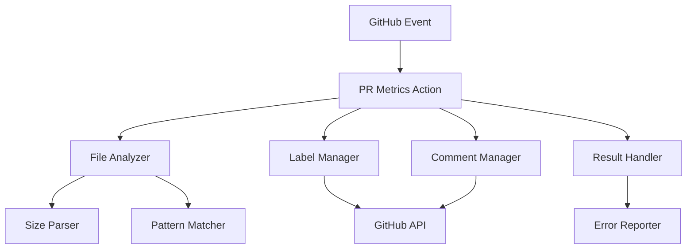
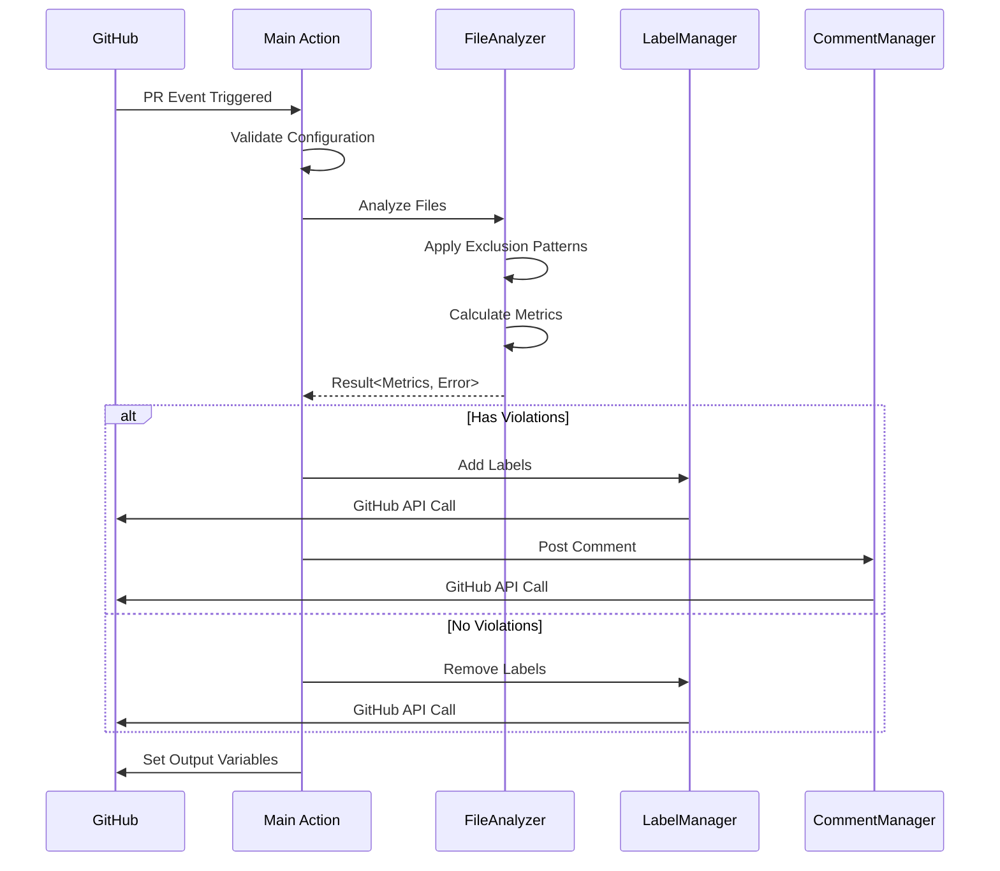

# 技術設計書

## 概要

**目的**: PR Metrics Actionは、プルリクエストのサイズと複雑度を自動的に評価し、レビューの効率化を実現する。

**ユーザー**: 開発チームはこれを利用して、大きすぎるPRの早期発見と適切な分割判断を行う。

**影響**: 現在手動で行われているPRサイズの確認を自動化し、一貫性のある品質基準を確立する。

### ゴール

- PRのファイルメトリクス（サイズ、行数、ファイル数）を自動計測
- 制限超過時の自動ラベル付与とコメント投稿
- CI/CDパイプラインとのシームレスな統合

### 非ゴール

- コードの品質や複雑度の分析（cyclomatic complexity等）
- セマンティックな変更の重要度判定
- 自動的なPRの分割や修正提案

## アーキテクチャ

### ハイレベルアーキテクチャ



**アーキテクチャ統合**:

- 既存パターンの保持: GitHub Actions標準パターン、Node.js非同期処理
- 新規コンポーネントの根拠: モジュール化による保守性向上、個別テスト可能性
- 技術スタック整合性: TypeScript strict mode、ESLint v9、Prettier統合
- ステアリング準拠: ファイル構造、命名規則、テスト戦略

### 技術スタックと設計決定

**エラーハンドリング戦略**:

- **決定**: neverthrowのResult<T, E>パターン採用
- **コンテキスト**: GitHub API呼び出しやファイル操作で多くの失敗ケースが存在
- **代替案**: try-catch、Promise.catch、カスタムEither実装
- **選択アプローチ**: 全ての失敗可能な関数がResult型を返し、型安全なエラーハンドリングを実現
- **根拠**: コンパイル時のエラー処理漏れ検出、関数型プログラミングパターンの活用
- **トレードオフ**: 学習曲線はあるが、長期的な保守性とバグ削減効果が上回る

**ビルド戦略**:

- **決定**: @vercel/nccによる単一ファイルバンドル
- **コンテキスト**: GitHub Actionsは単一のJavaScriptファイルを期待
- **代替案**: webpack、rollup、tsc直接使用
- **選択アプローチ**: nccで依存関係を含む単一ファイルを生成
- **根拠**: GitHub Actions推奨、ゼロ設定、高速実行
- **トレードオフ**: デバッグが若干困難だが、source-mapで緩和

**開発環境構成**:

- **決定**: pnpm + npm-run-all による並列タスク実行
- **コンテキスト**: 複数の品質チェックツールを効率的に実行する必要
- **代替案**: npm scripts単体、makeファイル、turbo
- **選択アプローチ**: run-p/run-sによる並列・順次実行制御
- **根拠**: package.jsonとの統合、クロスプラットフォーム対応
- **トレードオフ**: 依存関係が増えるが、開発効率が大幅に向上

## システムフロー

### PRチェックシーケンス



## コンポーネントとインターフェース

### Core Domain

#### PRMetricsAction

**責任と境界**

- **主要責任**: GitHub ActionsエントリーポイントとしてPRメトリクス分析を調整
- **ドメイン境界**: アプリケーション層のオーケストレーター
- **データ所有権**: 設定パラメータと実行コンテキスト
- **トランザクション境界**: GitHub Action実行単位

**依存関係**

- **インバウンド**: GitHub Actions Runtime
- **アウトバウンド**: FileAnalyzer, LabelManager, CommentManager
- **外部**: @actions/core, @actions/github

**サービスインターフェース**

```typescript
interface PRMetricsAction {
  run(): Promise<Result<void, ActionError>>;
  validateConfig(inputs: ActionInputs): Result<ValidatedConfig, ConfigurationError>;
  setOutputs(metrics: PRMetrics): void;
}

type ActionError =
  | ConfigurationError
  | FileAnalysisError
  | GitHubAPIError;
```

### Analysis Layer

#### FileAnalyzer

**責任と境界**

- **主要責任**: PR内のファイルメトリクスを分析し、違反を検出
- **ドメイン境界**: 分析ドメイン
- **データ所有権**: ファイルメトリクスと違反情報
- **トランザクション境界**: 個別ファイル分析単位

**依存関係**

- **インバウンド**: PRMetricsAction
- **アウトバウンド**: SizeParser, PatternMatcher
- **外部**: fs/promises, child_process (git commands)

**サービスインターフェース**

```typescript
interface FileAnalyzer {
  analyzeFiles(
    files: string[],
    config: AnalysisConfig
  ): ResultAsync<FileMetrics, FileAnalysisError>;

  checkViolations(
    metrics: FileMetrics,
    limits: LimitConfig
  ): Result<Violations, never>;
}

interface FileMetrics {
  files: FileInfo[];
  totalAdditions: number;
  totalFiles: number;
}

interface FileInfo {
  path: string;
  size: number;
  lines: number;
  additions: number;
  deletions: number;
}
```

#### SizeParser

**責任と境界**

- **主要責任**: 人間可読なサイズ文字列をバイト数に変換
- **ドメイン境界**: ユーティリティ層
- **データ所有権**: なし（ステートレス）

**サービスインターフェース**

```typescript
interface SizeParser {
  parse(input: string): Result<number, ParseError>;
  // "100KB" -> 102400
  // "1.5MB" -> 1572864
  // "500000" -> 500000
}
```

#### PatternMatcher

**責任と境界**

- **主要責任**: ファイルパスが除外パターンに一致するか判定
- **ドメイン境界**: ユーティリティ層
- **データ所有権**: デフォルト除外パターンリスト

**サービスインターフェース**

```typescript
interface PatternMatcher {
  isExcluded(
    filePath: string,
    patterns: string[]
  ): boolean;

  getDefaultPatterns(): string[];
  // Returns: ["*.lock", "*.min.js", "dist/**/*", etc.]
}
```

### Integration Layer

#### LabelManager

**責任と境界**

- **主要責任**: GitHub PRラベルの追加・削除を管理
- **ドメイン境界**: 統合層
- **データ所有権**: ラベル状態の変更記録
- **トランザクション境界**: GitHub API呼び出し単位

**依存関係**

- **インバウンド**: PRMetricsAction
- **アウトバウンド**: なし
- **外部**: @octokit/rest

**サービスインターフェース**

```typescript
interface LabelManager {
  applyLabels(
    violations: Violations,
    config: LabelConfig
  ): ResultAsync<LabelResult, GitHubAPIError>;

  removeLabels(
    labels: string[],
    config: LabelConfig
  ): ResultAsync<void, GitHubAPIError>;
}

interface LabelResult {
  added: string[];
  removed: string[];
  existing: string[];
}
```

#### CommentManager

**責任と境界**

- **主要責任**: PR違反レポートのコメント投稿と更新
- **ドメイン境界**: 統合層
- **データ所有権**: コメント内容とフォーマット
- **トランザクション境界**: GitHub API呼び出し単位

**依存関係**

- **インバウンド**: PRMetricsAction
- **アウトバウンド**: CommentFormatter
- **外部**: @octokit/rest

**サービスインターフェース**

```typescript
interface CommentManager {
  postOrUpdateComment(
    metrics: FileMetrics,
    violations: Violations,
    config: CommentConfig
  ): ResultAsync<void, GitHubAPIError>;

  findExistingComment(): ResultAsync<number | null, GitHubAPIError>;
}
```

## データモデル

### ドメインモデル

**コア概念**:

- **PRMetrics**: PR全体のメトリクス集約（集約ルート）
- **FileViolation**: 個別ファイルの制限違反（エンティティ）
- **SizeLimit**: サイズ制限設定（値オブジェクト）
- **PRAnalyzed**: PR分析完了イベント（ドメインイベント）

**ビジネスルールと不変条件**:

- ファイルサイズは常に0以上
- 除外パターンに一致するファイルは分析対象外
- 同一ラベルの重複追加は禁止
- Draft PRのスキップ設定時は全チェックをバイパス

### 論理データモデル

**構造定義**:

```typescript
// 設定値
interface Config {
  fileSizeLimit: string;
  fileLinesLimit: number;
  prAdditionsLimit: number;
  prFilesLimit: number;
  applyLabels: boolean;
  autoRemoveLabels: boolean;
  largeFileLabel: string;
  largePrLabel: string;
  tooManyFilesLabel: string;
  skipDraftPr: boolean;
  commentOnPr: 'auto' | 'always' | 'never';
  failOnViolation: boolean;
  additionalExcludePatterns: string[];
  githubToken: string;
}

// 分析結果
interface PRMetrics {
  files: FileInfo[];
  totalAdditions: number;
  totalFiles: number;
  violations: {
    largeFiles: string[];
    exceedsAdditions: boolean;
    exceedsFileCount: boolean;
  };
}
```

## エラーハンドリング

### エラー戦略

neverthrowのResult<T, E>パターンを全面採用し、Railway-Oriented Programmingによる関数合成を実現。

### エラーカテゴリと対応

**エラー型定義**:

```typescript
type AppError =
  | FileAnalysisError
  | GitHubAPIError
  | ConfigurationError
  | ParseError
  | FileSystemError;

interface FileAnalysisError {
  type: 'FileAnalysisError';
  file: string;
  message: string;
}

interface GitHubAPIError {
  type: 'GitHubAPIError';
  status?: number;
  message: string;
}

interface ConfigurationError {
  type: 'ConfigurationError';
  field: string;
  value: unknown;
  message: string;
}
```

**エラー処理フロー**:

- **ユーザーエラー（設定ミス）**: 詳細なエラーメッセージとガイダンスを提供
- **システムエラー（API失敗）**: リトライとグレースフルデグラデーション
- **ビジネスロジックエラー（制限違反）**: ラベル付与とコメント投稿で可視化

### モニタリング

- core.debugによる詳細ログ出力
- core.errorによるエラー記録
- GitHub Actions Summaryへの結果出力

## テスト戦略

### ユニットテスト

- FileAnalyzer: メトリクス計算ロジック、除外パターン適用
- SizeParser: 各種サイズ形式のパース、エラーケース
- PatternMatcher: glob パターンマッチング
- LabelManager: ラベル追加・削除ロジック（モック使用）
- CommentManager: コメントフォーマット生成

### 統合テスト

- FileAnalyzer + SizeParser: 実ファイルでのメトリクス計算
- LabelManager + GitHub API: API呼び出しのモック検証
- CommentManager + GitHub API: コメント更新ロジック
- エラーハンドリングチェーン: Result型の伝播確認

### E2Eテスト

- 小規模PRのチェック: 制限内での正常動作
- 大規模PRのチェック: 各種制限違反の検出
- Draft PRのスキップ: skip_draft_pr設定の動作確認
- ラベル自動削除: 修正後のラベル削除確認
- 既存コメント更新: 重複防止の確認

## CI/CD統合

### package.jsonスクリプト構成

**開発フロー**:

```json
{
  "scripts": {
    "dev": "tsx watch src/index.ts",
    "build": "ncc build src/index.ts -o dist --source-map --license licenses.txt",
    "test": "run-p lint type-check test:vitest",
    "test:vitest": "vitest run",
    "test:watch": "vitest",
    "test:coverage": "vitest run --coverage"
  }
}
```

**品質保証**:

```json
{
  "scripts": {
    "check": "run-p lint type-check format:check",
    "check:all": "run-s check test:vitest",
    "lint": "eslint .",
    "lint:fix": "eslint . --fix",
    "type-check": "tsc --noEmit",
    "format": "run-s lint:fix format:prettier",
    "format:check": "prettier --check ."
  }
}
```

### GitHub Actionsワークフロー

```yaml
name: CI
on: [push, pull_request]

jobs:
  test:
    runs-on: ubuntu-latest
    steps:
      - uses: actions/checkout@v4
      - uses: pnpm/action-setup@v2
      - uses: actions/setup-node@v4
        with:
          node-version: '20'
          cache: 'pnpm'
      - run: pnpm install
      - run: pnpm check:all
      - run: pnpm build
```

### リリースプロセス

1. `pnpm check:all` - 全品質チェック実行
2. `pnpm build` - プロダクションビルド生成
3. `dist/`ディレクトリをコミット
4. GitHub Releasesでタグ付け
5. GitHub Marketplaceへの公開（オプション）

## セキュリティ考慮事項

### 認証と認可

- GitHub Tokenは環境変数経由で安全に渡される
- 最小権限原則: pull-requests:write, issues:write のみ要求

### データ保護

- センシティブ情報（トークン）のログ出力を防止
- core.setSecretによる自動マスキング

### 依存関係管理

- Dependabotによる自動更新
- npm auditの定期実行
- @vercel/nccによる依存関係のバンドル（攻撃面の削減）
