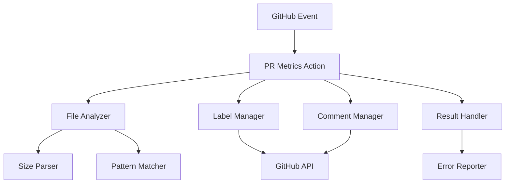
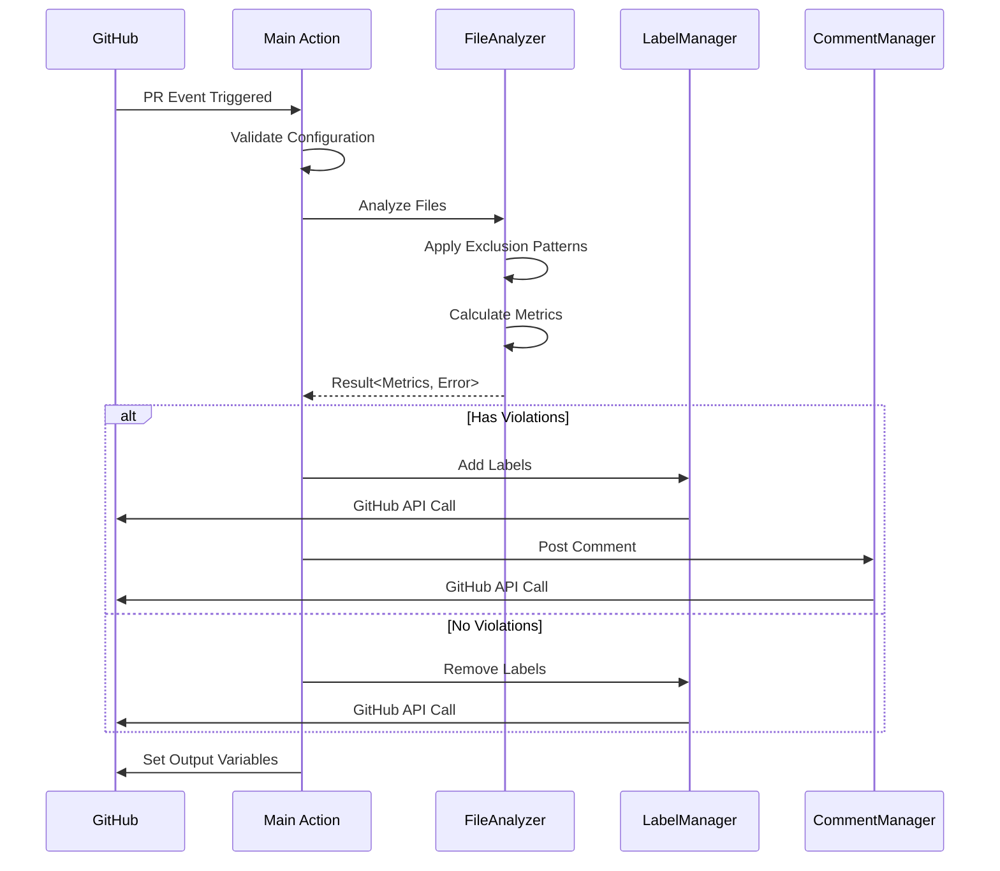

# 技術設計書

## 概要

**目的**: PR Metrics Actionは、プルリクエストのサイズと複雑度を自動的に評価し、レビューの効率化を実現する。

**ユーザー**: 開発チームはこれを利用して、大きすぎるPRの早期発見と適切な分割判断を行う。

**影響**: 現在手動で行われているPRサイズの確認を自動化し、一貫性のある品質基準を確立する。

### ゴール

- PRのファイルメトリクス（サイズ、行数、ファイル数）を自動計測
- 制限超過時の自動ラベル付与とコメント投稿
- CI/CDパイプラインとのシームレスな統合

### 非ゴール

- コードの品質や複雑度の分析（cyclomatic complexity等）
- セマンティックな変更の重要度判定
- 自動的なPRの分割や修正提案

## アーキテクチャ

### ハイレベルアーキテクチャ



**アーキテクチャ統合**:

- 既存パターンの保持: GitHub Actions標準パターン、Node.js非同期処理
- 新規コンポーネントの根拠: モジュール化による保守性向上、個別テスト可能性
- 技術スタック整合性: TypeScript strict mode、ESLint v9、Prettier統合
- ステアリング準拠: ファイル構造、命名規則、テスト戦略

### 技術スタックと設計決定

**エラーハンドリング戦略**:

- **決定**: neverthrowのResult<T, E>パターン採用
- **コンテキスト**: GitHub API呼び出しやファイル操作で多くの失敗ケースが存在
- **代替案**: try-catch、Promise.catch、カスタムEither実装
- **選択アプローチ**: 全ての失敗可能な関数がResult型を返し、型安全なエラーハンドリングを実現
- **根拠**: コンパイル時のエラー処理漏れ検出、関数型プログラミングパターンの活用
- **トレードオフ**: 学習曲線はあるが、長期的な保守性とバグ削減効果が上回る

**ビルド戦略**:

- **決定**: @vercel/nccによる単一ファイルバンドル
- **コンテキスト**: GitHub Actionsは単一のJavaScriptファイルを期待
- **代替案**: webpack、rollup、tsc直接使用
- **選択アプローチ**: nccで依存関係を含む単一ファイルを生成
- **根拠**: GitHub Actions推奨、ゼロ設定、高速実行
- **トレードオフ**: デバッグが若干困難だが、source-mapで緩和

**開発環境構成**:

- **決定**: pnpm + npm-run-all による並列タスク実行
- **コンテキスト**: 複数の品質チェックツールを効率的に実行する必要
- **代替案**: npm scripts単体、makeファイル、turbo
- **選択アプローチ**: run-p/run-sによる並列・順次実行制御
- **根拠**: package.jsonとの統合、クロスプラットフォーム対応
- **トレードオフ**: 依存関係が増えるが、開発効率が大幅に向上

## システムフロー

### PRチェックシーケンス



## コンポーネントとインターフェース

### Core Domain

#### PRMetricsAction

### 責任と境界

- **主要責任**: GitHub ActionsエントリーポイントとしてPRメトリクス分析を調整
- **ドメイン境界**: アプリケーション層のオーケストレーター
- **データ所有権**: 設定パラメータと実行コンテキスト
- **トランザクション境界**: GitHub Action実行単位

### 依存関係

- **インバウンド**: GitHub Actions Runtime
- **アウトバウンド**: InputMapper, FileAnalyzer, LabelManager, CommentManager
- **外部**: @actions/core, @actions/github

### サービスインターフェース

```typescript
// 関数型インターフェース
type RunAction = () => Promise<Result<void, AppError>>;
type ValidateConfig = (inputs: ActionInputs) => Result<ValidatedConfig, ConfigurationError>;
type SetOutputs = (metrics: PRMetrics) => void;

// 出力契約
interface ActionOutputs {
  large_files: string;         // JSON配列: サイズまたは行数制限を超えたファイル
  pr_additions: string;        // PR全体の追加行数
  pr_files: string;           // PR全体のファイル数
  exceeds_file_size: string;  // いずれかのファイルがサイズ制限超過 ("true" | "false")
  exceeds_file_lines: string; // いずれかのファイルが行数制限超過（ファイル単位） ("true" | "false")
  exceeds_additions: string;  // PR全体の追加行数が制限超過 ("true" | "false")
  exceeds_file_count: string; // PR全体のファイル数が制限超過 ("true" | "false")
  has_violations: string;     // いずれかの違反が存在 ("true" | "false")
}
```

#### InputMapper

### 責任と境界

- **主要責任**: action.ymlのsnake_case入力を内部のcamelCase設定に変換
- **ドメイン境界**: アダプター層
- **データ所有権**: パラメータマッピングルール
- **トランザクション境界**: ステートレス変換
- **action.yml整合性**: `runs.main`は`dist/index.js`を指定（nccビルド出力と一致）

### サービスインターフェース

```typescript
// 関数型インターフェース
type MapActionInputsToConfig = (inputs: ActionInputs) => Result<Config, ConfigurationError>;

// 変換ルール
const parseBoolean = (value: string, fieldName: string): boolean => {
  const normalized = value.trim().toLowerCase();
  // 許容値: true, 1, yes, on（大文字小文字不問、前後空白許容）
  return ['true', '1', 'yes', 'on'].includes(normalized);
};

const parseExcludePatterns = (value: string): string[] => {
  // カンマまたは改行で分割、空白トリム、空要素除去
  return value
    .split(/[,\n]/)
    .map(s => s.trim())
    .filter(s => s.length > 0);
};

const parseCommentMode = (value: string): 'auto' | 'always' | 'never' => {
  const normalized = value.trim().toLowerCase();
  if (['always', 'never'].includes(normalized)) return normalized as 'always' | 'never';
  return 'auto'; // デフォルト
};

const parseSizeThresholds = (value: string): Result<SizeThresholds, ParseError> => {
  try {
    const parsed = JSON.parse(value);
    // 基本的な検証
    if (!parsed.S || !parsed.M || !parsed.L) {
      return err({ type: 'ParseError', input: value, message: 'Missing required size thresholds' });
    }
    return ok(parsed as SizeThresholds);
  } catch (error) {
    return err({ type: 'ParseError', input: value, message: 'Invalid JSON for size thresholds' });
  }
};

// action.ymlの入力形式（snake_case）
// github_tokenは必須（required: true）でデフォルト値なし
// 環境変数GITHUB_TOKENまたはGH_TOKENからのフォールバックを実装
interface ActionInputs {
  file_size_limit: string;
  file_lines_limit: string;
  pr_additions_limit: string;
  pr_files_limit: string;
  apply_labels: string;
  auto_remove_labels: string;
  apply_size_labels: string;
  size_label_thresholds: string;
  large_files_label: string;
  too_many_files_label: string;
  skip_draft_pr: string;
  comment_on_pr: string;
  fail_on_violation: string;
  additional_exclude_patterns: string;
  github_token: string;
}

// GitHub Token取得（環境変数フォールバック）
const getGitHubToken = (): Result<string, ConfigurationError> => {
  const token =
    core.getInput('github_token') ||
    process.env.GITHUB_TOKEN ||
    process.env.GH_TOKEN;

  if (!token) {
    return err({
      type: 'ConfigurationError',
      field: 'github_token',
      value: undefined,
      message: 'GitHub token is required. Set github_token input or GITHUB_TOKEN/GH_TOKEN environment variable'
    });
  }
  return ok(token);
};

// 内部設定形式（camelCase、パース済み）
interface Config {
  fileSizeLimit: number;      // バイト数に変換済み（SizeParser使用）
  fileLinesLimit: number;      // 数値に変換済み
  prAdditionsLimit: number;    // 数値に変換済み
  prFilesLimit: number;        // 数値に変換済み
  applyLabels: boolean;
  autoRemoveLabels: boolean;
  applySizeLabels: boolean;
  sizeThresholds: SizeThresholds;  // パース済みのサイズ閾値
  largeFilesLabel: string;
  tooManyFilesLabel: string;
  skipDraftPr: boolean;
  commentOnPr: 'auto' | 'always' | 'never';
  failOnViolation: boolean;
  additionalExcludePatterns: string[];  // 検証済みパターンのみ含む
  githubToken: string;
}

// サイズ閾値の型定義
// 注: XLサイズはLの閾値を超えた場合（additions > 1000 OR files > 50）として判定
interface SizeThresholds {
  S: { additions: number; files: number };
  M: { additions: number; files: number };
  L: { additions: number; files: number };
  // XLは定義なし（Lを超えた場合に自動判定）
}
```

### Analysis Layer

#### DiffStrategy

### 責任と境界

- **主要責任**: PR差分の取得と正規化
- **ドメイン境界**: データ取得層
- **データ所有権**: 差分データの取得方法
- **トランザクション境界**: API呼び出しまたはgit操作単位

### 依存関係

- **インバウンド**: FileAnalyzer
- **アウトバウンド**: なし
- **外部**: @actions/github（getOctokit使用）、child_process（gitフォールバック）

### サービスインターフェース

```typescript
// PR情報
interface PullRequestInfo {
  owner: string;
  repo: string;
  pullNumber: number;
  baseSha: string;
  headSha: string;
  isDraft?: boolean;  // Draft PRステータス
}

// ファイル差分情報
interface FileDiff {
  filename: string;
  additions: number;
  deletions: number;
  changes: number;
  status: 'added' | 'removed' | 'modified' | 'renamed';
}

// getOctokitの戻り値型を使用
type Octokit = ReturnType<typeof github.getOctokit>;

// ローカル優先アプローチ（API fallback）
type FetchFromLocal = (pr: PullRequestInfo) => ResultAsync<FileDiff[], FileSystemError>;
type FetchFromAPI = (pr: PullRequestInfo, octokit: Octokit) => ResultAsync<FileDiff[], GitHubAPIError>;

// DiffStrategy インターフェース
type CreateDiffStrategy = (octokit: Octokit) => {
  fetchDiff: (pr: PullRequestInfo) => ResultAsync<FileDiff[], DiffError>;
};

const createDiffStrategy: CreateDiffStrategy = (octokit) => ({
  fetchDiff: (pr) => {
    // ローカル優先：高速かつ安定
    const fetchFromLocal: FetchFromLocal = (pr) =>
      // git diff --numstat --diff-filter=ACMR base...head (removed除外)
      ResultAsync.fromPromise(
        exec(`git diff --numstat --diff-filter=ACMR ${pr.baseSha}...${pr.headSha}`),
        (error) => ({ type: 'FileSystemError' as const, message: String(error) })
      ).map(parseGitDiff);

    const fetchFromAPI: FetchFromAPI = async (pr, octokit) => {
      // GitHub API: pulls.listFiles with pagination（フォールバック）
      const allFiles: FileDiff[] = [];
      let page = 1;
      const maxPages = 10;  // 最大1000ファイル（100件/ページ × 10ページ）

      while (page <= maxPages) {
        const result = await ResultAsync.fromPromise(
          octokit.rest.pulls.listFiles({
            owner: pr.owner,
            repo: pr.repo,
            pull_number: pr.pullNumber,
            per_page: 100,
            page
          }),
          (error) => ({ type: 'GitHubAPIError' as const, message: String(error) })
        );

        if (result.isErr()) return result;

        const files = result.value.data.map(file => ({
          filename: file.filename,
          additions: file.additions,
          deletions: file.deletions,
          changes: file.changes,
          status: file.status as FileDiff['status']
        }));

        allFiles.push(...files);

        // ページネーション終了条件: 取得件数がper_page未満なら最終ページ
        if (result.value.data.length < 100) break;
        page++;
      }

      return okAsync(allFiles);
    };

    // ローカル優先、APIフォールバック
    // フォールバック条件:
    // 1. checkout未実行（ワークフロー設定ミス）
    // 2. shallow clone（fetch-depth: 1）でベースSHAが存在しない
    // 3. gitコマンドが使用不可（コンテナ環境等）
    // 4. その他のgitエラー（権限、パス等）
    return fetchFromLocal(pr)
      .orElse((error) => {
        core.warning(`Local git commands failed: ${error.message}`);
        core.info('Falling back to GitHub API for diff retrieval');
        return fetchFromAPI(pr, octokit);
      });
  }
});
```

#### FileAnalyzer

### 責任と境界

- **主要責任**: PR内のファイルメトリクスを分析し、違反を検出
- **ドメイン境界**: 分析ドメイン
- **データ所有権**: ファイルメトリクスと違反情報
- **トランザクション境界**: 個別ファイル分析単位

### 依存関係

- **インバウンド**: PRMetricsAction
- **アウトバウンド**: SizeParser, PatternMatcher, DiffStrategy
- **外部**: fs/promises（ファイルサイズ取得）、child_process（行数取得）

### ファイル分析戦略

- **ファイルサイズ取得優先順位**:
  1. fs.stat（ローカルファイル、最速）
  2. git ls-tree -l（gitオブジェクト、高速）
  3. GitHub API（ネットワーク経由、フォールバック）

- **行数取得戦略**:
  - checkoutされたファイルから`wc -l`またはNode.jsで行数を計測
  - ファイル全体の行数を取得（差分の追加行数ではない）
  - バイナリファイルや行数取得不可の場合はスキップしサイズのみ評価
  - 実装注記: Linux環境前提で`wc -l`使用、またはNode.js実装（`fs.readFileSync`+`split('\\n')`）でクロスプラットフォーム対応

- **バイナリファイル判定（優先順位）**:
  - 判定順序:
    1. `istextorbinary`ライブラリによる内容ベース判定（最も正確）
    2. 拡張子ベースの判定（フォールバック）
  - 実装アプローチ1（推奨）: `istextorbinary`ライブラリを使用

    ```typescript
    import { isBinary } from 'istextorbinary';
    const checkBinary = (filePath: string): boolean => {
      const buffer = fs.readFileSync(filePath, { encoding: null }).subarray(0, 512);
      return isBinary(null, buffer);
    };
    ```

  - 実装アプローチ2（フォールバック）: 拡張子ベースの簡易判定

    ```typescript
    const BINARY_EXTENSIONS = ['.jpg', '.jpeg', '.png', '.gif', '.pdf', '.zip', '.exe', '.dll'];
    const isBinaryByExtension = (path: string): boolean => {
      return BINARY_EXTENSIONS.some(ext => path.toLowerCase().endsWith(ext));
    };
    ```

  - バイナリ判定の統合実装:

    ```typescript
    const isBinaryFile = (filePath: string): boolean => {
      try {
        // 優先度1: istextorbinaryによる内容判定
        const buffer = fs.readFileSync(filePath, { encoding: null }).subarray(0, 512);
        return isBinary(null, buffer);
      } catch {
        // 優先度2: 拡張子による判定（ファイル読み込み失敗時）
        return isBinaryByExtension(filePath);
      }
    };
    ```

  - バイナリファイル検出時は行数カウントをスキップし、サイズチェックのみ実施

- **変更種別の扱い**:
  - `added`、`modified`、`renamed`: 分析対象
  - `removed`: サイズ/行数評価およびファイル数カウントから除外
  - `renamed`: 新しいパスで評価

### サービスインターフェース

```typescript
// 関数型インターフェース
type AnalyzeFiles = (
  pr: PullRequestInfo,
  config: AnalysisConfig,
  diffStrategy: DiffStrategy
) => ResultAsync<FileMetrics, FileAnalysisError>;

type CheckViolations = (
  metrics: FileMetrics,
  limits: LimitConfig
) => Result<Violations, never>;

interface FileMetrics {
  files: FileInfo[];
  totalAdditions: number;
  totalFiles: number;
}

interface FileInfo {
  path: string;
  size: number;
  lines: number;
  additions: number;
  deletions: number;
}

// 違反の優先度定義
interface Violations {
  largeFiles: ViolationDetail[];      // 優先度1: ファイルサイズ違反
  exceedsFileLines: ViolationDetail[]; // 優先度2: ファイル行数違反
  exceedsAdditions: boolean;          // 優先度3: PR追加行数違反
  exceedsFileCount: boolean;          // 優先度4: ファイル数違反
}

// 違反表示順序を取得する関数
type GetPrioritizedViolationList = (violations: Violations) => ViolationSummary[];

interface ViolationDetail {
  file: string;
  actualValue: number;              // 実際の値（サイズまたは行数）
  limit: number;
  violationType: 'size' | 'lines';  // 違反タイプ
  severity: 'critical' | 'warning';
}
```

#### SizeParser

### 責任と境界

- **主要責任**: 人間可読なサイズ文字列をバイト数に変換
- **ドメイン境界**: ユーティリティ層
- **データ所有権**: なし（ステートレス）

### サービスインターフェース

```typescript
// 関数型インターフェース
type ParseSize = (input: string) => Result<number, ParseError>;
// "100KB" -> 102400
// "1.5MB" -> 1572864
// "500000" -> 500000
```

#### PatternMatcher

### 責任と境界

- **主要責任**: ファイルパスが除外パターンに一致するか判定
- **ドメイン境界**: ユーティリティ層
- **データ所有権**: デフォルト除外パターンリスト
- **パターン正規化**: globパターンの標準化とバリデーション

### 除外パターン仕様

```typescript
// デフォルト除外パターン（ハードコード）
const DEFAULT_PATTERNS = [
  // パッケージマネージャー
  '*.lock',
  'package-lock.json',
  'yarn.lock',
  'pnpm-lock.yaml',
  'bun.lockb',

  // 依存関係ディレクトリ
  'node_modules/**',
  'vendor/**',
  '.yarn/**',
  '.pnp.*',

  // ビルド成果物
  'dist/**',
  'build/**',
  'out/**',
  '*.min.js',
  '*.min.css',
  '*.bundle.js',

  // 自動生成
  '*.generated.*',
  '**/generated/**',

  // TypeScript定義
  '*.d.ts',
  '*.d.ts.map',

  // IDE/エディタ
  '.idea/**',
  '.vscode/**',
  '*.swp',
  '*.swo',
  '*~',

  // システムファイル
  '.git/**',
  '.DS_Store',
  'Thumbs.db',

  // フレームワーク固有
  '.next/**',
  '.nuxt/**',
  '.turbo/**',
  '.svelte-kit/**',

  // その他
  '*.map',
  '*.map.json',
  'coverage/**',
  '.cache/**'
];
```

### サービスインターフェース

```typescript
// 関数型インターフェース
// パス正規化（OS非依存）
type NormalizePath = (path: string) => string;

const normalizePath: NormalizePath = (path) => {
  return path
    .replace(/^\/+/, '')      // 先頭スラッシュ除去
    .replace(/\/+/g, '/')     // 重複スラッシュ除去
    .replace(/\\/g, '/');     // Windows パス区切り統一
};

// パターンマッチング（minimatch使用）
type IsExcluded = (
  filePath: string,
  patterns: string[]
) => boolean;

const isExcluded: IsExcluded = (filePath, patterns) => {
  const normalizedPath = normalizePath(filePath);
  return patterns.some(pattern =>
    minimatch(normalizedPath, normalizePattern(pattern))
  );
};

// パターンの正規化
type NormalizePattern = (pattern: string) => string;

const normalizePattern: NormalizePattern = (pattern) => {
  return pattern
    .trim()
    .replace(/^\/+/, '')      // 先頭スラッシュ除去
    .replace(/\/+/g, '/')     // 重複スラッシュ除去
    .replace(/\\/g, '/');     // Windows パス区切り統一
};

// デフォルトパターン取得
type GetDefaultPatterns = () => string[];

// パターン検証
type ValidatePattern = (pattern: string) => Result<string, PatternError>;

const validatePattern: ValidatePattern = (pattern) => {
  try {
    // minimatchによる構文チェック
    new minimatch.Minimatch(pattern);
    return ok(normalizePattern(pattern));
  } catch (error) {
    return err({
      type: 'PatternError' as const,
      pattern,
      message: `Invalid glob pattern: ${pattern}`
    });
  }
};
```

### Integration Layer

#### LabelManager

### 責任と境界

- **主要責任**: GitHub PRラベルの追加・削除を管理
- **ドメイン境界**: 統合層
- **データ所有権**: ラベル状態の変更記録
- **トランザクション境界**: GitHub API呼び出し単位
- **冪等性保証**: 既存ラベルの存在チェックにより重複追加を防止

### 依存関係

- **インバウンド**: PRMetricsAction
- **アウトバウンド**: なし
- **外部**: @actions/github（getOctokit使用）

### 権限チェックと処理継続

フォークPRで権限が不足している場合、ラベル操作をスキップし分析は継続:

```typescript
// 権限チェック
type CheckPermissions = () => ResultAsync<boolean, never>;

const checkPermissions: CheckPermissions = () => {
  return ResultAsync.fromPromise(
    octokit.rest.repos.checkCollaborator({
      owner,
      repo,
      username: context.actor
    }),
    () => false
  ).map(() => true)
   .orElse(() => {
     core.info('Insufficient permissions to manage labels (fork PR). Skipping label operations.');
     return okAsync(false);
   });
};
```

### サービスインターフェース

```typescript
// 関数型インターフェース
type ApplyLabels = (
  violations: Violations,
  metrics: PRMetrics,
  config: LabelConfig
) => ResultAsync<LabelResult, GitHubAPIError>;

type RemoveLabels = (
  labels: string[],
  config: LabelConfig
) => ResultAsync<void, GitHubAPIError>;

// PRサイズ判定
type DeterminePRSize = (
  metrics: PRMetrics,
  thresholds: SizeThresholds
) => 'S' | 'M' | 'L' | 'XL';

const determinePRSize: DeterminePRSize = (metrics, thresholds) => {
  const { totalAdditions, totalFiles } = metrics;

  // サイズ判定ロジック: OR条件で評価
  // いずれか一方でも閾値を超えたらより大きいサイズとして判定

  // XL: Lの閾値をadditionsまたはfilesのいずれかが超えた場合
  if (totalAdditions > thresholds.L.additions || totalFiles > thresholds.L.files) {
    return 'XL';
  }
  // L: Mの閾値をadditionsまたはfilesのいずれかが超えた場合
  if (totalAdditions > thresholds.M.additions || totalFiles > thresholds.M.files) {
    return 'L';
  }
  // M: Sの閾値をadditionsまたはfilesのいずれかが超えた場合
  if (totalAdditions > thresholds.S.additions || totalFiles > thresholds.S.files) {
    return 'M';
  }
  // S: 両方がS閾値以下
  return 'S';
};

interface LabelResult {
  added: string[];
  removed: string[];
  existing: string[];
}

// ラベル適用の冪等性実装
type EnsureLabelsIdempotent = (
  currentLabels: string[],
  targetLabels: string[],
  sizeLabel: string | null
) => LabelOperations;

interface LabelOperations {
  toAdd: string[];     // 追加すべきラベル（既存でないもののみ）
  toRemove: string[];  // 削除すべきラベル
}

const ensureLabelsIdempotent: EnsureLabelsIdempotent = (current, target, sizeLabel) => {
  const currentSet = new Set(current);
  const targetSet = new Set(target);

  // サイズラベル変更時は古いラベルを削除
  const oldSizeLabels = current.filter(l => l.startsWith('size/') && l !== sizeLabel);

  return {
    toAdd: [...targetSet].filter(l => !currentSet.has(l)),
    toRemove: [...oldSizeLabels, ...currentSet].filter(l =>
      !targetSet.has(l) && l !== sizeLabel
    )
  };
};
```

#### CommentManager

### 責任と境界

- **主要責任**: PR違反レポートのコメント投稿と更新
- **ドメイン境界**: 統合層
- **データ所有権**: コメント内容とフォーマット
- **トランザクション境界**: GitHub API呼び出し単位

### 依存関係

- **インバウンド**: PRMetricsAction
- **アウトバウンド**: CommentFormatter
- **外部**: @actions/github（getOctokit使用）

### コメント識別仕様

```typescript
// HTMLコメントによる署名
const COMMENT_SIGNATURE = '<!-- pr-metrics-action -->';

// コメントフォーマット
const formatComment = (metrics: FileMetrics, violations: Violations): string => {
  return `${COMMENT_SIGNATURE}
## 📊 PR Metrics Report

${formatViolations(violations)}
${formatSummary(metrics)}

<details>
<summary>📋 詳細</summary>

${formatDetails(metrics)}

</details>

---
_Generated by [PR Metrics Action](https://github.com/jey3dayo/pr-metrics-action)_
`;
};
```

### サービスインターフェース

```typescript
// 関数型インターフェース
type PostOrUpdateComment = (
  metrics: FileMetrics,
  violations: Violations,
  config: CommentConfig
) => ResultAsync<void, GitHubAPIError>;

// 署名でコメントを識別
type FindExistingComment = () => ResultAsync<number | null, GitHubAPIError>;

const findExistingComment: FindExistingComment = () => {
  return listComments()
    .map(comments =>
      comments.find(c => c.body?.includes(COMMENT_SIGNATURE))?.id || null
    );
};

// コメント投稿戦略
type ShouldPostComment = (
  config: CommentConfig,
  hasViolations: boolean
) => boolean;

const shouldPostComment: ShouldPostComment = (config, hasViolations) => {
  switch (config.commentOnPr) {
    case 'always': return true;
    case 'never': return false;
    case 'auto': return hasViolations;
  }
};
```

## データモデル

### ドメインモデル

### コア概念

- **PRMetrics**: PR全体のメトリクス集約（集約ルート）
- **FileViolation**: 個別ファイルの制限違反（エンティティ）
- **SizeLimit**: サイズ制限設定（値オブジェクト）
- **PRAnalyzed**: PR分析完了イベント（ドメインイベント）

### ビジネスルールと不変条件

- ファイルサイズは常に0以上
- 除外パターンに一致するファイルは分析対象外
- 同一ラベルの重複追加は禁止
- Draft PRのスキップ設定時は全チェックをバイパス

### 論理データモデル

### 構造定義

```typescript
// 設定値（この部分は既に更新済みで、InputMapperセクションの設定を参照）
// Config インターフェースは InputMapper セクションで定義済み

// 分析結果
interface PRMetrics {
  files: FileInfo[];
  totalAdditions: number;
  totalFiles: number;
  violations: Violations;  // 型を統一
}
```

## エラーハンドリング

### エラー戦略

neverthrowのResult<T, E>パターンを全面採用し、Railway-Oriented Programmingによる関数合成を実現。

**実装注意事項**: `ResultAsync.combine`、`okAsync`等のimport整合性に注意。型定義と実際の関数がマッチするよう実装時に検証が必要。

### エラーカテゴリと対応

**エラー型定義**:

```typescript
// AppError統合型（9種類のエラー型）
type AppError =
  | FileAnalysisError      // 1. ファイル分析エラー
  | GitHubAPIError         // 2. GitHub API呼び出しエラー
  | ConfigurationError     // 3. 設定値検証エラー
  | ParseError             // 4. パースエラー（サイズ、JSON等）
  | FileSystemError        // 5. ファイルシステムエラー
  | ViolationError         // 6. 制限違反検出エラー
  | DiffError              // 7. 差分取得エラー
  | PatternError           // 8. パターン検証エラー
  | CacheError;            // 9. キャッシュ操作エラー

interface FileAnalysisError {
  type: 'FileAnalysisError';
  file: string;
  message: string;
}

interface GitHubAPIError {
  type: 'GitHubAPIError';
  status?: number;
  message: string;
}

interface ConfigurationError {
  type: 'ConfigurationError';
  field: string;
  value: unknown;
  message: string;
}

interface ParseError {
  type: 'ParseError';
  input: string;
  message: string;
}

interface FileSystemError {
  type: 'FileSystemError';
  path?: string;
  message: string;
}

interface ViolationError {
  type: 'ViolationError';
  violations: Violations;
  message: string;
}

interface DiffError {
  type: 'DiffError';
  source: 'api' | 'git';
  message: string;
}

interface PatternError {
  type: 'PatternError';
  pattern: string;
  message: string;
}

interface CacheError {
  type: 'CacheError';
  key?: string;
  message: string;
}
```

**エラー処理フロー**:

- **ユーザーエラー（設定ミス）**: 詳細なエラーメッセージとガイダンスを提供
- **システムエラー（API失敗）**: リトライとグレースフルデグラデーション
- **ビジネスロジックエラー（制限違反）**: ラベル付与とコメント投稿で可視化

### 失敗ポリシー

**failOnViolation設定の動作**:

```typescript
// メインエントリーポイントでの処理
// 処理順序: 分析→ラベル→コメント→setFailed（fail_on_violation時）
async function run(): Promise<void> {
  const analysisResult = await analyzeFiles(pr, config, diffStrategy);

  if (analysisResult.isOk()) {
    const metrics = analysisResult.value;

    // 1. ラベル処理（権限があれば実行）
    if (await hasLabelPermissions()) {
      await applyLabels(metrics, config);
    }

    // 2. コメント処理（権限があれば実行）
    if (await hasCommentPermissions()) {
      await postComment(metrics, config);
    }

    // 3. 違反時のfail処理（最後に実行）
    if (hasViolations(metrics) && config.failOnViolation) {
      // ラベルとコメントの後でsetFailedを呼ぶ
      core.setFailed(`❌ PR violates limits`);
    } else {
      core.info('✅ PR metrics check completed');
    }
  } else {
    // エラータイプによる処理分岐
    const error = analysisResult.error;
    if (error.type === 'ConfigurationError') {
      // 設定エラーは常に失敗
      core.setFailed(`⚠️ Configuration error: ${error.message}`);
    } else {
      // その他のエラーは警告として扱う
      core.warning(`⚠️ ${error.message}`);
    }
  }
}

// Result型の伝播例（関数型アプローチ）
const runPRMetricsAction = (
  config: Config,
  pr: PullRequestInfo
): ResultAsync<void, AppError> => {
  return validateConfig(config)
    .asyncAndThen(validatedConfig =>
      analyzeFiles(pr, validatedConfig, createDiffStrategy(octokit))
    )
    .andThen(metrics => checkViolations(metrics, config))
    .asyncAndThen(violations =>
      handleViolations(violations, config)
        .map(() => {
          // 違反があり、failOnViolation=trueの場合はエラーとして返す
          const hasViolations =
            violations.largeFiles.length > 0 ||
            violations.exceedsFileLines.length > 0 ||
            violations.exceedsAdditions ||
            violations.exceedsFileCount;

          if (hasViolations && config.failOnViolation) {
            return err<void, ViolationError>({
              type: 'ViolationError',
              violations,
              message: 'PR violates configured limits'
            });
          }
          return ok(undefined);
        })
    );
};
```

### モニタリング

**ログレベルと出力内容**:

```typescript
// 進捗状況の出力（core.info）
core.info(`📊 Analyzing ${files.length} files in PR #${pr.pullNumber}`);
core.info(`✅ Applied ${appliedLabels.length} labels`);
core.info(`📝 Comment posted/updated`);

// 詳細デバッグ情報（core.debug）
core.debug(`Files to analyze: ${files.length}`);
core.debug(`Excluded by patterns: ${excludedCount} files`);
core.debug(`Skip reason: ${skipReason}`);
core.debug(`Pattern hits: ${JSON.stringify(patternHitCounts)}`);

// 警告とエラー
core.warning(`High file count: ${fileCount} files`);
core.error(`Failed to analyze file: ${file}`);

// 統計情報の収集
interface AnalysisStatistics {
  totalFiles: number;
  analyzedFiles: number;
  excludedFiles: number;
  patternHits: Record<string, number>;  // パターンごとのヒット数
  processingTimeMs: number;
  memoryUsageMB: number;
}

// GitHub Actions Summaryへの結果出力
const writeSummary = async (stats: AnalysisStatistics): Promise<void> => {
  await core.summary
    .addHeading('📊 PR Metrics Analysis Results')
    .addTable([
      [{data: 'Metric', header: true}, {data: 'Value', header: true}],
      ['Total Files', String(stats.totalFiles)],
      ['Analyzed Files', String(stats.analyzedFiles)],
      ['Excluded Files', String(stats.excludedFiles)],
      ['Processing Time', `${stats.processingTimeMs}ms`],
      ['Memory Usage', `${stats.memoryUsageMB}MB`]
    ])
    .write();
};
```

## パフォーマンス最適化

### 早期打ち切り最適化

**ファイル数制限の早期検出**:

```typescript
// pr_files_limit超過を早期検出して詳細解析を省略
const checkEarlyTermination = (
  fileCount: number,
  config: Config
): Result<void, ViolationError> => {
  if (fileCount > config.prFilesLimit) {
    core.info(`Early termination: ${fileCount} files exceed limit of ${config.prFilesLimit}`);
    return err({
      type: 'ViolationError',
      violations: {
        largeFiles: [],
        exceedsFileLines: [],
        exceedsAdditions: false,
        exceedsFileCount: true
      },
      message: `Too many files in PR: ${fileCount} > ${config.prFilesLimit}`
    });
  }
  return ok(undefined);
};

// 大規模PR（3000+ファイル）でも効率的に動作
const MAX_FILES_FOR_DETAILED_ANALYSIS = 3000;
const shouldSkipDetailedAnalysis = (fileCount: number): boolean => {
  if (fileCount > MAX_FILES_FOR_DETAILED_ANALYSIS) {
    core.warning(`Skipping detailed analysis for ${fileCount} files (exceeds ${MAX_FILES_FOR_DETAILED_ANALYSIS})`);
    return true;
  }
  return false;
};
```

### API呼び出し最適化

**ページング戦略**:

```typescript
interface PaginationConfig {
  perPage: 100;  // GitHub APIの標準最大値（100件/ページ）
  maxPages: 10;  // 最大1000ファイルまで取得可能
}

// デフォルト設定
const DEFAULT_PAGINATION: PaginationConfig = {
  perPage: 100,    // GitHub API推奨の最大ページサイズ
  maxPages: 10     // 合計最大1000ファイルまで
};

async function* fetchAllFiles(
  octokit: Octokit,
  params: PullRequestParams,
  paginationConfig: PaginationConfig
): AsyncGenerator<FileInfo[]> {
  let page = 1;
  while (page <= paginationConfig.maxPages) {
    const response = await octokit.rest.pulls.listFiles({
      ...params,
      per_page: paginationConfig.perPage,
      page
    });

    yield response.data;

    if (response.data.length < paginationConfig.perPage) break;
    page++;
  }
}
```

**並列処理**:

```typescript
// ファイルメトリクス取得の並列化
async function analyzeFilesParallel(
  files: string[]
): ResultAsync<FileMetrics[], FileAnalysisError> {
  // バッチサイズで分割（メモリ制約考慮）
  const BATCH_SIZE = 10;
  const batches = chunk(files, BATCH_SIZE);

  const results = await Promise.all(
    batches.map(batch =>
      Promise.all(batch.map(file => analyzeFile(file)))
    )
  );

  return ResultAsync.combine(results.flat());
}
```

### リトライ戦略

**指数バックオフ**:

```typescript
interface RetryConfig {
  maxRetries: 3;
  initialDelayMs: 1000;
  maxDelayMs: 10000;
  backoffFactor: 2;
}

async function withRetry<T>(
  fn: () => Promise<T>,
  config: RetryConfig
): Promise<Result<T, Error>> {
  let delay = config.initialDelayMs;

  for (let i = 0; i <= config.maxRetries; i++) {
    try {
      const result = await fn();
      return ok(result);
    } catch (error) {
      if (i === config.maxRetries) {
        return err(error as Error);
      }

      core.debug(`Retry ${i + 1}/${config.maxRetries} after ${delay}ms`);
      await sleep(delay);
      delay = Math.min(delay * config.backoffFactor, config.maxDelayMs);
    }
  }
}
```

### キャッシュ戦略

**ファイルサイズキャッシュ**:

```typescript
// 関数型キャッシュ実装
interface FileSizeCache {
  get: (key: string) => number | undefined;
  set: (key: string, value: number) => void;
  has: (key: string) => boolean;
}

const createFileSizeCache = (): FileSizeCache => {
  const cache = new Map<string, number>();

  return {
    get: (key: string) => cache.get(key),
    set: (key: string, value: number) => { cache.set(key, value); },
    has: (key: string) => cache.has(key)
  };
};

// GitHub APIからのETagを利用
const getFileSizeWithCache = (
  cache: FileSizeCache,
  path: string,
  etag?: string
): ResultAsync<number, CacheError> => {
  const cacheKey = `${path}:${etag || 'no-etag'}`;

  if (cache.has(cacheKey)) {
    return okAsync(cache.get(cacheKey)!);
  }

  return fetchFileSize(path)
    .map(size => {
      cache.set(cacheKey, size);
      return size;
    });
};
```

### メモリ最適化

**ストリーミング処理**:

```typescript
// 大きなファイルリストのストリーミング処理
const processLargeFileList = async (
  fileGenerator: AsyncGenerator<FileInfo[]>
): ResultAsync<Metrics, ProcessError> => {
  // 関数型のアキュムレーター
  const createMetricsAccumulator = () => {
    let metrics: Metrics = { files: [], totalAdditions: 0, totalFiles: 0 };

    return {
      add: (batch: Metrics) => {
        metrics = {
          files: [...metrics.files, ...batch.files],
          totalAdditions: metrics.totalAdditions + batch.totalAdditions,
          totalFiles: metrics.totalFiles + batch.totalFiles
        };
      },
      get: () => metrics
    };
  };

  const accumulator = createMetricsAccumulator();

  for await (const batch of fileGenerator) {
    // バッチごとに処理してメモリを解放
    const batchResult = await processBatch(batch);
    if (batchResult.isErr()) return err(batchResult.error);

    accumulator.add(batchResult.value);

    // メモリ使用量チェック
    if (process.memoryUsage().heapUsed > MEMORY_LIMIT) {
      core.warning('High memory usage detected, triggering GC');
      global.gc?.();
    }
  }

  return ok(accumulator.get());
};
```

## テスト戦略

### ユニットテスト

- FileAnalyzer: メトリクス計算ロジック、除外パターン適用
- SizeParser: 各種サイズ形式のパース、エラーケース
- PatternMatcher: glob パターンマッチング
- LabelManager: ラベル追加・削除ロジック（モック使用）
- CommentManager: コメントフォーマット生成

### 統合テスト

- FileAnalyzer + SizeParser: 実ファイルでのメトリクス計算
- LabelManager + GitHub API: API呼び出しのモック検証
- CommentManager + GitHub API: コメント更新ロジック
- エラーハンドリングチェーン: Result型の伝播確認

### 統合テスト（モック使用）

- 小規模PRのチェック: 制限内での正常動作（GitHub APIモック）
- 大規模PRのチェック: 各種制限違反の検出（ファイルシステムモック）
- Draft PRのスキップ: skip_draft_pr設定の動作確認（コンテキストモック）
- ラベル自動削除: 修正後のラベル削除確認（APIレスポンスモック）
- 既存コメント更新: 重複防止の確認（コメントAPIモック）

## CI/CD統合

### package.jsonスクリプト構成

**開発フロー**:

```json
{
  "scripts": {
    "dev": "tsx watch src/index.ts",
    "build": "ncc build src/index.ts -o dist --source-map --license licenses.txt",
    "test": "run-p lint type-check test:vitest",
    "test:vitest": "vitest run",
    "test:watch": "vitest",
    "test:coverage": "vitest run --coverage"
  }
}
```

**品質保証**:

```json
{
  "scripts": {
    "check": "run-p lint type-check format:check",
    "check:all": "run-s check test:vitest",
    "lint": "eslint .",
    "lint:fix": "eslint . --fix",
    "type-check": "tsc --noEmit",
    "format": "run-s lint:fix format:prettier",
    "format:check": "prettier --check ."
  }
}
```

### GitHub Actionsワークフロー

**推奨イベントタイプ**:

```yaml
name: PR Metrics Check
on:
  pull_request:
    types: [opened, synchronize, reopened, ready_for_review]
```

- `opened`: 新規PR作成時
- `synchronize`: PRへのpush時
- `reopened`: クローズ後の再オープン時
- `ready_for_review`: Draft → Ready移行時（skip_draft_pr有効時に重要）

**CI/CDワークフロー例**:

```yaml
name: CI
on:
  pull_request:
    types: [opened, synchronize, reopened, ready_for_review]

jobs:
  test:
    runs-on: ubuntu-latest
    steps:
      - uses: actions/checkout@v4
      - uses: pnpm/action-setup@v2
      - uses: actions/setup-node@v4
        with:
          node-version: '20'
          cache: 'pnpm'
      - run: pnpm install
      - run: pnpm check:all
      - run: pnpm build
```

### リリースプロセス

1. `pnpm check:all` - 全品質チェック実行
2. `pnpm build` - プロダクションビルド生成
3. `dist/`ディレクトリをコミット
4. GitHub Releasesでタグ付け
5. GitHub Marketplaceへの公開（オプション）

## 主要関数シグネチャ例

### コアドメイン関数

```typescript
// メインエントリー
export async function analyzeDiff(
  context: Context,
  config: Config
): Promise<Result<Analysis, AppError>> {
  const pr = extractPullRequestInfo(context);
  const diffStrategy = createDiffStrategy(context.octokit);

  return analyzeFiles(pr, config, diffStrategy)
    .andThen(metrics => checkViolations(metrics, config.limits))
    .map(violations => ({ metrics, violations }));
}

// ラベル適用
export async function applyLabels(
  pr: PullRequestRef,
  analysis: Analysis,
  options: LabelOptions
): Promise<Result<void, AppError>> {
  const hasPermission = await checkLabelPermissions(pr);
  if (!hasPermission) {
    core.info('Skipping labels: insufficient permissions');
    return ok(undefined);
  }

  return determineSizeLabel(analysis.metrics, options.thresholds)
    .andThen(sizeLabel => updateLabels(pr, [...analysis.violations, sizeLabel]));
}

// コメント投稿
export async function postAnalysisComment(
  pr: PullRequestRef,
  analysis: Analysis,
  mode: CommentMode
): Promise<Result<void, AppError>> {
  if (!shouldPostComment(mode, analysis.hasViolations)) {
    return ok(undefined);
  }

  const hasPermission = await checkCommentPermissions(pr);
  if (!hasPermission) {
    core.info('Skipping comment: insufficient permissions');
    return ok(undefined);
  }

  return findExistingComment(pr)
    .andThen(commentId => updateOrCreateComment(pr, commentId, analysis));
}

// 違反検出
export function checkViolations(
  metrics: FileMetrics,
  limits: LimitConfig
): Result<Violations, never> {
  return ok({
    largeFiles: findLargeFiles(metrics.files, limits),
    exceedsFileLines: findExceedingLineCount(metrics.files, limits),
    exceedsAdditions: metrics.totalAdditions > limits.prAdditionsLimit,
    exceedsFileCount: metrics.totalFiles > limits.prFilesLimit
  });
}
```

### ヘルパー関数

```typescript
// GitHub Token取得
export function getGitHubToken(): Result<string, ConfigurationError> {
  const token = core.getInput('github_token')
    || process.env.GITHUB_TOKEN
    || process.env.GH_TOKEN;

  return token
    ? ok(token)
    : err({
        type: 'ConfigurationError',
        field: 'github_token',
        value: undefined,
        message: 'GitHub token required'
      });
}

// PR情報抽出
export function extractPullRequestInfo(context: Context): PullRequestInfo {
  return {
    owner: context.repo.owner,
    repo: context.repo.repo,
    pullNumber: context.issue.number,
    baseSha: context.payload.pull_request.base.sha,
    headSha: context.payload.pull_request.head.sha,
    isDraft: context.payload.pull_request.draft || false
  };
}

// Draft PRチェック
export function shouldSkipDraftPR(
  isDraft: boolean,
  config: Config
): boolean {
  if (config.skipDraftPr && isDraft) {
    core.info('Skipping Draft PR analysis as configured');
    return true;
  }
  return false;
}

// 冪等性保証付きラベル更新
export async function ensureLabelsIdempotent(
  pr: PullRequestRef,
  targetLabels: string[]
): Promise<Result<void, GitHubAPIError>> {
  const currentLabels = await getCurrentLabels(pr);
  const operations = calculateLabelOperations(currentLabels, targetLabels);

  return Promise.all([
    ...operations.toAdd.map(label => addLabel(pr, label)),
    ...operations.toRemove.map(label => removeLabel(pr, label))
  ]).then(results => combineResults(results));
}
```

## セキュリティ考慮事項

### 認証と認可

- GitHub Tokenは環境変数経由で安全に渡される（GITHUB_TOKEN/GH_TOKEN環境変数へのフォールバックあり）
- 最小権限原則: pull-requests:write（ラベル操作用）, issues:write（コメント投稿用）のみ要求
- action.ymlでは`github_token`を`required: true`として、環境変数経由または入力パラメータで提供

### データ保護

- センシティブ情報（トークン）のログ出力を防止
- core.setSecretによる自動マスキング

### 依存関係管理

- Dependabotによる自動更新
- npm auditの定期実行
- @vercel/nccによる依存関係のバンドル（攻撃面の削減）
