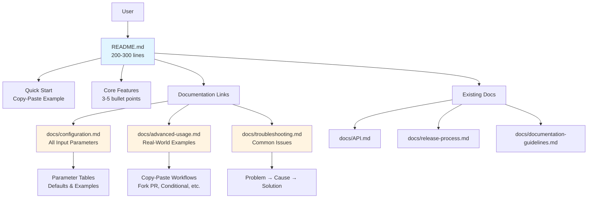
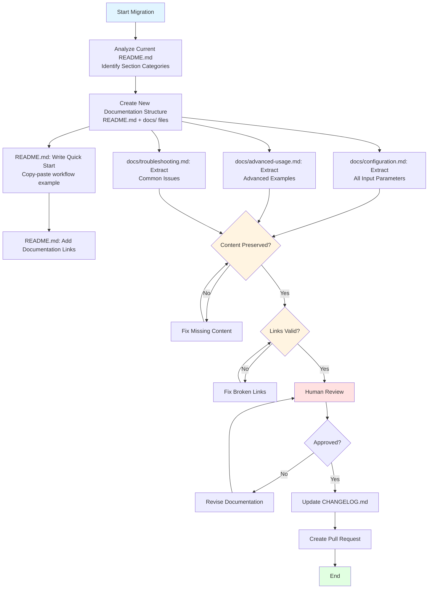
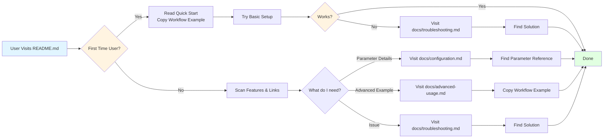
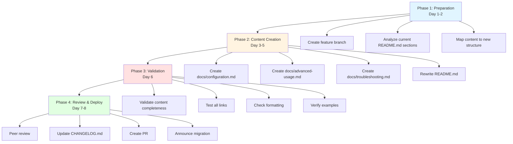

# Technical Design Document

## Overview

**Purpose**: This feature simplifies the PR Labeler project's README.md from 717 lines to 200-300 lines by restructuring documentation, prioritizing quick-start workflows, and separating detailed information into dedicated docs/ files. This improves first-time user onboarding, accelerates information access for existing users, and reduces documentation maintenance burden.

**Users**:

- **First-time users** need to understand basic usage within 5 minutes and start using the action with copy-paste examples
- **Existing users** need quick access to advanced configuration and troubleshooting
- **Maintainers** need simplified documentation updates with consistent structure
- **Global audience** requires English-first documentation with optional Japanese translation

**Impact**: Transforms current monolithic README.md (717 lines) into a modular documentation structure where README.md serves as an entry point (200-300 lines) and detailed information lives in docs/ subdirectories.

### Goals

- Reduce README.md from 717 lines to 200-300 lines
- Enable 5-minute quick-start for new users with copy-paste workflow examples
- Organize detailed information into logical docs/ files without information loss
- Establish English-first documentation with Japanese translation support
- Maintain backward compatibility with existing links and bookmarks

### Non-Goals

- Adding new features to PR Labeler functionality
- Changing action.yml input parameters or behavior
- Translating all documentation to multiple languages (Japanese README.ja.md is optional, not required)
- Redesigning the visual identity or branding
- Modifying CI/CD workflows or release processes

## Architecture

### Existing Architecture Analysis

**Current Documentation Structure** (Monolithic):

```
pr-labeler/
├── README.md (717 lines) - Everything in one file
│   ├── Features
│   ├── Quick Start + Advanced Examples
│   ├── Input Parameters (all details)
│   ├── Advanced Usage (multiple scenarios)
│   ├── Configuration Examples
│   └── Default Exclude Patterns
└── docs/
    ├── API.md
    ├── release-process.md
    ├── documentation-guidelines.md
    └── i18n-error-migration-guide.md
```

**Challenges with Current Structure**:

- Information overload for first-time users
- Mixing basic and advanced content
- Difficult to maintain and update specific sections
- No clear navigation path for different user personas

### High-Level Architecture



**Architecture Integration**:

- Existing docs/ files (API.md, release-process.md, etc.) remain unchanged
- New documentation files follow existing documentation-guidelines.md
- README.md becomes a hub with clear links to specialized documentation
- Information is preserved completely, only reorganized for better accessibility

### Technology Stack and Design Decisions

**Technology Alignment**:

- Markdown format for all documentation (consistent with existing docs/)
- GitHub-flavored Markdown for tables and code blocks
- No external dependencies or build tools required
- Documentation structure follows GitHub best practices (actions/checkout, docker/build-push-action)

**Key Design Decisions**:

#### Decision 1: Content Separation Strategy

**Decision**: Split README.md into hub-and-spoke model with README.md as entry point and docs/ as detailed information repository.

**Context**: Current 717-line README.md contains both quick-start examples and comprehensive parameter documentation, making it difficult for new users to identify essential information.

**Alternatives**:

1. **Flat structure**: Keep everything in README.md but reorganize sections
2. **Multi-level structure**: Create nested docs/guides/, docs/reference/, docs/examples/
3. **Hub-and-spoke model** (selected): README.md as hub, flat docs/ with specific purpose files

**Selected Approach**: Hub-and-spoke model with three core documentation files:

- `docs/configuration.md`: Comprehensive input parameter reference
- `docs/advanced-usage.md`: Copy-paste workflow examples for advanced scenarios
- `docs/troubleshooting.md`: Problem-solution pairs for common issues

**Rationale**:

- Minimizes navigation depth (maximum 2 clicks to any information)
- Aligns with user mental model (quick-start → specific need → detailed doc)
- Simplifies maintenance (clear ownership of each documentation file)
- Follows patterns from successful GitHub Actions (actions/checkout, docker/build-push-action)

**Trade-offs**:

- **Gain**: Faster onboarding, easier maintenance, clear information hierarchy
- **Sacrifice**: Slight information duplication between README.md and docs/ (quick-start vs. comprehensive examples)

#### Decision 2: Language Strategy

**Decision**: English-first documentation in README.md with simultaneous Japanese README.ja.md release to prevent user experience regression.

**Context**: Current README.md mixes Japanese and English content, creating language barriers for global users. Project has international GitHub Actions Marketplace presence. However, existing Japanese-speaking user base requires continued Japanese support to avoid onboarding experience degradation.

**Alternatives**:

1. **Japanese-first**: Keep current mixed approach
2. **Bilingual inline**: Include both languages in same file with language toggles
3. **English-first, delayed Japanese translation**: English README.md first, Japanese translation later (rejected due to UX regression)
4. **English-first with simultaneous Japanese release** (selected)

**Selected Approach**:

- README.md written in English (primary)
- README.ja.md released simultaneously (same PR)
- docs/ files in English with future Japanese translations planned
- Language selection prominently displayed in both READMEs
- Synchronization guidelines in documentation-guidelines.md

**Rationale**:

- GitHub Actions Marketplace requires English documentation
- English enables wider adoption and contribution
- Separate translation files prevent content conflicts
- Simultaneous Japanese release prevents existing user base regression
- Follows industry standard (most popular actions use English-first with translations)

**Trade-offs**:

- **Gain**: Global accessibility, marketplace compliance, no Japanese user regression, easier contributions
- **Sacrifice**: Additional translation maintenance burden (mitigated by synchronization guidelines)

#### Decision 3: Migration Approach

**Decision**: Incremental migration with backward compatibility for existing links.

**Context**: External documentation, blog posts, and bookmarks may link to specific README.md sections using anchor links.

**Alternatives**:

1. **Big-bang replacement**: Replace README.md entirely in one PR
2. **Incremental with redirects**: Add HTML redirects or link warnings
3. **Incremental with anchor preservation** (selected)

**Selected Approach**:

- Preserve critical section anchors in new README.md structure
- Add clear migration notes in README.md pointing to new docs/ files
- Document changes in CHANGELOG.md
- Create GitHub Issue announcement (Issue #35) with migration guide

**Rationale**:

- Minimizes breaking changes for existing users
- Provides clear migration path
- Maintains SEO value of existing links
- Allows gradual user adaptation

**Trade-offs**:

- **Gain**: Smooth transition, preserved external links, user confidence
- **Sacrifice**: Slightly longer README.md due to anchor preservation (acceptable within 200-300 line target)

## System Flows

### Documentation Migration Flow



### User Navigation Flow



## Requirements Traceability

| Requirement | Requirement Summary                       | Components                                                             | Implementation Details                                                                      |
| ----------- | ----------------------------------------- | ---------------------------------------------------------------------- | ------------------------------------------------------------------------------------------- |
| 1.1-1.8     | README.md simplification & quick-start    | README.md rewrite                                                      | 200-300 lines, quick-start section with copy-paste workflow, permissions guide, docs/ links |
| 2.1-2.4     | README.md structure design                | README.md sections                                                     | Title, badges, features (3-5), quick-start, permissions, docs links, contribution, license  |
| 3.1-3.7     | Detailed documentation separation         | docs/configuration.md, docs/advanced-usage.md, docs/troubleshooting.md | Parameter tables, copy-paste examples, problem-solution format                              |
| 4.1-4.5     | Multi-language support                    | README.md (English), README.ja.md (optional)                           | English-first, separate translation file, sync guidelines                                   |
| 5.1-5.5     | Information preservation & link integrity | Migration validation                                                   | All content migrated, anchor preservation, link validation                                  |
| 6.1-6.6     | Documentation quality & maintainability   | All documentation files                                                | Clear heading structure, syntax highlighting, metadata, table formatting                    |
| 7.1-7.5     | Best practices application                | README.md pattern                                                      | Reference actions/checkout, docker/build-push-action, parameter tables, relevant badges     |

## Components and Interfaces

### Documentation Structure

#### README.md (Hub)

**Responsibility & Boundaries**

- **Primary Responsibility**: Entry point for all users, providing quick-start guide and navigation to detailed documentation
- **Domain Boundary**: User onboarding and navigation hub
- **Content Ownership**: Project overview, core features, quick-start example, essential links
- **Target Length**: 200-300 lines

**Dependencies**

- **Inbound**: External links from GitHub Actions Marketplace, blog posts, social media
- **Outbound**: Links to docs/configuration.md, docs/advanced-usage.md, docs/troubleshooting.md, existing docs/

**Contract Definition**

**Content Structure**:

```markdown
# PR Labeler
[Badges: License, TypeScript, Test Status, Coverage]

> One-line description

## ✨ Features
- 3-5 core features (bullet points)

## 🚀 Quick Start
- Minimum viable workflow (10-15 lines)
- Copy-paste ready example
- Required permissions

## 📚 Documentation
- [Configuration Guide](docs/configuration.md)
- [Advanced Usage](docs/advanced-usage.md)
- [Troubleshooting](docs/troubleshooting.md)
- [API Documentation](docs/API.md)
- [Release Process](docs/release-process.md)

## 🤝 Contributing
## 📄 License
```

**Preconditions**: README.md must be self-contained for basic usage
**Postconditions**: Users can start using the action within 5 minutes
**Invariants**: Quick-start example must always be functional and up-to-date

**Detailed Layout Example with Anchor Compatibility**:

````markdown
# PR Labeler

[Badges: License, TypeScript, Test Status, Coverage]

> Automatically analyze and label Pull Requests based on size, complexity, category, and risk

[🇬🇧 English](README.md) | [🇯🇵 日本語](README.ja.md)

> **📢 Documentation Update**: README.md has been simplified for better readability.
> Detailed documentation moved to [docs/](docs/).
> [Previous comprehensive version](https://github.com/owner/repo/blob/pre-simplification-readme/README.md) is archived.

## ✨ Features

- **Automatic PR Labeling**: Size, complexity, category, and risk-based labels
- **GitHub Actions Integration**: Seamless workflow integration with summary output
- **Flexible Configuration**: Customizable thresholds and selective label enabling
- **Directory-Based Labeling**: Path-based label automation with priority control
- **Multi-language Support**: English and Japanese output messages

## 🚀 Quick Start

[10-15 line copy-paste workflow example with minimal configuration]

```yaml
name: PR Check
on:
  pull_request:
    types: [opened, synchronize]

jobs:
  pr-check:
    runs-on: ubuntu-latest
    permissions:
      contents: read
      pull-requests: write
    steps:
      - uses: jey3dayo/pr-labeler@v1
        with:
          github_token: ${{ secrets.GITHUB_TOKEN }}
````

**Next Steps**: [Configuration Guide](docs/configuration.md) | [Advanced Usage](docs/advanced-usage.md)

## 🔒 Required Permissions

[Brief permissions section with workflow example]

<!-- Legacy anchor compatibility -->

<a id="必要な権限"></a>
<a id="permissions"></a>

## 🔧 Input Parameters

For comprehensive input parameter documentation, see [Configuration Guide](docs/configuration.md).

**Quick Reference**:

- [Basic Limits](docs/configuration.md#basic-limits)
- [Label Settings](docs/configuration.md#label-settings)
- [Selective Label Enabling](docs/configuration.md#selective-label-enabling)

<!-- Legacy anchor compatibility -->

<a id="入力パラメータ"></a>
<a id="input-parameters"></a>

## 📝 Advanced Usage

For real-world examples and advanced scenarios, see [Advanced Usage Guide](docs/advanced-usage.md).

**Common Scenarios**:

- [Fork PR Support](docs/advanced-usage.md#fork-pr-support)
- [Conditional Execution](docs/advanced-usage.md#conditional-execution)
- [Custom Configuration](docs/advanced-usage.md#custom-configuration)

<!-- Legacy anchor compatibility -->

<a id="高度な使用例"></a>
<a id="advanced-usage"></a>

## 📚 Documentation

- [Configuration Guide](docs/configuration.md) - All input parameters and defaults
- [Advanced Usage](docs/advanced-usage.md) - Real-world workflow examples
- [Troubleshooting](docs/troubleshooting.md) - Common issues and solutions
- [API Documentation](docs/API.md) - Programmatic usage
- [Release Process](docs/release-process.md) - Version management

## 🤝 Contributing

Contributions are welcome! Please see [CONTRIBUTING.md](CONTRIBUTING.md) for guidelines.

## 📄 License

MIT License - see [LICENSE](LICENSE) file for details.

---

**Total Lines**: ~220-250 lines (includes placeholder sections + anchor compatibility)

````

**Line Count Breakdown**:
- Header + badges + description: ~15 lines
- Features: ~10 lines
- Quick Start: ~30 lines
- Permissions: ~10 lines
- Input Parameters (placeholder): ~15 lines
- Advanced Usage (placeholder): ~15 lines
- Documentation links: ~10 lines
- Contributing + License: ~10 lines
- Migration notice: ~5 lines
- HTML anchors (invisible): ~15 lines
- **Total**: ~235 lines

**Anchor Compatibility Cost**: 20-25 lines for placeholder sections + HTML anchors, well within 200-300 line target.

#### docs/configuration.md

**Responsibility & Boundaries**

- **Primary Responsibility**: Comprehensive reference for all action input parameters
- **Domain Boundary**: Configuration reference documentation
- **Content Ownership**: All input parameters, default values, type definitions, examples
- **Target Structure**: Parameter tables + detailed explanations

**Dependencies**

- **Inbound**: Links from README.md, docs/advanced-usage.md
- **Outbound**: References to action.yml (source of truth), docs/advanced-usage.md (usage examples)

**Contract Definition**

**Content Structure**:

```markdown
# Configuration Guide

## Overview
Brief introduction to configuration system

## Input Parameters

### Basic Limits
| Parameter | Required | Default | Description | Example |
|-----------|----------|---------|-------------|---------|
| file_size_limit | No | 100KB | ... | `200KB` |
| ... | ... | ... | ... | ... |

### Label Settings
[Similar table format]

### Selective Label Enabling
[Similar table format with examples]

### Action Settings
[Similar table format]

### Exclusion Settings
[Similar table format]

### Directory-Based Labeling
[Similar table format]

## Configuration File (.github/pr-labeler.yml)
- YAML structure
- Schema validation
- Full example

## Default Values
- Complete list of defaults
- Rationale for default choices
````

**Preconditions**: Must match action.yml input definitions exactly
**Postconditions**: Users can understand and configure all parameters
**Invariants**: Default values must always match action.yml

#### docs/advanced-usage.md

**Responsibility & Boundaries**

- **Primary Responsibility**: Real-world, copy-paste workflow examples for advanced scenarios
- **Domain Boundary**: Practical usage examples and patterns
- **Content Ownership**: Complete workflow files for specific use cases
- **Target Structure**: Scenario-based examples with explanations

**Dependencies**

- **Inbound**: Links from README.md, docs/configuration.md
- **Outbound**: References to docs/configuration.md (parameter details), docs/troubleshooting.md (if issues arise)

**Contract Definition**

**Content Structure**:

```markdown
# Advanced Usage

## Fork PR Support (pull_request_target)
- Scenario description
- Complete workflow example (copy-paste ready)
- Security considerations

## Conditional Execution
- Scenario: Skip for certain labels/branches
- Complete workflow example
- Explanation of conditions

## Strict Mode (Fail on Violations)
- Scenario description
- Complete workflow example
- When to use

## Summary-Only Mode
- Scenario description
- Complete workflow example
- Use cases

## Selective Label Enabling
- Multiple scenarios with different combinations
- Complete workflow examples for each
- Decision guidance

## Custom PR Labeler Configuration
- .github/pr-labeler.yml setup
- Complete configuration examples
- Category customization
- Threshold adjustments

## Directory-Based Labeling
- .github/directory-labeler.yml setup
- Complete configuration examples
- Priority and namespace policies
```

**Preconditions**: Examples must be tested and functional
**Postconditions**: Users can copy-paste examples and adapt to their needs
**Invariants**: All workflow examples must pass validation (valid YAML, correct syntax)

#### docs/troubleshooting.md

**Responsibility & Boundaries**

- **Primary Responsibility**: Problem-solution pairs for common issues
- **Domain Boundary**: User support and debugging
- **Content Ownership**: Common errors, permission issues, unexpected behaviors
- **Target Structure**: Problem → Cause → Solution format

**Dependencies**

- **Inbound**: Links from README.md, docs/advanced-usage.md
- **Outbound**: References to docs/configuration.md (parameter fixes), GitHub documentation (permissions)

**Contract Definition**

**Content Structure**:

```markdown
# Troubleshooting Guide

## Common Issues

### Permission Errors
**Problem**: "Resource not accessible by integration"
**Cause**: Insufficient permissions in workflow
**Solution**:
- Add required permissions to workflow
- Example fix with code

### Labels Not Applied
**Problem**: Labels don't appear on PR
**Cause**: Labels must be created manually first (when apply_labels: true)
**Solution**:
- Create labels in repository settings
- Or use apply_labels: false

### Draft PR Skipped Unexpectedly
**Problem**: Action skips draft PR
**Cause**: skip_draft_pr default is true
**Solution**:
- Set skip_draft_pr: false if needed
- Example configuration

### Complexity Analysis Fails
**Problem**: Syntax errors in complexity report
**Cause**: TypeScript/JavaScript syntax errors in code
**Solution**:
- Fix syntax errors
- Or exclude problematic files

### Wrong File Count
**Problem**: Metrics don't match expectations
**Cause**: Default exclude patterns filtering files
**Solution**:
- Review default exclude patterns
- Adjust additional_exclude_patterns

## Debugging Tips
- Enable debug logging
- Check GitHub Actions Summary
- Validate workflow syntax

## Getting Help
- GitHub Issues
- Discussions
```

**Preconditions**: Issues must be actual reported problems or foreseeable errors
**Postconditions**: Users can self-solve common problems without creating issues
**Invariants**: Solutions must be verified to work

### Integration Strategy

**Modification Approach**:

- **README.md**: Complete rewrite with new structure
- **docs/ files**: Create new files, preserve existing docs/
- **CHANGELOG.md**: Document restructuring changes

**Backward Compatibility**:

- Preserve key section anchors where possible
- Add migration notes in README.md
- Document breaking documentation changes in CHANGELOG.md

**Migration Path**:

1. Create new docs/ files first (configuration.md, advanced-usage.md, troubleshooting.md)
2. Validate content completeness (no information loss)
3. Rewrite README.md with links to new docs/
4. Test all internal links
5. Update CHANGELOG.md
6. Create PR with migration announcement

## Migration Strategy

### Migration Phases



**Phase 1: Preparation** (Day 1-2)

- Create feature branch: `feature/readme-simplification`
- Analyze current README.md structure (717 lines)
- Map content to new structure:
  - README.md: Lines 1-150 (overview, quick-start, features)
  - docs/configuration.md: Lines 276-411 (input parameters, thresholds)
  - docs/advanced-usage.md: Lines 497-691 (advanced examples, custom config)
  - docs/troubleshooting.md: New content based on common issues

**Phase 2: Content Creation** (Day 3-5)

- Create docs/configuration.md with all input parameters in table format
- Create docs/advanced-usage.md with copy-paste workflow examples
- Create docs/troubleshooting.md with problem-solution pairs
- Rewrite README.md to 200-300 lines with:
  - Title, badges, one-line description
  - Core features (3-5 bullet points)
  - Quick-start section (minimum viable workflow)
  - Required permissions
  - Documentation links
  - Contribution and license sections

**Phase 3: Validation** (Day 6)

- Content completeness check:
  - ✅ All 717 lines of original content accounted for
  - ✅ No information lost in migration
  - ✅ All code examples functional
- Link validation:
  - ✅ All internal links resolve correctly
  - ✅ All anchors work as expected
  - ✅ External links still valid
- Format validation:
  - ✅ Markdown syntax correct
  - ✅ Tables render properly
  - ✅ Code blocks have syntax highlighting

**Phase 4: Review & Deploy** (Day 7-8)

- Peer review of all documentation changes
- Update CHANGELOG.md with documentation restructuring notes
- Create Pull Request with detailed description
- Announce migration in Issue #35 with links to new structure

### Anchor Compatibility Strategy

**Critical Challenge**: External links (blog posts, issues, bookmarks) may point to specific README.md sections using anchor links (e.g., `#入力パラメータ`, `#使用方法`). When content moves to docs/, these anchors will return 404, breaking the external ecosystem.

**Implementation Strategy**:

**1. Placeholder Sections with Redirect Links**

Create minimal placeholder sections in README.md that preserve anchor compatibility and redirect users to new locations:

```markdown
## 🔧 Input Parameters

For detailed input parameter documentation, see [Configuration Guide](docs/configuration.md).

Quick reference: [Basic Limits](docs/configuration.md#basic-limits) | [Label Settings](docs/configuration.md#label-settings) | [Selective Enabling](docs/configuration.md#selective-label-enabling)

<!-- Legacy anchor compatibility -->
<a id="入力パラメータ"></a>
```

**Cost**: Each placeholder section adds ~5 lines → 4-5 placeholders = 20-25 lines (within 200-300 line target).

**2. HTML Anchor Preservation**

Use HTML comment anchors to maintain backward compatibility without visible content:

```markdown
<!-- Legacy anchor: 高度な使用例 -->
<a id="高度な使用例"></a>
<a id="advanced-usage"></a>

For advanced usage examples, see [Advanced Usage Guide](docs/advanced-usage.md).
```

**3. Critical Anchors to Preserve**

Based on README.md analysis, preserve these high-traffic anchors:

| Japanese Anchor   | English Anchor      | Redirect Destination              |
| ----------------- | ------------------- | --------------------------------- |
| `#入力パラメータ` | `#input-parameters` | docs/configuration.md             |
| `#使用方法`       | `#usage`            | Quick Start section (in README)   |
| `#高度な使用例`   | `#advanced-usage`   | docs/advanced-usage.md            |
| `#必要な権限`     | `#permissions`      | Permissions section (in README)   |
| `#自動適用ラベル` | `#labels`           | docs/configuration.md#auto-labels |

**4. Migration Notice Section**

Add a prominent migration notice at the top of README.md for 1-2 releases:

```markdown
> **📢 Documentation Update**: README.md has been simplified. Detailed documentation moved to [docs/](docs/). See [Migration Guide](docs/migration-guide.md) for details.
```

**5. Archive Link Strategy**

For users who prefer the old comprehensive README:

- Tag the last commit before migration: `git tag pre-simplification-readme`
- Add link in README.md: "Previous comprehensive README: [View archived version](https://github.com/owner/repo/blob/pre-simplification-readme/README.md)"
- Remove archive link after 2-3 releases once migration is stable

**Trade-offs**:

- **Placeholder sections**: Add 20-25 lines to README.md but prevent 404 errors
- **HTML anchors**: Invisible to readers but maintain backward compatibility
- **Migration notice**: Temporary addition (removed after 2-3 releases)
- **Total impact**: ~220-250 lines (well within 200-300 line target)

### Rollback Triggers

**Immediate rollback if**:

- Critical information found missing after validation
- Multiple external links break due to anchor changes
- GitHub Actions Marketplace compliance issues discovered
- Peer review identifies fundamental structural problems

**Rollback procedure**:

1. Revert PR commits
2. Re-analyze missing/broken content
3. Create revised migration plan
4. Repeat validation phase

### Validation Checkpoints

**Content Validation Checklist**:

- [ ] All input parameters from original README.md present in docs/configuration.md
- [ ] All advanced examples from original README.md present in docs/advanced-usage.md
- [ ] Quick-start example tested and functional
- [ ] README.md length between 200-300 lines
- [ ] No information loss verified by side-by-side comparison

**Link Validation Checklist**:

- [ ] All internal links (README.md → docs/) resolve correctly
- [ ] All docs/ cross-references work
- [ ] Key section anchors preserved for backward compatibility
- [ ] External links (if any) still valid

**Quality Validation Checklist**:

- [ ] Markdown syntax validated with linter
- [ ] Code blocks have appropriate language tags
- [ ] Tables formatted correctly
- [ ] Heading hierarchy (H1-H4) logical
- [ ] No broken images or assets

## Testing Strategy

### Documentation Validation

**Link Validation Tests**:

- Automated link checking with `markdown-link-check`
- Manual verification of internal anchor links
- Cross-reference validation between README.md and docs/

**Content Completeness Tests**:

- Line-by-line comparison of original vs. new structure
- Checklist validation for each requirement
- Parameter table completeness check against action.yml

**Example Functionality Tests**:

- Copy-paste quick-start example into fresh repository
- Test workflow execution
- Verify GitHub Actions Summary output
- Validate label application

### Manual Review Tests

**User Experience Tests**:

- Time-to-first-success for new users (target: < 5 minutes)
- Navigation path clarity (can users find advanced examples?)
- Search functionality (Ctrl+F for common terms)

**Maintenance Tests**:

- Update simulation (modify one parameter, verify impact)
- Consistency check (parameter names match across files)
- Synchronization verification (docs/configuration.md matches action.yml)

### Acceptance Criteria

**Success Criteria**:

1. ✅ README.md length: 200-300 lines (current: 717)
2. ✅ All requirements (1.1-7.5) met and validated
3. ✅ Zero broken links in all documentation
4. ✅ Quick-start example functional in test repository
5. ✅ Peer review approval
6. ✅ No content loss verified

**Quality Gates**:

- Markdown linting passes (markdownlint)
- Link checking passes (markdown-link-check)
- Manual review approval from 2+ team members
- No regression in GitHub Actions functionality

## Performance & Scalability

### Documentation Performance

**Target Metrics**:

- README.md load time: < 1 second (reduced from current due to size reduction)
- Search indexing: Improved due to better structure
- GitHub rendering: Faster due to smaller file size

**Optimization Strategies**:

- Limit images to 3 or fewer, max 500KB each
- Keep individual docs/ files under 100KB
- Use relative links for faster resolution

### Maintenance Scalability

**Update Patterns**:

- New feature documentation: Add to docs/advanced-usage.md, update quick-start if needed
- New parameter: Add to docs/configuration.md table, update CHANGELOG.md
- Bug fix: Update docs/troubleshooting.md if user-facing

**Synchronization Strategy**:

- Document in documentation-guidelines.md: "When updating action.yml, update docs/configuration.md"
- Add CI check (future): Validate parameter consistency between action.yml and docs/configuration.md
- Regular audits: Quarterly documentation review for outdated content

## Security Considerations

### Information Security

**No sensitive information disclosure**:

- Examples use placeholder tokens (`${{ secrets.GITHUB_TOKEN }}`)
- No hardcoded credentials or API keys
- Security best practices documented (e.g., fork PR handling)

**Link Security**:

- All external links verified before inclusion
- No shortened URLs or tracking links
- HTTPS-only links where applicable

### Access Control

**Documentation permissions**:

- README.md and docs/ are public (open-source project)
- No authentication required for documentation access
- Contribution guidelines reference security policy

## Appendix: Content Migration Map

### Current README.md → New Structure Mapping

| Current Section           | Lines   | New Location             | Notes                         |
| ------------------------- | ------- | ------------------------ | ----------------------------- |
| Title & Badges            | 1-8     | README.md (Header)       | Keep, update badge list       |
| 🚀 機能                   | 9-102   | README.md (Features)     | Simplify to 3-5 bullet points |
| 📋 使用方法               | 104-216 | README.md (Quick Start)  | Extract minimal example       |
| 📋 使用方法               | 218-274 | docs/advanced-usage.md   | Move i18n examples            |
| 🔧 入力パラメータ         | 276-377 | docs/configuration.md    | All parameters as tables      |
| 📊 GitHub Actions Summary | 412-437 | docs/configuration.md    | Move to config doc            |
| 📤 出力変数               | 439-450 | docs/configuration.md    | Move to config doc            |
| 🏷️ 自動適用ラベル         | 452-484 | README.md (Features)     | Summarize, link to config     |
| 🔒 必要な権限             | 486-495 | README.md (Permissions)  | Keep in quick-start area      |
| 📝 高度な使用例           | 497-691 | docs/advanced-usage.md   | All examples with full code   |
| 🎯 デフォルト除外パターン | 698-711 | docs/configuration.md    | Move to config doc            |
| 🤝 コントリビューション   | 713-715 | README.md (Contributing) | Keep, simplify                |
| 📄 ライセンス             | 717-719 | README.md (License)      | Keep                          |

### New Content to Create

**docs/troubleshooting.md** (New):

- Permission errors
- Label creation issues
- Draft PR skipping
- Complexity analysis failures
- File count mismatches
- Debug logging tips

**README.ja.md** (Same PR, Required):

- Japanese translation of README.md
- Released simultaneously with README.md to prevent UX regression
- Language selection links in both READMEs
- Maintained separately with synchronization guidelines in documentation-guidelines.md

**docs/migration-guide.md** (Optional):

- Detailed migration guide for users
- Mapping of old anchors to new locations
- Archive link to pre-simplification README
- Can be combined with CHANGELOG.md entry if brief
