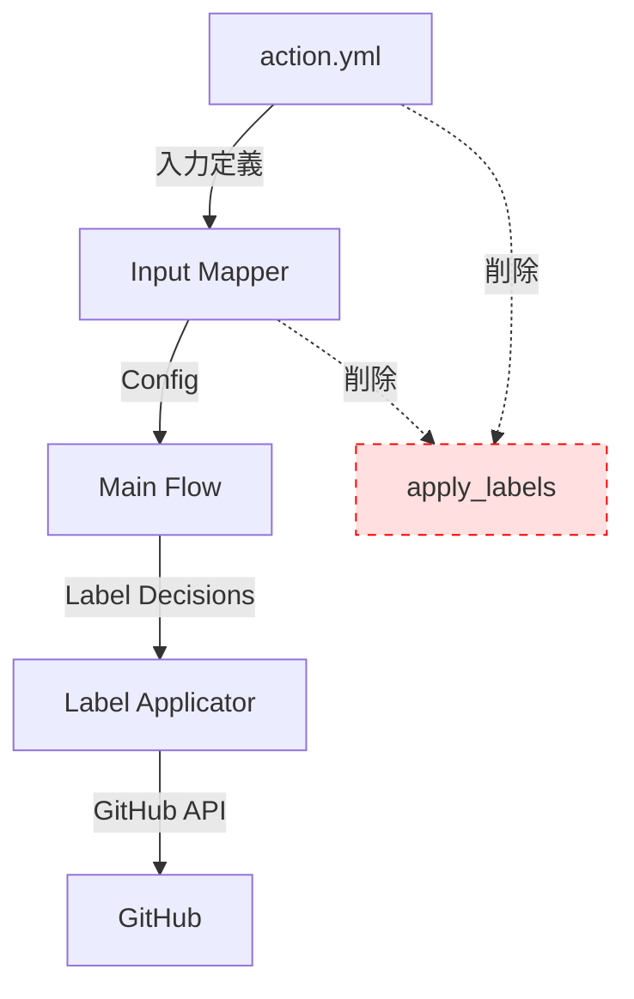
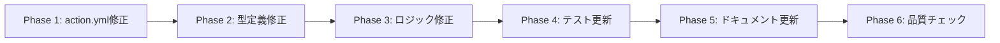

# 技術設計書

## 概要

本機能は、PR Labelerの入力パラメータ設計を簡素化し、ユーザー混乱を削減することを目的とします。具体的には、冗長な`apply_labels`パラメータを完全削除し、複雑度分析機能をデフォルトOFFに変更し、複雑度閾値をより実用的な値に緩和します。

**目的**: 既存ユーザーと新規ユーザーの両方に対して、より直感的で実用的なパラメータ設計を提供する

**対象ユーザー**:

- PR Labelerを導入するプロジェクトのメンテナー
- 既存のPR Labeler設定を最適化したいユーザー

**影響範囲**:

- 入力パラメータ定義(`action.yml`)
- 入力マッピングロジック(`src/input-mapper.ts`)
- ラベル適用ロジック(`src/index.ts`, `src/label-applicator.ts`)
- テストコード(`__tests__/`)
- ドキュメント(`README.md`, `docs/configuration.md`, `CHANGELOG.md`)

### ゴール

- 冗長な`apply_labels`パラメータを完全に削除し、個別`*_enabled`制御に統一
- 複雑度分析機能をオプトイン(デフォルトOFF)に変更し、実用性を向上
- 複雑度閾値を業界標準に合わせて緩和(`{"medium": 15, "high": 30}`)
- すべての既存機能を維持し、テストカバレッジ93%以上を保証

### 非ゴール

- 個別`*_enabled`パラメータの動作変更(既存の動作を維持)
- 新しいラベル種別の追加
- ラベル適用アルゴリズムの変更

## アーキテクチャ

### 既存アーキテクチャ分析

**現在の設計パターン**:

- **Railway-Oriented Programming**: neverthrow `Result<T, E>`型による明示的なエラーハンドリング
- **モジュール分離**: 入力検証、ビジネスロジック、GitHub API呼び出しの明確な境界
- **依存性注入**: GitHub APIクライアントとConfigを引数で渡すテスタブルな設計

**既存のドメイン境界**:

- **Input Layer**: `input-mapper.ts`で入力検証とパース
- **Business Logic Layer**: `label-decision-engine.ts`でラベル判定、`label-applicator.ts`でラベル適用
- **Infrastructure Layer**: `actions-io.ts`でGitHub Actions I/O、GitHub APIクライアント

**維持すべき統合ポイント**:

- `Config`インターフェースを通じた設定の型安全な受け渡し
- 個別`*_enabled`フラグによるラベル種別の選択的有効化
- neverthrow `Result`型による一貫したエラーハンドリング

### 高レベルアーキテクチャ



**アーキテクチャ統合**:

- **既存パターン維持**: Railway-Oriented Programming、モジュール分離、依存性注入
- **新コンポーネント**: なし(既存コンポーネントの修正のみ)
- **技術スタック整合性**: TypeScript strict mode、neverthrow、ESLint/Prettier準拠
- **ステアリング準拠**: 型安全性徹底、純粋関数優先、明示的エラーハンドリング

## 要件トレーサビリティ

| 要件    | 要件概要                          | コンポーネント                            | インターフェース                                  | 実装ファイル                                                                          |
| ------- | --------------------------------- | ----------------------------------------- | ------------------------------------------------- | ------------------------------------------------------------------------------------- |
| 1.1     | action.ymlから`apply_labels`削除  | Input Definition                          | `action.yml` inputs                               | `action.yml`                                                                          |
| 1.2-1.6 | `applyLabels`プロパティ・参照削除 | Input Mapper, Label Applicator, Main Flow | `Config`, `mapActionInputsToConfig`, メインフロー | `src/input-mapper.ts`, `src/label-applicator.ts`, `src/index.ts`, `src/actions-io.ts` |
| 2.1-2.2 | 複雑度機能デフォルトOFF           | Input Definition, Input Mapper            | `action.yml`, `Config`                            | `action.yml`, `src/input-mapper.ts`                                                   |
| 3.1-3.3 | 複雑度閾値緩和                    | Input Definition, Input Mapper            | `action.yml`, `parseComplexityThresholdsV2`       | `action.yml`, `src/input-mapper.ts`, `src/actions-io.ts`                              |
| 4.1-4.5 | テスト更新                        | Test Suite                                | `__tests__/*.test.ts`                             | `__tests__/input-mapper.test.ts`, `__tests__/label-applicator.test.ts`, 他            |
| 5.1-5.7 | ドキュメント更新                  | Documentation                             | README, docs, CHANGELOG                           | `README.md`, `docs/configuration.md`, `CHANGELOG.md`                                  |
| 6.1-6.6 | 既存機能保全                      | All Components                            | 個別`*_enabled`フラグ                             | 全ソースコード                                                                        |

## コンポーネントと設計

### Input Layer

#### action.yml

**責任と境界**:

- **主要責任**: GitHub Actions入力パラメータの定義とデフォルト値の提供
- **ドメイン境界**: Input Definition層、ビジネスロジックから完全に独立
- **データ所有権**: 入力パラメータのスキーマとデフォルト値

**依存関係**:

- **インバウンド**: GitHub Actionsランタイム
- **アウトバウンド**: なし(他のコンポーネントに依存しない)

**契約定義**:

**変更内容**:

1. `apply_labels`パラメータ定義を完全削除
2. `complexity_enabled`のデフォルト値を`"true"`から`"false"`に変更
3. `complexity_thresholds`のデフォルト値を`'{"medium": 10, "high": 20}'`から`'{"medium": 15, "high": 30}'`に変更

**削除されるパラメータ**:

```yaml
# 削除前(lines 31-34)
apply_labels:
  description: "Apply labels to PR (auto: prefixed labels)"
  required: false
  default: "true"
```

**変更されるパラメータ**:

```yaml
# 複雑度有効化フラグ(lines 52-55)
complexity_enabled:
  description: "Enable complexity labels (complexity/medium, complexity/high)"
  required: false
  default: "false"  # 変更: "true" → "false"

# 複雑度閾値(lines 57-60)
complexity_thresholds:
  description: "JSON string for complexity label thresholds"
  required: false
  default: '{"medium": 15, "high": 30}'  # 変更: {"medium": 10, "high": 20}
```

#### Input Mapper (`src/input-mapper.ts`)

**責任と境界**:

- **主要責任**: GitHub Actions入力のパースと検証、`Config`オブジェクトへの変換
- **ドメイン境界**: Input Validation層、ビジネスロジックには関与しない
- **データ所有権**: 入力パース結果とバリデーションエラー

**依存関係**:

- **インバウンド**: `src/index.ts`(メインフロー), `src/actions-io.ts`
- **アウトバウンド**: `bytes`パッケージ(サイズパース), neverthrow

**契約定義**:

**変更内容**:

1. `Config`インターフェースから`applyLabels: boolean`プロパティを削除
2. `mapActionInputsToConfig`関数から`apply_labels`の読み込み処理を削除
3. デフォルト値変更は`action.yml`に委任(Input Mapperは渡された値をそのまま使用)

**削除されるインターフェース**:

```typescript
// src/input-mapper.ts:34-71
export interface Config {
  // ... 他のプロパティ
  applyLabels: boolean; // ← 削除
  // ... 他のプロパティ
}
```

**削除される処理**:

```typescript
// src/input-mapper.ts:mapActionInputsToConfig内
const config: Config = {
  // ... 他のプロパティ
  applyLabels: parseBoolean(inputs.apply_labels), // ← 削除
  // ... 他のプロパティ
};
```

**統合戦略**:

- **修正アプローチ**: 既存コードからの削除のみ、新規コード追加なし
- **後方互換性**: まだリリースされていないため考慮不要
- **移行パス**: なし(完全削除)

### Business Logic Layer

#### Main Flow (`src/index.ts`)

**責任と境界**:

- **主要責任**: PR分析のメインフロー制御、各ステップのオーケストレーション
- **ドメイン境界**: Application層、ビジネスロジックの調整役
- **データ所有権**: フロー全体の実行状態

**依存関係**:

- **インバウンド**: GitHub Actionsランタイム
- **アウトバウンド**: すべてのビジネスロジックモジュール

**契約定義**:

**変更内容**:
`config.applyLabels`チェックを削除し、個別`*_enabled`フラグのみで制御するロジックに変更

**削除される処理**:

```typescript
// src/index.ts:229付近
if (config.applyLabels) {
  // ラベル適用処理
}
```

**変更後のロジック**:

```typescript
// 個別*_enabledフラグで既に制御されているため、
// config.applyLabelsチェックは不要
// Label Decision EngineとLabel Applicatorが
// 個別フラグを参照して動作
```

**統合戦略**:

- **修正アプローチ**: 条件分岐の削除、既存のLabel Decision Engine/Applicatorが個別フラグを参照
- **後方互換性**: なし(完全削除)

#### Label Applicator (`src/label-applicator.ts`)

**責任と境界**:

- **主要責任**: GitHub APIを使ったラベルの適用と削除、冪等性保証
- **ドメイン境界**: Infrastructure層、GitHub API操作のみ担当
- **データ所有権**: ラベル適用結果(added/removed/skipped)

**依存関係**:

- **インバウンド**: `src/index.ts`(メインフロー)
- **アウトバウンド**: `@actions/github`(Octokit), neverthrow

**契約定義**:

**変更内容**:
`applyLabels`関数は`config.applyLabels`を参照していないため、変更不要。個別`*_enabled`フラグは`LabelDecisions`を通じて既に反映されている。

**確認事項**:

- `applyLabels`関数のシグネチャに`config.applyLabels`への依存がないことを確認
- `LabelPolicyConfig`に`applyLabels`プロパティがないことを確認

#### Actions I/O (`src/actions-io.ts`)

**責任と境界**:

- **主要責任**: GitHub Actions入力の取得、出力の設定
- **ドメイン境界**: Infrastructure層、I/O操作のみ担当
- **データ所有権**: Actions入力値の生データ

**依存関係**:

- **インバウンド**: `src/index.ts`
- **アウトバウンド**: `@actions/core`

**契約定義**:

**変更内容**:

1. `apply_labels`入力の読み込み処理を削除(該当行を削除)
2. 複雑度閾値のデフォルト値を`'{"medium": 15, "high": 30}'`に変更(line 135付近)

**削除される処理**:

```typescript
// src/actions-io.tsのgetActionInputs関数内
apply_labels: core.getInput('apply_labels') || 'true', // ← 削除
```

**変更される処理**:

```typescript
// src/actions-io.ts:135付近(現在)
complexity_thresholds: core.getInput('complexity_thresholds') || '{"medium": 10, "high": 20}',

// 変更後
complexity_thresholds: core.getInput('complexity_thresholds') || '{"medium": 15, "high": 30}',
```

## データモデル

### 論理データモデル

**変更前の`Config`インターフェース**:

```typescript
export interface Config {
  // ... 他のプロパティ
  applyLabels: boolean; // ← 削除対象
  // PR Labeler - Selective Label Enabling
  sizeEnabled: boolean;
  complexityEnabled: boolean; // デフォルト値が "true" → "false" に変更
  categoryEnabled: boolean;
  riskEnabled: boolean;
  // ... 他のプロパティ
  complexityThresholdsV2: { medium: number; high: number }; // デフォルト値が {10, 20} → {15, 30} に変更
}
```

**変更後の`Config`インターフェース**:

```typescript
export interface Config {
  // ... 他のプロパティ
  // applyLabels: boolean; ← 削除
  // PR Labeler - Selective Label Enabling
  sizeEnabled: boolean;
  complexityEnabled: boolean; // action.ymlでデフォルト "false"
  categoryEnabled: boolean;
  riskEnabled: boolean;
  // ... 他のプロパティ
  complexityThresholdsV2: { medium: number; high: number }; // action.ymlでデフォルト {15, 30}
}
```

**整合性とインテグリティ**:

- `Config`インターフェースから`applyLabels`を削除しても、個別`*_enabled`フラグで制御可能
- デフォルト値変更は`action.yml`で管理、Input Mapperは渡された値をそのまま使用
- 既存の依存関係検証(`fail_on_pr_size`が`size_enabled`を要求)は維持

## エラーハンドリング

### エラー戦略

本機能は既存コードの削除と設定値変更のみであり、新しいエラーケースは導入されません。既存のエラーハンドリングパターン(neverthrow `Result`型)をそのまま維持します。

### エラーカテゴリと対応

**ユーザーエラー(4xx相当)**:

- 既存: 入力パラメータの型エラー(`parseBooleanStrict`, `parseComplexityThresholdsV2`)
- 変更: `apply_labels`関連のバリデーションエラーが削除される

**システムエラー(5xx相当)**:

- 既存: GitHub API呼び出しエラー
- 変更: なし

**ビジネスロジックエラー(422相当)**:

- 既存: 依存関係検証エラー(`fail_on_pr_size`が`size_enabled`を要求)
- 変更: なし

### モニタリング

- 既存のログ出力(`core.info`, `core.warning`, `core.error`)を維持
- `apply_labels`関連のログメッセージを削除

## テスト戦略

### ユニットテスト

**Input Mapper (`__tests__/input-mapper.test.ts`)**:

- `apply_labels`パラメータに関連するテストケースを完全削除
- `complexityEnabled`デフォルト値が`false`であることを検証するテストケースを追加
- 新しい複雑度閾値(`{"medium": 15, "high": 30}`)を使用するテストケースを追加

**Label Applicator (`__tests__/label-applicator.test.ts`)**:

- `applyLabels`パラメータへの依存を削除
- 個別`*_enabled`フラグを使用するテストケースに更新

**削除されるテストケース例**:

```typescript
// __tests__/input-mapper.test.ts
describe('apply_labels parameter', () => {
  it('should parse apply_labels as boolean', () => {
    // ← このテストケース全体を削除
  });
});
```

**追加されるテストケース例**:

```typescript
// __tests__/input-mapper.test.ts
describe('complexity default values', () => {
  it('should use false as default for complexity_enabled', () => {
    const inputs = createMinimalInputs();
    // complexity_enabled未指定時はfalseになることを検証
  });

  it('should use {medium: 15, high: 30} as default thresholds', () => {
    const inputs = createMinimalInputs();
    // complexity_thresholds未指定時は{15, 30}になることを検証
  });
});
```

### 統合テスト

**メインフロー (`__tests__/index.test.ts`, `__tests__/integration.test.ts`)**:

- `config.applyLabels`チェックを削除したフローが正常に動作することを検証
- 個別`*_enabled`フラグでラベル制御が機能することを確認

### カバレッジ目標

- 既存カバレッジ93%以上を維持
- 削除されたコードに対するテストケースも削除されるため、カバレッジは維持される

## マイグレーション戦略

本機能はまだリリースされていないため、マイグレーション戦略は不要です。完全削除により、痕跡なく`apply_labels`パラメータが除去されます。

### 実装フェーズ



**Phase 1: action.yml修正**

- `apply_labels`パラメータ定義を削除
- `complexity_enabled`デフォルト値を`"false"`に変更
- `complexity_thresholds`デフォルト値を`'{"medium": 15, "high": 30}'`に変更

**Phase 2: 型定義修正**

- `src/input-mapper.ts`の`Config`インターフェースから`applyLabels`削除
- `src/actions-io.ts`の`ActionInputs`型から`apply_labels`削除(型定義の一貫性維持)

**Phase 3: ロジック修正**

- `src/input-mapper.ts`の`mapActionInputsToConfig`から`apply_labels`読み込み削除
- `src/index.ts`の`config.applyLabels`チェック削除
- `src/actions-io.ts`の`apply_labels`入力取得削除
- `src/actions-io.ts`の複雑度閾値デフォルト値変更

**Phase 4: テスト更新**

- `__tests__/input-mapper.test.ts`から`apply_labels`関連テスト削除
- `__tests__/label-applicator.test.ts`の更新
- 複雑度デフォルト値テスト追加

**Phase 5: ドキュメント更新**

- `README.md`から`apply_labels`記載削除
- `docs/configuration.md`のパラメータテーブル更新
- `CHANGELOG.md`に破壊的変更記録

**Phase 6: 品質チェック**

- `pnpm lint && pnpm type-check && pnpm test && pnpm build`実行
- カバレッジ93%以上確認

### ロールバック条件

- テストが失敗した場合
- ビルドが失敗した場合
- カバレッジが93%を下回った場合

### 検証チェックポイント

- [ ] すべてのテストが成功
- [ ] 型チェックがエラー0件
- [ ] ESLintがエラー0件
- [ ] カバレッジ93%以上
- [ ] ビルド成功(`dist/index.js`生成)
