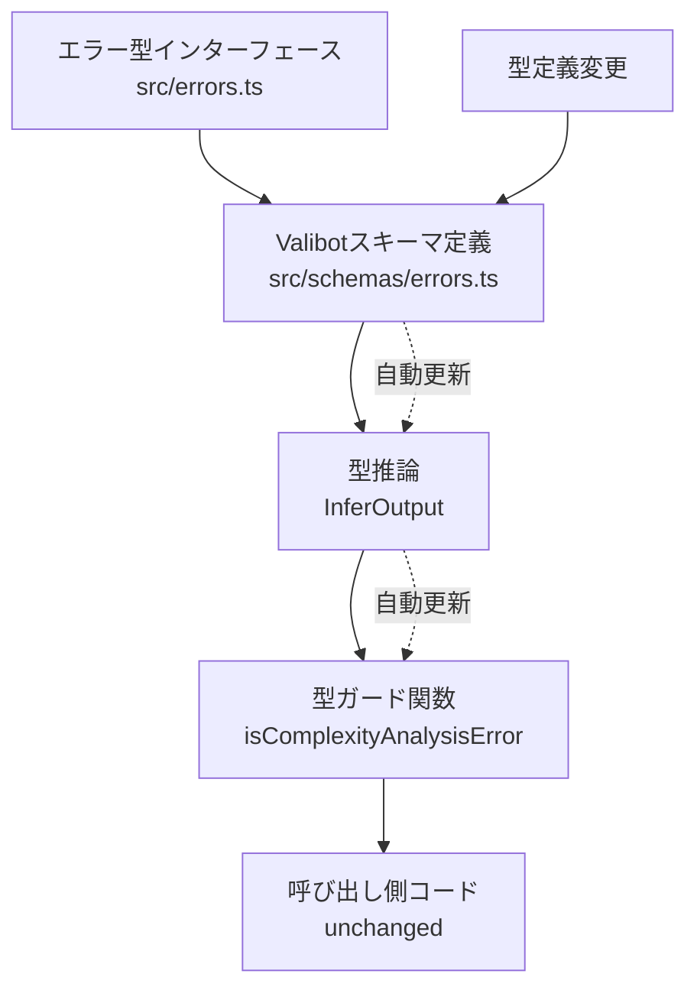
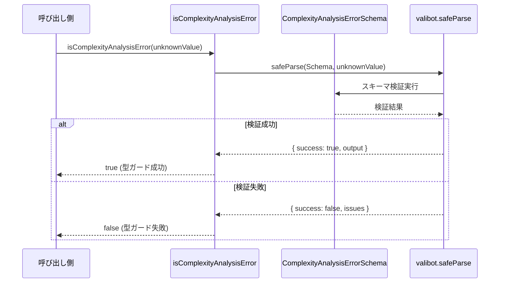
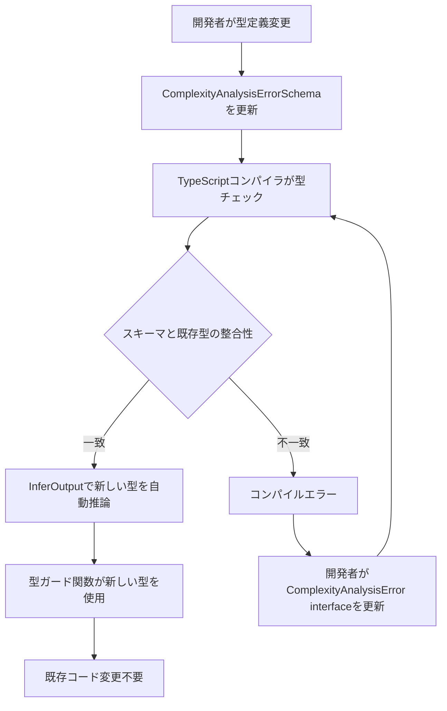

# 技術設計書 - Valibot型バリデーション移行

## 概要

本機能は、`src/errors.ts`の手動実装型ガード関数をValibotスキーマベースのバリデーションに置き換える。現状、`ComplexityAnalysisError`型の型ガード関数`isComplexityAnalysisError`は、型定義変更時に手動更新が必要であり、型とバリデーションロジックの乖離リスクがある。Valibotスキーマを導入することで、スキーマから型を自動推論し、型安全性を向上させる。

**目的**: 型ガード関数を手動実装からスキーマベースに移行し、型定義とランタイムバリデーションの整合性を自動的に保証する。

**ユーザー**: 開発者が型定義を変更する際、スキーマ更新のみで型チェックとランタイムバリデーションが自動的に更新される。

**影響**: `src/errors.ts`の型ガード関数実装方法を変更するが、関数シグネチャと呼び出し側コードは完全に互換性を維持する。

### 目標

- 型定義とバリデーションロジックの単一情報源化（スキーマを真実の源とする）
- 型変更時の手動型ガード関数更新の排除
- ランタイムバリデーションの強化（詳細なエラー情報の提供）
- 後方互換性の完全な維持（既存コードの変更不要）
- バンドルサイズ増加を5KB以下に抑制

### 非目標

- 他のエラー型（`FileAnalysisError`, `GitHubAPIError`等）へのValibot適用は将来検討
- 設定ファイルバリデーション（`src/config-loader.ts`）への適用は本スコープ外
- 型ガード関数以外のバリデーションロジックの変更は含まない

## アーキテクチャ

### 既存アーキテクチャ分析

**現在の実装パターン**:

- `src/errors.ts`: 型定義（interface）と型ガード関数が分離
- 型ガード関数: 手動実装の簡易型チェック（`typeof`と`in`演算子）
- 型とバリデーションロジックの同期: 手動メンテナンス

**ドメイン境界**:

- エラー型定義: `src/errors.ts` で集約管理
- エラー生成: `createComplexityAnalysisError`等のファクトリ関数
- エラーハンドリング: neverthrow `Result<T, E>`型で伝播

**技術的制約**:

- CommonJS形式のバンドル（@vercel/ncc）
- GitHub Actions環境での実行（バンドルサイズ重視）
- TypeScript strict mode有効（厳格な型チェック）

### 高レベルアーキテクチャ



**アーキテクチャ統合**:

- **既存パターン維持**: エラー型は`src/errors.ts`で公開、型ガード関数のシグネチャは変更なし
- **新規コンポーネント追加**: `src/schemas/errors.ts`を新設し、Valibotスキーマを集約管理
- **技術スタック整合**: Valibotの名前空間import（`import * as v`）でTree-shakingを最適化
- **ステアリング準拠**: 型安全性の徹底（`any`型排除）、Railway-Oriented Programming（Result型）継続

### 技術スタック整合

**既存技術スタックとの統合**:

| 層                 | 既存技術                       | Valibot統合方法                                            |
| ------------------ | ------------------------------ | ---------------------------------------------------------- |
| 型システム         | TypeScript 5.9.3 (strict mode) | `InferOutput<typeof Schema>`で型推論                       |
| バンドラー         | @vercel/ncc 0.38.4 → **0.40+** | CommonJS + ESM デュアルビルド対応                          |
| エラーハンドリング | neverthrow Result<T, E>        | `safeParse`の成功/失敗を`Result`型に変換可能（オプション） |
| テスト             | Vitest 3.2.4                   | スキーマ単体テスト + 型ガード互換性テスト                  |

**新規依存関係**:

- **valibot**: 最新版（執筆時点: v0.42.1+）
  - バンドルサイズ: ~2-5KB（Tree-shaking後）
  - CJS/ESM両対応
  - ゼロ依存関係

**主要設計決定**

#### 1. スキーマ配置とファイル構造

**決定**: `src/schemas/errors.ts`に全エラー型スキーマを集約

**コンテキスト**: 型定義は`src/errors.ts`、スキーマは別ファイルで管理し、関心の分離を保つ

**代替案検討**:

1. `src/errors.ts`に型定義とスキーマを同居させる
2. エラー型ごとにファイル分割（`src/schemas/complexity-analysis-error.ts`）
3. 型定義をスキーマから完全に生成（スキーマを唯一の情報源とする）

**選択アプローチ**: `src/schemas/errors.ts`に集約

**理由**:

- 既存の型定義構造を維持し、段階的移行を可能にする
- スキーマ定義の一覧性が高く、メンテナンス性が向上
- ファイル分割は初期段階では過剰（将来的にスキーマ数が増加した場合に再検討）

**トレードオフ**:

- 獲得: 既存コードへの影響最小化、段階的移行の容易性、スキーマの一覧性
- 犠牲: 型定義とスキーマの完全な単一情報源化は実現せず（型インターフェースとスキーマが併存）

#### 2. 型の単一情報源化戦略

**決定**: `InferOutput<typeof Schema>`で推論された型を内部実装で使用し、既存の`ComplexityAnalysisError`インターフェースをexport

**コンテキスト**: 既存コードは`ComplexityAnalysisError`型を参照しているため、後方互換性を維持しつつ、型安全性を向上させる

**代替案検討**:

1. 既存型を削除し、`export type ComplexityAnalysisError = v.InferOutput<typeof ComplexityAnalysisErrorSchema>`に統一
2. スキーマから型を生成し、既存インターフェースを自動更新
3. 並行運用（既存型とスキーマ推論型を両方維持）

**選択アプローチ**: 並行運用 + 段階的移行パス

**理由**:

- 既存のimport文やコードが動作し続ける（ゼロダウンタイム移行）
- スキーマ変更時にTypeScriptコンパイラが型不整合を検出
- 将来的に全エラー型がValibot化された時点で、型をスキーマ推論に統一可能

**トレードオフ**:

- 獲得: 後方互換性、段階的移行、TypeScriptによる整合性チェック
- 犠牲: 型定義の重複（一時的）、スキーマと型の手動同期が必要（移行期間中）

#### 3. importの最適化戦略

**決定**: 名前空間import（`import * as v from 'valibot'`）を使用（実測で個別importとの比較が必要）

**コンテキスト**: バンドルサイズ制約（5KB以下）を満たすため、Tree-shakingを最大化する必要がある

**代替案検討**:

1. 個別import（`import { object, string, optional } from 'valibot'`）
2. 名前空間import（`import * as v from 'valibot'`）
3. 部分的個別import（よく使う関数のみ個別import）

**選択アプローチ**: 名前空間import

**理由**:

- Valibotの公式ドキュメントで推奨されているパターン
- @vercel/ncc 0.40+のTree-shaking最適化により、未使用コードは自動削減
- コード可読性が向上（`v.object`, `v.string`の方が明示的）

**トレードオフ**:

- 獲得: コード可読性、公式推奨パターンの踏襲、nccの最適化に委ねる
- 犠牲: 個別importと比較してわずかにバンドルサイズが大きい可能性（計測で検証）

**実測による検証**:

- Phase 4（検証とロールアウト）で、名前空間importと個別importの両方でビルドし、バンドルサイズを比較
- 5KB制約を満たせない場合は個別importに切り替え
- 計測方法: `ls -lh dist/index.js`でバイトサイズを確認（圧縮前）

## システムフロー

### 型ガード関数実行フロー



### 型変更時の自動更新フロー



## 要件トレーサビリティ

| 要件      | 要件概要                    | コンポーネント                                           | インターフェース                           | フロー                   |
| --------- | --------------------------- | -------------------------------------------------------- | ------------------------------------------ | ------------------------ |
| 1.1-1.3   | 依存関係の更新、CJSバンドル | package.json, ncc設定                                    | -                                          | -                        |
| 1.4       | バンドルサイズ≦5KB          | build script, CI                                         | -                                          | -                        |
| 2.1-2.5   | 型ガード関数のValibot移行   | ComplexityAnalysisErrorSchema, isComplexityAnalysisError | safeParse()                                | 型ガード実行フロー       |
| 3.1-3.6   | 型スキーマの定義と管理      | src/schemas/errors.ts                                    | ComplexityAnalysisErrorSchema, InferOutput | 型変更時の自動更新フロー |
| 11.1-11.5 | スキーマ配置と命名規約      | src/schemas/errors.ts                                    | -                                          | -                        |
| 12.1-12.3 | 未知キーの扱いポリシー      | ComplexityAnalysisErrorSchema (strict)                   | -                                          | -                        |

## コンポーネントと インターフェース

### エラースキーマ管理層

#### ComplexityAnalysisErrorSchema

**責任と境界**

- **主要責任**: `ComplexityAnalysisError`型のランタイムバリデーション定義を提供
- **ドメイン境界**: エラー型スキーマ定義（src/schemas/errors.ts）
- **データ所有権**: エラー型のバリデーションルール（必須/任意プロパティ、列挙値）
- **トランザクション境界**: N/A（バリデーション定義のみ）

**依存関係**

- **受信依存**: `isComplexityAnalysisError`型ガード関数
- **送信依存**: Valibot library（`object`, `string`, `optional`, `enum`, `literal`）
- **外部依存**: なし

**外部依存調査: Valibot**

- **公式ドキュメント**: <https://valibot.dev/>
- **GitHub**: <https://github.com/fabian-hiller/valibot>
- **npm**: <https://www.npmjs.com/package/valibot>
- **バージョン互換性**: v0.42.1+（最新版推奨）
- **破壊的変更**: v0.x系はsemverに従わない可能性があるため、patch更新に注意
- **認証**: 不要
- **レート制限**: なし（ローカルライブラリ）
- **パフォーマンス**: 軽量（2-5KB、Zodより95%小さい）、Tree-shakingで最小化
- **CommonJS対応**: `dist/index.cjs`提供（@vercel/ncc 0.40+で互換）
- **未知の懸念**: ncc 0.40+でのバンドル成功を実装時に検証必要

**契約定義**

**スキーマインターフェース**:

```typescript
import * as v from 'valibot';

// ComplexityAnalysisError reason列挙値（単一情報源）
const ComplexityAnalysisReasonEnum = [
  'too_large',
  'analysis_failed',
  'timeout',
  'encoding_error',
  'binary',
  'syntax_error',
  'general',
] as const;

/**
 * ComplexityAnalysisErrorのValibotスキーマ定義
 *
 * 未知キーの扱い: v.object()はデフォルトでstrictモード（未知キーを拒否）
 * 明示的に許可する場合は v.looseObject() を使用可能だが、本設計では不使用
 */
export const ComplexityAnalysisErrorSchema = v.object({
  type: v.literal('ComplexityAnalysisError'),
  reason: v.enum(ComplexityAnalysisReasonEnum),
  message: v.string(),
  filename: v.optional(v.string()),
  details: v.optional(v.string()),
  fileSize: v.optional(v.number()),
  maxSize: v.optional(v.number()),
  timeoutSeconds: v.optional(v.number()),
});

// 型推論（内部実装で使用）
export type ComplexityAnalysisErrorOut = v.InferOutput<typeof ComplexityAnalysisErrorSchema>;
```

**事前条件**: なし（スキーマ定義は静的）

**事後条件**: スキーマオブジェクトがValibotのバリデーション関数で使用可能

**不変条件**:

- `type`は常に`'ComplexityAnalysisError'`リテラル
- `reason`は定義された列挙値のみ受け入れ
- 未知のプロパティは拒否（strictモード）

**状態管理**

- **状態モデル**: なし（スキーマは不変定義）
- **永続化**: なし
- **並行性**: なし

**統合戦略**

- **変更アプローチ**: 既存の`src/errors.ts`型定義を維持し、スキーマを新規追加（拡張）
- **後方互換性**: `ComplexityAnalysisError`インターフェースは変更せず、エクスポート継続
- **移行パス**: 型ガード関数の内部実装のみ変更、呼び出し側コードは無変更

#### isComplexityAnalysisError型ガード関数

**責任と境界**

- **主要責任**: unknown型の値を`ComplexityAnalysisError`型として安全に絞り込む
- **ドメイン境界**: エラー型ガード（src/errors.ts）
- **データ所有権**: なし（判定ロジックのみ）
- **トランザクション境界**: N/A

**依存関係**

- **受信依存**: エラーハンドリングコード全般（catch句、エラー判定ロジック）
- **送信依存**: `ComplexityAnalysisErrorSchema`, Valibot `safeParse`
- **外部依存**: Valibot library

**契約定義**

**サービスインターフェース**:

```typescript
/**
 * ComplexityAnalysisError型ガード関数
 * @param e - 検証対象の未知の値
 * @returns eがComplexityAnalysisError型の場合true
 */
export function isComplexityAnalysisError(e: unknown): e is ComplexityAnalysisError {
  const result = v.safeParse(ComplexityAnalysisErrorSchema, e);
  return result.success;
}
```

**事前条件**: なし（unknown型を受け入れ）

**事後条件**:

- `true`を返す場合、`e`は`ComplexityAnalysisError`型として扱える（TypeScriptの型ガード）
- `false`を返す場合、`e`は`ComplexityAnalysisError`型ではない

**不変条件**:

- 同じ入力に対して常に同じ結果を返す（純粋関数）
- 副作用なし

**統合戦略**

- **変更アプローチ**: 関数シグネチャは完全に維持、内部実装のみ変更（ラップ）
- **後方互換性**: 既存の手動型チェックと同等の挙動を保証（互換性テストで検証）
- **移行パス**: 段階的置換（他の型ガード関数は将来的に順次移行）

## データモデル

### ドメインモデル

**コア概念**:

- **エラー型スキーマ**: Valibotスキーマとして定義されるバリデーションルール
- **型推論型**: `InferOutput`で自動生成される型定義
- **型ガード関数**: スキーマを利用したランタイム型チェック関数

**ビジネスルールと不変条件**:

1. **スキーマとTypeScript型の整合性**: `ComplexityAnalysisErrorSchema`から推論される型が、既存の`ComplexityAnalysisError`インターフェースと一致しなければならない
2. **列挙値の単一情報源**: `reason`プロパティの許容値は`ComplexityAnalysisReasonEnum`で一元管理
3. **未知キーの拒否**: スキーマで定義されていないプロパティは型エラーとして扱う（strictモード）

### データ契約と統合

**型推論契約**:

```typescript
// スキーマから推論される型
type ComplexityAnalysisErrorOut = v.InferOutput<typeof ComplexityAnalysisErrorSchema>;

// 既存のTypeScript型との整合性チェック（型レベル）
type AssertEqual<T, U> = T extends U ? (U extends T ? true : false) : false;
type SchemaMatchesInterface = AssertEqual<ComplexityAnalysisErrorOut, ComplexityAnalysisError>;
// コンパイル時にtrueであることを確認
```

**スキーマバージョニング戦略**:

- 初期フェーズでは単一スキーマファイル（`src/schemas/errors.ts`）で管理
- 将来的にエラー型が増加した場合、スキーマバージョニング（v1, v2）を検討
- 後方互換性: 新しいオプショナルプロパティの追加は許可、既存プロパティの削除は禁止

**クロスコンポーネントデータ管理**:

- 型ガード関数と型定義の同期: TypeScriptコンパイラが自動検証
- ランタイムバリデーションと型システムの一致: `InferOutput`により保証

## エラーハンドリング

### エラー戦略

Valibotの`safeParse`を使用することで、バリデーションエラーを安全にキャッチし、詳細なエラー情報を取得できる。型ガード関数では単純に真偽値を返すが、将来的にエラー詳細をログ出力することも可能。

### エラーカテゴリと対応

**バリデーションエラー**（4xx相当）:

- **型不一致**: プロパティの型が期待と異なる → `safeParse`の`result.issues`に詳細情報
- **必須プロパティ欠落**: `type`, `reason`, `message`が存在しない → バリデーション失敗
- **列挙値違反**: `reason`が許容値以外 → バリデーション失敗
- **未知キー検出**: スキーマで定義されていないプロパティが含まれる → バリデーション失敗（strictモード）

**対応方針**:

- **型ガード関数**: `false`を返し、呼び出し側で適切な処理を継続
- **ログ出力**: 開発環境では`core.debug()`でバリデーションエラー詳細を出力（オプション）
- **Railway-Oriented Programming**: 既存のneverthrow `Result<T, E>`パターンとの統合（将来検討）

### モニタリング

- **エラー追跡**: バリデーション失敗時に`result.issues`を記録（実装フェーズで詳細設計）
- **ログレベル**: `core.debug()`でバリデーションエラーの詳細をGitHub Actionsログに出力
- **ヘルスモニタリング**: バンドルサイズ計測をCIに統合（要件8.6）

## テスト戦略

### ユニットテスト

**スキーマ単体テスト**（`__tests__/schemas/errors.test.ts`）:

1. **正常系**: 全プロパティが正しい値の場合、`safeParse`が成功
2. **必須プロパティ欠落**: `type`, `reason`, `message`のいずれかが欠けている場合、バリデーション失敗
3. **型不一致**: `reason`が文字列以外、`fileSize`が数値以外の場合、バリデーション失敗
4. **列挙値違反**: `reason`が定義外の値（`'unknown_reason'`）の場合、バリデーション失敗
5. **未知キー検出**: スキーマで定義されていないプロパティ（`unknownField`）が含まれる場合、バリデーション失敗

**型ガード関数テスト**（`__tests__/errors.test.ts`に追加）:

1. **正常系**: 有効な`ComplexityAnalysisError`オブジェクトで`isComplexityAnalysisError`が`true`を返す
2. **異常系**: `null`, `undefined`, 数値、文字列、他のエラー型で`false`を返す
3. **境界値**: 空文字列の`message`、負数の`fileSize`で適切に処理
4. **互換性**: 既存の手動型ガード関数と同じ入力で同じ結果を返す（レグレッション防止）

### 統合テスト

**型ガードとエラーハンドリングの統合**（`__tests__/integration.test.ts`）:

1. **エラーキャッチフロー**: `try-catch`で捕捉したエラーを`isComplexityAnalysisError`で判定し、適切に処理
2. **neverthrow統合**: `Result<T, E>`型と組み合わせて使用した場合の動作確認（将来）
3. **型推論の動作**: `isComplexityAnalysisError`がTypeScriptの型ガードとして機能し、`if`文内で型が絞り込まれる

### パフォーマンステスト

**バリデーション性能測定**:

1. **実行時間比較**: 既存の手動型ガード関数 vs Valibot版の実行時間を計測（10%以内の差を確認）
2. **大量呼び出し**: 1000回の型ガード関数呼び出しでメモリ使用量が大幅に増加しないことを確認
3. **バンドルサイズ計測**: `pnpm build`後の`dist/index.js`サイズを移行前後で比較（5KB以下の増加を確認）

## パフォーマンスとスケーラビリティ

### ターゲットメトリクス

| メトリクス               | 目標値                  | 測定方法                                                    |
| ------------------------ | ----------------------- | ----------------------------------------------------------- |
| バンドルサイズ増加       | ≦5KB                    | `dist/index.js`のサイズ比較（圧縮前、gzip前のバイトサイズ） |
| 型ガード関数実行時間     | 既存実装の±10%以内      | Vitestでベンチマーク                                        |
| 依存関係インストール時間 | ≦10秒（GitHub Actions） | CIログで計測                                                |
| ビルド時間               | 既存の±20%以内          | CIログで計測                                                |

### スケーリングアプローチ

- **水平スケーリング**: N/A（GitHub Actionsのシングルプロセス実行）
- **Tree-shaking最適化**: 名前空間importと@vercel/ncc 0.40+の組み合わせで未使用コードを削減
- **将来的な拡張**: 他のエラー型（全10種類）へのValibot適用時も、スキーマファイルを集約管理することでバンドルサイズ増加を抑制

### キャッシング戦略

- **スキーマ定義のキャッシング**: Valibotスキーマは静的定義のため、ランタイムキャッシング不要
- **バリデーション結果のキャッシング**: 型ガード関数は純粋関数だが、同一オブジェクトの再検証は稀なためキャッシング不要

## 移行戦略

### 移行フェーズ

```mermaid
flowchart TD
    A[Phase 1: 準備] --> B[Phase 2: スキーマ実装]
    B --> C[Phase 3: 型ガード移行]
    C --> D[Phase 4: 検証とロールアウト]

    A1[依存関係追加<br/>@vercel/ncc 0.40+<br/>valibot最新版] --> A
    A2[src/schemas/ディレクトリ作成] --> A

    B1[ComplexityAnalysisErrorSchema定義] --> B
    B2[InferOutput型エクスポート] --> B
    B3[スキーマ単体テスト作成] --> B

    C1[isComplexityAnalysisError実装更新] --> C
    C2[型ガード互換性テスト追加] --> C
    C3[既存テストスイート実行] --> C

    D1[バンドルサイズ計測] --> D
    D2[CI/CDパイプライン通過確認] --> D
    D3[本番環境デプロイ] --> D
```

### ロールバックトリガー

以下の条件を満たす場合、VCS（Git）でコミットを元に戻す:

1. **バンドルサイズ超過**: `dist/index.js`が5KB以上増加
2. **CI/CD失敗**: lint, type-check, test, buildのいずれかが失敗
3. **型ガード互換性問題**: 既存の型ガード関数と挙動が異なる
4. **パフォーマンス劣化**: 型ガード関数の実行時間が既存実装の+10%以上
5. **実行時エラー**: GitHub Actions環境での実行時エラー発生

### バリデーションチェックポイント

| フェーズ | チェック内容         | 合格基準                                 |
| -------- | -------------------- | ---------------------------------------- |
| Phase 2  | スキーマ単体テスト   | 全テストパス、カバレッジ100%             |
| Phase 3  | 型ガード互換性テスト | 既存実装と同一の真偽値を返す             |
| Phase 3  | 既存テストスイート   | 全テストパス、カバレッジ90%以上維持      |
| Phase 4  | バンドルサイズ       | 増加≦5KB                                 |
| Phase 4  | CI/CDパイプライン    | lint + type-check + test + build全て成功 |
| Phase 4  | Node 20/22互換性     | 両バージョンで正常動作                   |

### 移行期間中の運用

- **ロールバック方式**: VCS（Git）によるコミットの元に戻しを基本とする（コメントアウトでの保持は避ける）
- **段階的デプロイ**: `feat/valibot-migration`ブランチでPR作成 → CI通過 → レビュー → mainマージ
- **モニタリング**: GitHub ActionsログでValibotのバリデーションエラーを監視（`core.debug()`出力）
- **ドキュメント更新**: `docs/valibot-migration.md`に移行ガイド作成（要件7.6）

---

**設計承認後の次ステップ**: `/kiro:spec-tasks valibot-validation-migration -y` を実行して実装タスクを生成
